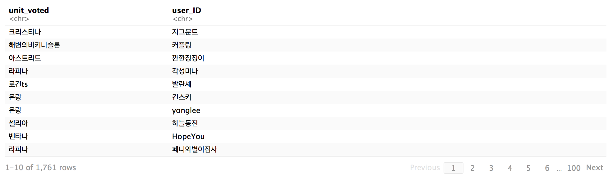
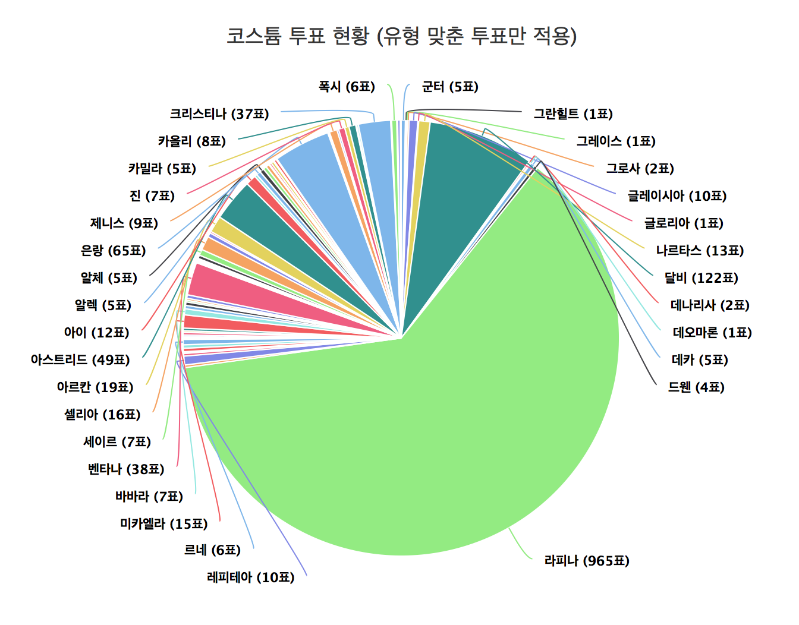
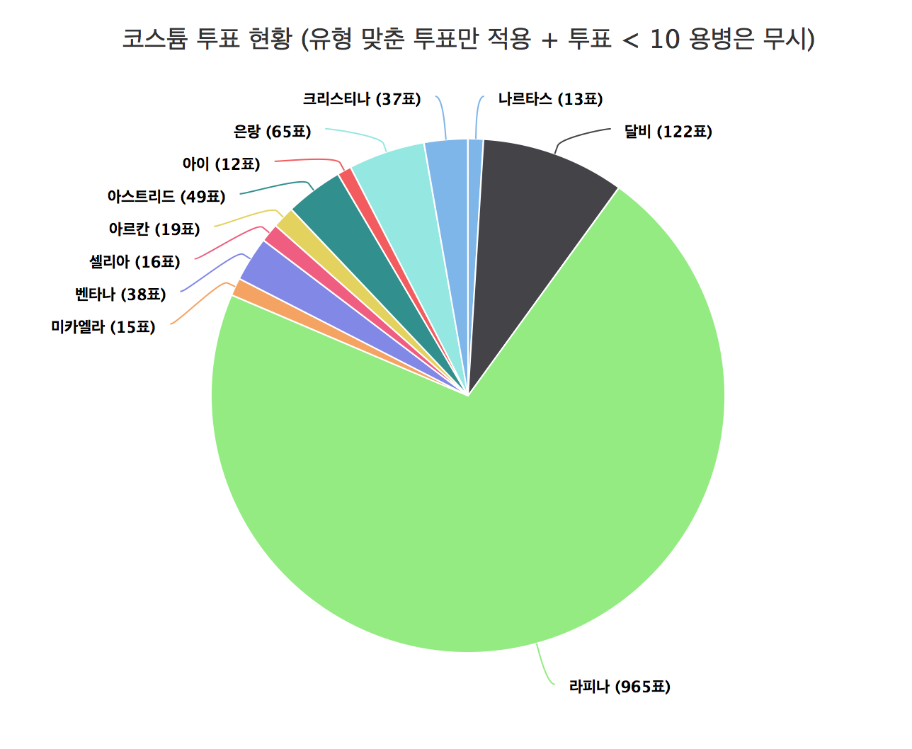

## Abstract

There was a costume voting event in a mobile SRPG game called Browndust. The voting was held in Browndust Official NaverCafe
and people were able to vote in the format '[username] / [unitname]'. There were over 1800 comments and I thought to myself that
making a web crawler here wouldn't be so bad. There was a slight problem when trying to crawl in NaverCafe because the url are
hidden, so I could not use a orthodox method of going reading html of each unique url. This is where I approached **Selenium**.
After crawling with **Python** and **Selenium**, and making a simple dataframe, I used **R** and **Highcharter** to visualize the
result!

-----

## Web Crawling

I used Chrome as Webdriver.

**Setting up for Crawling**

from selenium import webdriver
from selenium.webdriver.common.by import By
from selenium.webdriver.support.ui import WebDriverWait
from selenium.webdriver.support import expected_conditions as EC
import pandas as pd
import re
import time

def get_n_child_index(lastCounter, currentCounter):
    nextPageChildPos = -1
    currentSector = int(currentCounter/10)
    if(currentSector == 0):
        nextPageChildPos = currentCounter + 1
    else:
        nextPageChildPos = ((currentCounter%10) + 2) + 1
    return(nextPageChildPos)

df = pd.DataFrame(columns=['user_ID','unit_voted'])
dfIndexCounter = 1
r = re.compile('.*\/.*')
# Could've used User-Defined Method, but this was cleaner and simpler
lastIndex = int(input('Last Comment Page : ')) # 19


There isn't anything particularly special until here. User defined method is specific to NaverCafe comment page sector,
so just keep that in mind. *If you are interested... the comment page sector is labelled as nchild, and the nchild is slightly different depending on how many pages are*

**Crawling with Selenium**

driver = webdriver.Chrome()

driver.get('http://cafe.naver.com/browndust/ArticleRead.nhn?clubid=28708849&menuid=16&articleid=217084')
time.sleep(3)
driver.switch_to_frame('cafe_main')

for pageIndex in range(0, lastIndex):
    time.sleep(3)
    commentList = WebDriverWait(driver, 10).until(EC.presence_of_element_located((By.CSS_SELECTOR, '#cmt_list')))
    splitCommentList = (commentList.text).split('\n')
    splitCommentList = list(filter(r.match, splitCommentList))

    # parsing for every legitimate comment
    for elements in splitCommentList:
        splitElement = elements.split('/')
        userID = splitElement[0].replace(' ','')
        unitVoted = splitElement[1].replace(' ','')
        data = pd.DataFrame({'user_ID': userID, 'unit_voted': unitVoted}, index=[dfIndexCounter])
        df = pd.concat([df,data])
        dfIndexCounter += 1

    print('comment Page ' + str(pageIndex+1) + ' complete...')

    # Current page crawling is complete, so preparing next comment page
    if(pageIndex != (lastIndex - 1)):
        nextPageChildPos = get_n_child_index(lastIndex, pageIndex)
        nextPageXPath = '//*[@id="cmt_paginate"]/a[' + str(nextPageChildPos) + ']'
        nextPageCrawl = WebDriverWait(driver, 10).until(EC.element_to_be_clickable((By.XPATH, nextPageXPath)))
        nextPageCrawl.send_keys(webdriver.common.keys.Keys.SPACE)
        nextPageCrawl.click()


If you are a programmer with a bit of knowledge in selenium, you might have some issues on how this code was built...
Here are some explanations on why such code was inserted in some areas. If I see any additional questions in comments,
I will add them when I have the time! :^)

**1. Why do you need time.sleep when you're already using WebDriverWait?**

The xPath for current comment page and the next comment page are the same, so before it goes on to the next comment page, it checks xPath for current comment page (which will return True and continue that results as an error). So in order to wait for not checking for xPath in the current page, added time.sleep.

**2. Why do you need send_keys, when you only need to do click?**

If the clicking element is not currently viewed on the browser (physically), it returns an error. I've googled about this problem, and other people also had this problem. So, the send_keys will scroll the browser to actually see the element that's about to be clicked, which solves the error.

**Exporting Dataframe as csv**

df.to_csv('~/Desktop/browndust-related/browndust-costume-event-crawled-comment.csv', sep=',', encoding='utf-8')


The output df looks something like this

-----

## Data Handling and Visualization

**Data Handling**

library(pacman)
pacman::p_load(readr,dplyr,highcharter)

df.comment <- readr::read_csv('~/Desktop/browndust-related/browndust-costume-event-crawled-comment.csv')
df.comment$X1 <- NULL
df.unit <- readr::read_csv('~/Desktop/browndust-related/browndust-unit-db.csv')

# User Defined Function
reduce_duplicates <- function(dup.userID) {
  all.dup.index.list <- lapply(dup.userID, function(x) which(df.formal$user_ID %in% x))
  all.dup.index <- unlist(all.dup.index.list, use.names=FALSE)
  keeping.index <- vapply(all.dup.index.list, tail, n = 1L, FUN.VALUE = numeric(1))
  removing.index <- all.dup.index[!(all.dup.index %in% keeping.index)]
  return(removing.index)
}

df.formal <- df.comment[df.comment$unit_voted %in% df.unit$용병이름,]
df.informal <- df.comment[!(df.comment$unit_voted %in% df.unit$용병이름),]

df.duplicate <- df.formal[duplicated(df.formal$user_ID),]

removing.index <- reduce_duplicates(df.duplicate$user_ID)
df.formal <- df.formal[-removing.index,]


There are some users who didn't write just unitname, but some extra texts such as 'unit x in maid costume', since those
comments did not follow the rules, I've separated them into a formal / informal dataframe (it's possible to distinguish them
with grep and apply, so if needed this is possible)

**Data Visualization**

Since I uploaded the results in the NaverCafe, results are in korean, but those are just unitnames and titles.


df.formal.pie.data <- table(df.formal$unit_voted)
highchart() %>%
 hc_chart(type = "pie") %>%
 hc_add_series_labels_values(labels = attributes(df.formal.pie.data)$dimnames[[1]], values = df.formal.pie.data) %>%
 hc_tooltip(pointFormat = paste('{point.y} 표 <b>{point.percentage:.1f}%</b>')) %>%
 hc_title(text = "코스튬 투표 현황 (유형 맞춘 투표만 적용)")


Due to too much data, removing unit votes less than 10


df.formal.pie.data.reformat <- df.formal.pie.data[df.formal.pie.data > 10]
highchart() %>%
 hc_chart(type = "pie") %>%
 hc_add_series_labels_values(labels = attributes(df.formal.pie.data.reformat)$dimnames[[1]], values = df.formal.pie.data.reformat) %>%
 hc_tooltip(pointFormat = paste('{point.y} 표 <b>{point.percentage:.1f}%</b>')) %>%
 hc_title(text = "코스튬 투표 현황 (유형 맞춘 투표만 적용 + 투표 < 10 용병은 무시)")


Due to one unit getting overwhemling votes from users, there was no need to go through the informal dataframe to extract
votes. (better for me XD)
