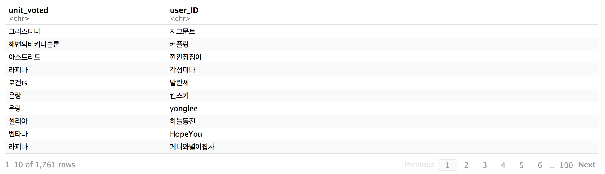

## 개요

브라운더스트 (모바일 SRPG게임)에서 코스튬 투표 이벤트가 있었다. 브라운더스트 공식 네이버카페에서 '[유저이름] / [용병이름]' 유형으로 댓글 투표가 있었는데, 댓글이 약
1800개가 넘어가서 웹 크롤러가 있으면 좋을 것 같다고 해서 시작했다. 처음부터 네이버카페 url이 숨긴 상태여서 평시 사용되는 웹 크롤러 (유일한 url로 html 읽어오기)는
사용할수가 없어서 **셀레늄** 을 사용하게 되었다. 그래서 큰그림으로 보면, 웹 크롤링은 **파이썬** 과 **셀레늄** 으로 처리를 했고, **R** 과 **하이차터** 로 데이터
시각화를 했다!

-----

## 웹 크롤링

웹 드라이버는 크롬을 사용했습니다.

**크롤링 준비과정**

from selenium import webdriver
from selenium.webdriver.common.by import By
from selenium.webdriver.support.ui import WebDriverWait
from selenium.webdriver.support import expected_conditions as EC
import pandas as pd
import re
import time

def get_n_child_index(lastCounter, currentCounter):
    nextPageChildPos = -1
    currentSector = int(currentCounter/10)
    if(currentSector == 0):
        nextPageChildPos = currentCounter + 1
    else:
        nextPageChildPos = ((currentCounter%10) + 2) + 1
    return(nextPageChildPos)

df = pd.DataFrame(columns=['user_ID','unit_voted'])
dfIndexCounter = 1
r = re.compile('.*\/.*')
# 사용자 정의 함수를 사용해도 됬지만, 그냥 유저에게 받는게 더 깔끔하고 간략했
lastIndex = int(input('Last Comment Page : ')) # 19


여기까진 뭐 특별한 것 없다. 사용자 정의 함수는 네이버카페 댓글 페이지 분할 시스템에 적용된 함수라, 네이버카페 댓글에서만 사용 가능한걸 알고 있으시면 됩니다.
*관심 있으시면... 페이지 분할 paginator를 보시면 nchild로 구분되있는데, 총 페이지 숫자에 맞춰서 지정된다*

**셀레늄으로 크롤링**

driver = webdriver.Chrome()

driver.get('http://cafe.naver.com/browndust/ArticleRead.nhn?clubid=28708849&menuid=16&articleid=217084')
time.sleep(3)
driver.switch_to_frame('cafe_main')

for pageIndex in range(0, lastIndex):
    time.sleep(3)
    commentList = WebDriverWait(driver, 10).until(EC.presence_of_element_located((By.CSS_SELECTOR, '#cmt_list')))
    splitCommentList = (commentList.text).split('\n')
    splitCommentList = list(filter(r.match, splitCommentList))

    # 각각 댓글 텍스트 parsing  
    for elements in splitCommentList:
        splitElement = elements.split('/')
        userID = splitElement[0].replace(' ','')
        unitVoted = splitElement[1].replace(' ','')\
        data = pd.DataFrame({'user_ID': userID, 'unit_voted': unitVoted}, index=[dfIndexCounter])
        df = pd.concat([df,data])
        dfIndexCounter += 1

    print('comment Page ' + str(pageIndex+1) + ' complete...')

    # 인제 현재 페이지 크롤링 완료되어서, 다음페이지 준비하는 과정입니다
    if(pageIndex != (lastIndex - 1)):
        nextPageChildPos = get_n_child_index(lastIndex, pageIndex)
        nextPageXPath = '//*[@id="cmt_paginate"]/a[' + str(nextPageChildPos) + ']'
        nextPageCrawl = WebDriverWait(driver, 10).until(EC.element_to_be_clickable((By.XPATH, nextPageXPath)))
        nextPageCrawl.send_keys(webdriver.common.keys.Keys.SPACE)
        nextPageCrawl.click()


셀레늄을 다뤄보신분들이나 따라하시면서 '이걸 왜하지?'라는 생각이 들게 몇개 있어서 미리 FAQ처럼 밑에 설명했습니다. 만약 다른 궁금한거 있으시면 댓글로 달아주세요,
나중에 시간되면 추가하겠습니다! :^)

**1. WebDriverWait를 사용하는데, 왜 time.sleep이 필요한가?**

지금 현재 페이지와 다음페이지 xPath가 같아서, 만약 time.sleep을 안넣으면, 다음 페이지 가기전에 현재 페이지 에서 확인하게 됩니다. xPath가 같아서, 기달리지 않고 바로 실행하려다가 에러나서, time.sleep를 추가하게 되었습니다.

**2. click만 하면 되는데, 왜 send_keys까지 필요한가?**

이건 확실히 왜 바로 click하면 에러가 안뜨는데 인터넷에서 다른 유사한 문제를 읽어보니, 현재 화면이 element에 없으면 에러가 나는 경우가 있다고 합니다. 그래서 send_keys를 사용해서 지금 화면을 다음페이지 가는 element에 고정 후 click을 하는겁니다.

**csv로 데이터프레임 추출**

df.to_csv('~/Desktop/browndust-related/browndust-costume-event-crawled-comment.csv', sep=',', encoding='utf-8')


결과물은 대략 아래와 같습니다

-----

## 데이터 핸들링 및 시각화

**데이터 핸들링**

library(pacman)
pacman::p_load(readr,dplyr,highcharter)

df.comment <- readr::read_csv('~/Desktop/browndust-related/browndust-costume-event-crawled-comment.csv')
df.comment$X1 <- NULL
df.unit <- readr::read_csv('~/Desktop/browndust-related/browndust-unit-db.csv')

# 사용자 정의 함수
reduce_duplicates <- function(dup.userID) {
  all.dup.index.list <- lapply(dup.userID, function(x) which(df.formal$user_ID %in% x))
  all.dup.index <- unlist(all.dup.index.list, use.names=FALSE)
  keeping.index <- vapply(all.dup.index.list, tail, n = 1L, FUN.VALUE = numeric(1))
  removing.index <- all.dup.index[!(all.dup.index %in% keeping.index)]
  return(removing.index)
}

df.formal <- df.comment[df.comment$unit_voted %in% df.unit$용병이름,]
df.informal <- df.comment[!(df.comment$unit_voted %in% df.unit$용병이름),]

df.duplicate <- df.formal[duplicated(df.formal$user_ID),]

removing.index <- reduce_duplicates(df.duplicate$user_ID)
df.formal <- df.formal[-removing.index,]


어느 유저들은 규칙을 어긋나게 추가로 용병이름에 다른 텍스트를 넣는 케이스도 있었습니다. (예: '메이드 코스튬 입은 용병 x'). 규칙을 어긋나서 일단 유형 / 비유형
으로 나눴고 만약 필요하면 추가로 grep하고 apply 함수로 필요한 추출이 가능합니다.

**데이터 시각화**

Since I uploaded the results in the NaverCafe, results are in korean, but those are just unitnames and titles.


df.formal.pie.data <- table(df.formal$unit_voted)
highchart() %>%
 hc_chart(type = "pie") %>%
 hc_add_series_labels_values(labels = attributes(df.formal.pie.data)$dimnames[[1]], values = df.formal.pie.data) %>%
 hc_tooltip(pointFormat = paste('{point.y} 표 <b>{point.percentage:.1f}%</b>')) %>%
 hc_title(text = "코스튬 투표 현황 (유형 맞춘 투표만 적용)")


데이터가 너무 많아서 투표 10개보다 낮은 투표는 무시


df.formal.pie.data.reformat <- df.formal.pie.data[df.formal.pie.data > 10]
highchart() %>%
 hc_chart(type = "pie") %>%
 hc_add_series_labels_values(labels = attributes(df.formal.pie.data.reformat)$dimnames[[1]], values = df.formal.pie.data.reformat) %>%
 hc_tooltip(pointFormat = paste('{point.y} 표 <b>{point.percentage:.1f}%</b>')) %>%
 hc_title(text = "코스튬 투표 현황 (유형 맞춘 투표만 적용 + 투표 < 10 용병은 무시)")


'라피나' 용병이 압도적으로 투표를 많이 가져가서, 비유형 데이터프레임에서 데이터 추출은 필요가 없게되었네요... (저한테 좋죠 ㅎㅎ)
