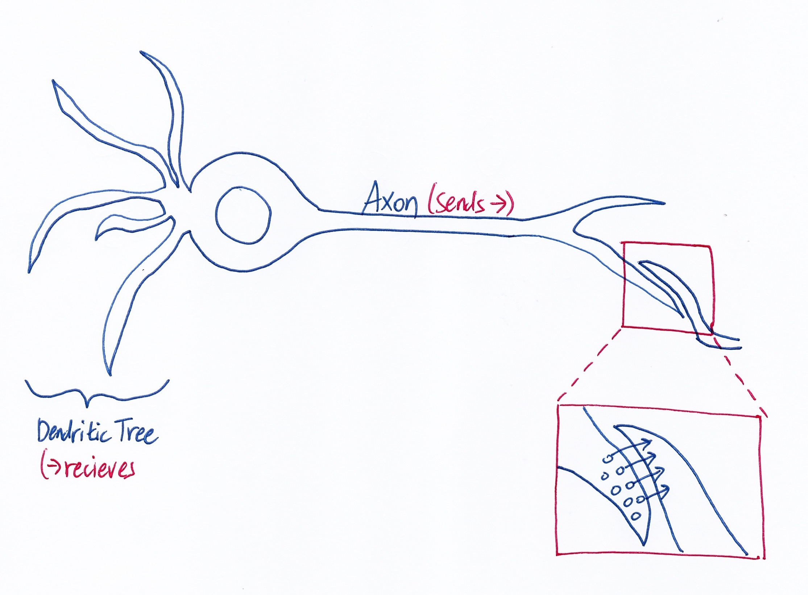
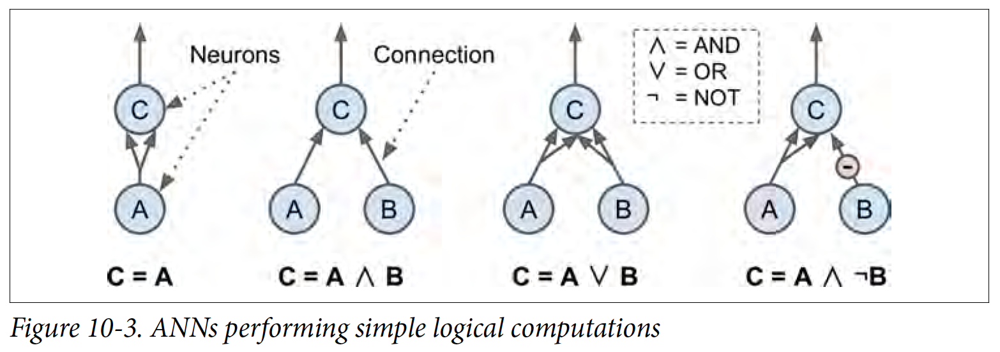
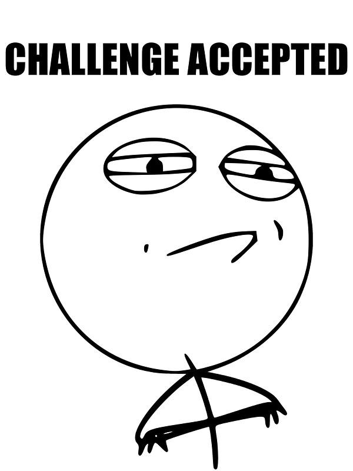
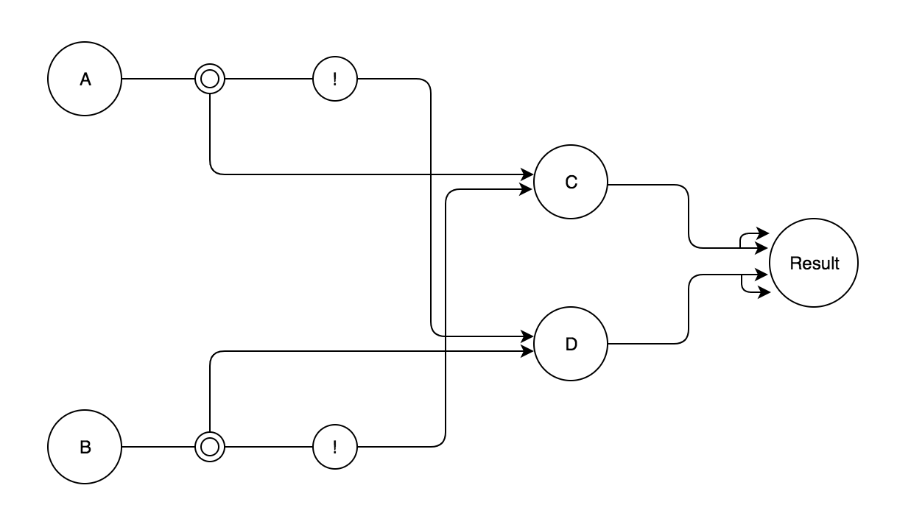
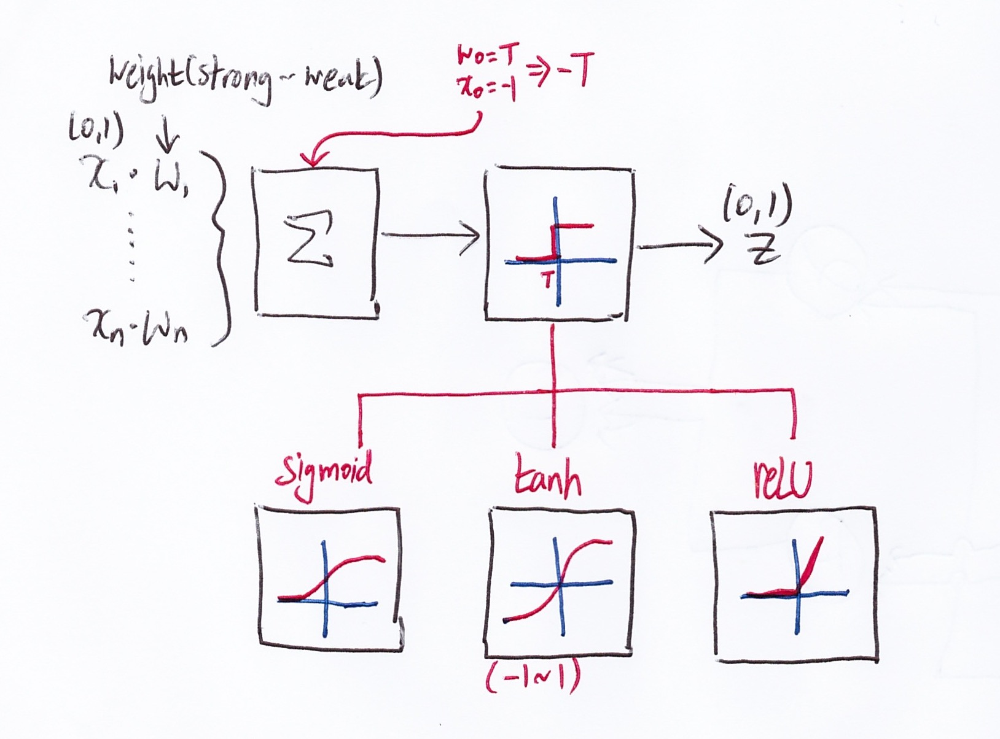
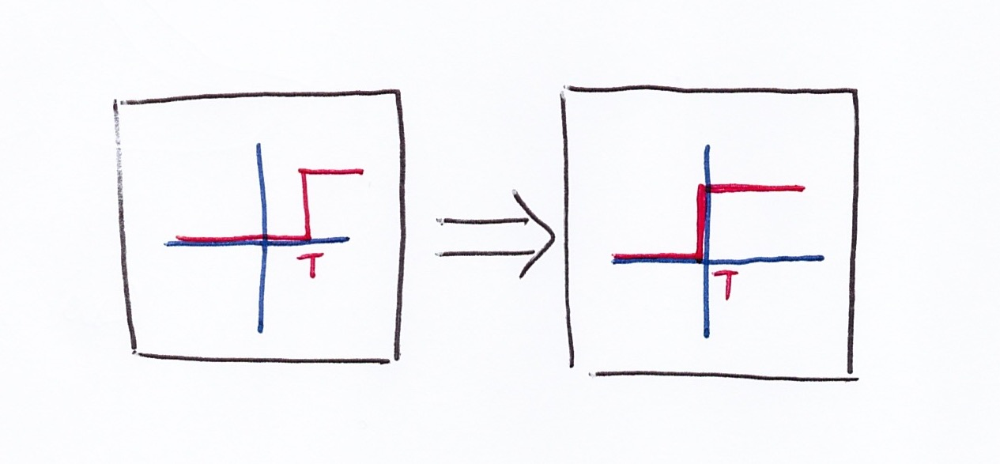
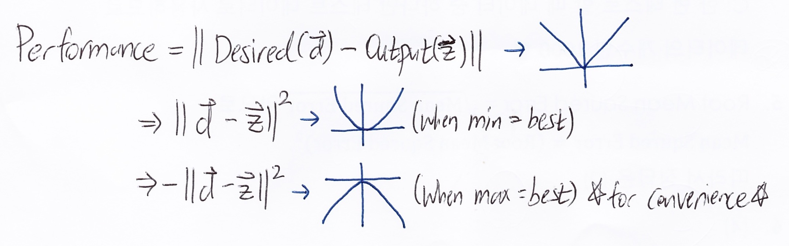
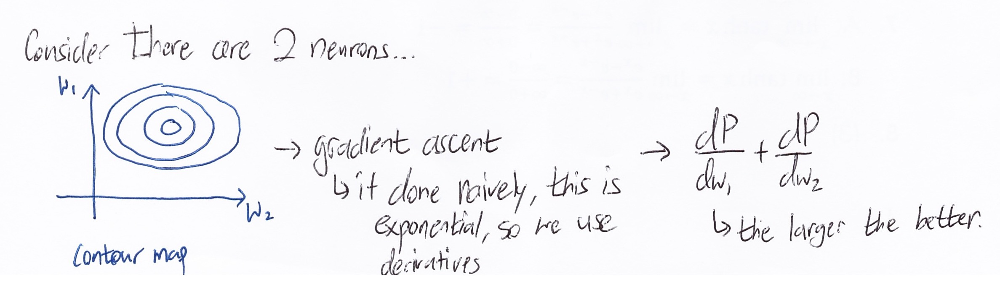
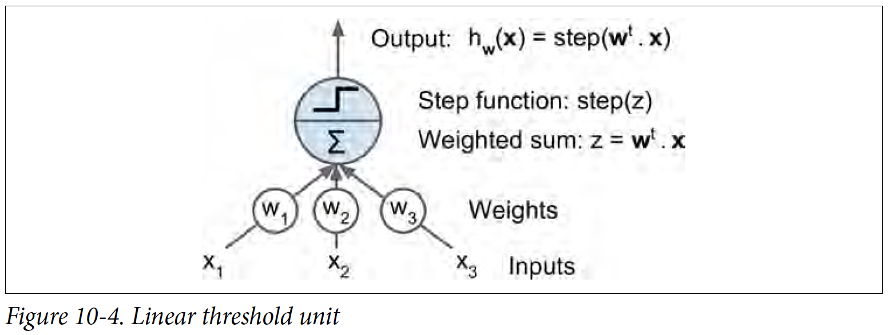
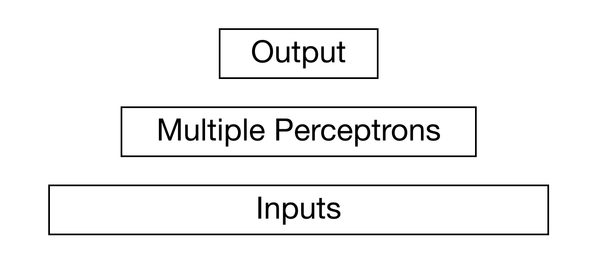

## Abstract

I've been interested in Neural Networks recently and I've started to study about it. Here is how I understood the basics of
Neural Network. (The sources I've referenced the most when learning was
[MIT OpenCourse Lecture](https://www.youtube.com/watch?v=uXt8qF2Zzfo) and
[O'Reilly recent Machine Learning Book](http://shop.oreilly.com/product/0636920052289.do))

-----

## Table of Contents

* Basic Structure of Neuron
* Basic Concept of Neuron Applied for Computers Visualized
* Elaboration on Neural Network Optimization
* Applying Concepts into Python (Tensorflow)

-----

## Basic Structure of Neuron

Basically, there are multiple neurons that communicate with each other by receiving information with dendritic tree and sending information with axon. As you can see in the close up part, they don't send just 1 signals, but multiple signals. Those multiple signals either makes the other neuron stimulated or not (basically it's either 0 or 1). However, we care about the bigger picture, so we will only care if the whole signals result to 0 or a 1 (i.e. a single neuron). Since each neuron have different **weights**. The 'learning' part is applied to these weights. We will optimize the weights so that it is closest to the actual result. *Deep learning will tweak the weights according to how much it contributes to the error so that at the end, the optimization is more closer to the actual result*

-----

## Basic Concept of Neuron Applied for Computers Visualized

For simplicity, I'm going to ignore about weights, and just stick with 0 and 1. In the O'Reilly ML Book, it has this tree like diagram showing simple logical computations.

For 2 signals (in this case A and B), you can see with diagram how signals can lead up to stimulate the other neuron. In the
textbook, it also leaves a question at the end : *How would A XOR B look like?*

It didn't really say if there could be intermediate nodes to get the inputs, so for the sake of a better looking graph,
I'm going to assume there can be intermediate nodes to save a computed value. Here is my diagram.

------

## Elaboration on Neural Network Optimization

Time to get our hands dirty with a bit of mathematical concepts! I'm going to leave out some maths out (i.e. chain rules and multiple differentiation) However, you do need to understand what taking a derivate of a certain function does.

Here is the first step

* Let there be **n** number of signals.
* **x** is when will either be 0 or 1 (it fires or doesn't fire signals)
* **w** is weight

Note there is an **-T** input with the signal inputs. This is done for mathematical convenience (translating the T to origin).
The figure below shows the translation.

Then there is 3 popular activation functions. Before I elaborate on those functions, a good question is, **why do we need to transform a stepwise function (original) into another function?** Later on when we try to find the maximum/minimum (depending on how you look at it), we'd have to use a optimization concept called **gradient ascent/descent**. This can be only applied to a continuous function. Thus, the stepwise function has to be transformed into a continuous function.

* **sigmoid** : this one is intuitive and is done quite a lot in the field of data analysis (i.e. if you have a questionnaire that has answers yes/no, then normally a sigmoid is done on the data). However, this usually needs more computation than other function and usually gives mediocre results compared to other activation function
* **tanh (Hyperbolic Tangent Function)** : it's pretty similar to sigmoid, but it helps speed up convergence due to stronger gradient caused by the larger range of the function.
* **ReLU (Rectified Linear Unit)** : there is a slight problem near origin due to abrupt change (i.e. it has mathematical problems when differentiated). However, due to it's shape, it is fast to compute it does reduce some issues with gradient ascent/descent. *This function is the most popular currently*

Now it's time to move on the how this turns into a gradient ascent/descent problem. First we have an output **z** that can be compared to the desired (actual) result to measure performance, so that math goes like this.

*Just incase the reader is not familiar why the values are in vector... since the desired and output have multiple values, it's possible to think of them as a 1xN dimension matrix (where N = number of values), which is basically a vector.*

If two vectors are just subtracted, it's not very convenient for math, so the the whole performance is squared. Additionally, **-** is multiplied so that we can do gradient ascent (usually climbing is the norm). Of course there is no problem just using the positive value and use gradient descent. (for this blog I will keep using maximum / gradient ascent)

Now all we have to do is find the maximum. Now the problem can be taken on as shown below.

It's explained above, but gradient ascent done naively is exponential (intractable), so differentiation is used. When both in vertical and horizontal direction changes the most positively means that that is the optimal step to take.

Now with this we keep the weights adjusting so the neural network is modified to be closer and closer to the desired output!

Since overall theory of neural network is covered let's move on to coding with Python... '^'

------

## Applying Concepts into Python (Tensorflow)

**Perceptron** is one of the simplest Artificial Neural Network (ANN) structure, so we'll start at that. This one uses a threshold value (aka Linear Threshold Unit), so it does not need to convert stepwise function into a continuous function. In the textbook, it has a good visual example as shown below

It works similar to one of the Machine Learning Algorithm, SVM (Support Vector Machine). There are different threshold ranges, but basically it classifies the inputs depending on if **z** is negative/positive.

I won't be coding out the basic Perceptron codes on my blog, since I'd be just copy pasting exact same code as O'Reilly Machine Learning Book, so I strongly encourage you to visit the [github](https://github.com/ageron/handson-ml/blob/master/10_introduction_to_artificial_neural_networks.ipynb) created by the author that has all the codes and output.

**Multi Layer Perceptron (MLP)** is the next level for ANN structure. So there are inputs in the lower level, multiple perceptron in the middle level, and output on the upper level

It's possible to expand the MLP level into multiple level, which will result in a Deep Neural Network (DNN). As I mentioned previously, these multi-layer will look for neurons that contribute the most in the error and tweak their weights. We'll now build a DNN in tensorflow (also note most of the codes here are from [O'Reilly Machine Learning Book](http://shop.oreilly.com/product/0636920052289.do)). We will be building a DNN with 2 hidden layers (this is the most basic structure of a DNN).

### Model

First we will load libraries and initialize variables


import tensorflow as tf
import numpy as np

# getting MNIST data and splitting train and test
(X_train, y_train), (X_test, y_test) = tf.keras.datasets.mnist.load_data()
# reshape is done so that it's a 2d matrix
X_train = X_train.astype(np.float32).reshape(-1, 28*28) / 255.0
X_test = X_test.astype(np.float32).reshape(-1, 28*28) / 255.0
y_train = y_train.astype(np.int32)
y_test = y_test.astype(np.int32)

# there are 50000 data, so this is a 80/20 split
X_valid, X_train = X_train[:10000], X_train[10000:]
y_valid, y_train = y_train[:10000], y_train[10000:]

input_dim = 28*28  # MNIST data is 28x28 pixels
hidden_1 = 300
hidden_2 = 100
output = 10

X = tf.placeholder(tf.float32, shape=(None, input_dim), name="X")
y = tf.placeholder(tf.int32, shape=(None), name="y")


Now the all the setup, it's time to create define the model using **tensorflow**. First starting with a user defined function of a neuron layer (note that there are built in functions inside tensorflow, so you don't actuall have the trouble of doing this phase. So, this is for learning purposes)


def neuron_layer(X, n_neurons, name, activation=None):
    with tf.name_scope(name):
        # creating weight matrix W
        n_inputs = int(X.get_shape()[1])
        std = 2 / np.sqrt(n_inputs) # this helps to converge much faster
        init = tf.truncated_normal((n_inputs, n_neurons),
                                    stddev=std) # truncated avoids large weights, so more efficient
        W = tf.Variable(init, name="kernel")
        # bias set to 0
        b = tf.Variable(tf.zeros([n_neurons]), name="bias")
        # Z (the output) = X (0 or 1) * W (weight) + b (bias)
        Z = tf.matmul(X, W) + b

        # activation default on ReLU
        if activation is not None:
            return activation(Z)
        else:
            return Z


Now that a neuron layer is defined, we move on to making a input -> **hidden layer 1** -> **hidden layer 2** -> **output**.


with tf.name_scope("dnn"):
    hidden1 = neuron_layer(X, hidden_1, name="hidden1", activation=tf.nn.relu)
    hidden2 = neuron_layer(hidden1, hidden_2, name="hidden2", activation=tf.nn.relu)
    logits = neuron_layer(hidden2, output, name="outputs")


Now that all the inputs have been turned into a value which have to be optimized and classified accordingly (the images are from 0~9, so we cannot use a regular sigmoid). Luckily,


with tf.name_scope("loss"):
    xentropy = tf.nn.sparse_softmax_cross_entropy_with_logits(labels=y, logits=logits)
    loss = tf.reduce_mean(xentropy, name="loss")

with tf.name_scope("train"):
    optimizer = tf.train.GradientDescentOptimizer(0.01) # learning rate
    training_op = optimizer.minimize(loss)

with tf.name_scope("eval"):
    correct = tf.nn.in_top_k(logits, y, 1)
    accuracy = tf.reduce_mean(tf.cast(correct, tf.float32))


...
