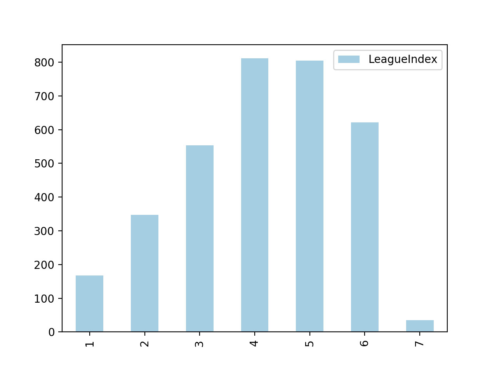

---

## Before reading this post, I strongly suggest you read this part first

I'm going to do a simple linear regression on the variable provided in the dataset and try to visualize some problematic variables and try to make a final model with the most correlated variable. In the end, I will organize and make a kernel up on Kaggle.com if possible, so go to the link on the bottom for an organized report. 'Stream of Progress' tags are a progressive post that are going to talk about stuff that maybe aren't so worth your time.

**Finalized Post/Blog/Kernel**

* [For Kaggle](www.google.com)
* [For My Own Blog](www.google.com)

---

## Getting to Know the Data

There are total of 20 variables in the dataset. It's explained quite succinctly on the kaggle page ([Skillcraft Kaggle](https://www.kaggle.com/danofer/skillcraft/home)). I'm going to set the *League Index as the Dependent Variable* and *Other Variables as Independent Variable* first to get the gist of the dataset.

**Getting Data**

import pandas as pd
import urllib.request as urllib

# getting data
url = 'https://raw.githubusercontent.com/Jinwooooo/Kaggle-SC2' +
      '-Skillcraft-Regression-Analysis/master/data/raw-skillcraft.csv'
response = urllib.urlopen(url)
df_main = pd.read_csv(response)
response.close()


**1st Model (Full)**

import statsmodels.api as sm

# Dependent Variable
y = df_main[['LeagueIndex']]

# Independent Variable
x_1 = df_main.drop(['GameID','LeagueIndex'], axis=1)

# 1st Model (Full)
model_1 = sm.OLS(y,x_1).fit()
print(model_1.summary())


You can notice I've dropped GameID, since it's intuitive it's gonna be random and will have no causation to the dependent variable whatsoever. So, the output comes like this.


OLS Regression Results                            
==============================================================================
Dep. Variable:            LeagueIndex   R-squared:                       0.947
Model:                            OLS   Adj. R-squared:                  0.947
Method:                 Least Squares   F-statistic:                     3313.
Date:                Tue, 04 Sep 2018   Prob (F-statistic):               0.00
Time:                        11:43:03   Log-Likelihood:                -4746.6
No. Observations:                3338   AIC:                             9529.
Df Residuals:                    3320   BIC:                             9639.
Df Model:                          18                                         
Covariance Type:            nonrobust                                         
========================================================================================
                           coef    std err          t      P>|t|      [0.025      0.975]
----------------------------------------------------------------------------------------
Age                      0.0228      0.004      5.347      0.000       0.014       0.031
HoursPerWeek             0.0083      0.002      5.432      0.000       0.005       0.011
TotalHours           -1.086e-06   1.01e-06     -1.076      0.282   -3.07e-06    8.93e-07
APM                     -0.0100      0.002     -4.756      0.000      -0.014      -0.006
SelectByHotkeys         87.7749     12.495      7.025      0.000      63.276     112.274
AssignToHotkeys        845.1831    105.214      8.033      0.000     638.892    1051.474
UniqueHotkeys            0.0312      0.009      3.659      0.000       0.014       0.048
MinimapAttacks        1025.4474    116.747      8.784      0.000     796.545    1254.350
MinimapRightClicks      -3.8355     54.979     -0.070      0.944    -111.632     103.961
NumberOfPACs           864.9794     45.537     18.995      0.000     775.696     954.263
GapBetweenPACs          -0.0075      0.002     -4.959      0.000      -0.011      -0.005
ActionLatency           -0.0074      0.002     -4.486      0.000      -0.011      -0.004
ActionsInPAC             0.2866      0.027     10.809      0.000       0.235       0.339
TotalMapExplored        -0.0067      0.003     -2.094      0.036      -0.013      -0.000
WorkersMade            221.4666     38.250      5.790      0.000     146.470     296.463
UniqueUnitsMade         -0.0085      0.012     -0.702      0.483      -0.032       0.015
ComplexUnitsMade       244.2682    210.433      1.161      0.246    -168.323     656.859
ComplexAbilitiesUsed    18.6144     84.779      0.220      0.826    -147.611     184.840
==============================================================================
Omnibus:                       15.520   Durbin-Watson:                   2.049
Prob(Omnibus):                  0.000   Jarque-Bera (JB):               15.680
Skew:                          -0.163   Prob(JB):                     0.000394
Kurtosis:                       2.917   Cond. No.                     2.16e+08
==============================================================================

Warnings:
[1] Standard Errors assume that the covariance matrix of the errors is correctly specified.
[2] The condition number is large, 2.16e+08. This might indicate that there are
strong multicollinearity or other numerical problems.


It's common practice to remove p-values that are lower than 0.05 (of course adjustments are made depending on the result you are trying to achieve through linear regression). So I'm going to remove total of 5 independent variable (TotalHours, MinimapRightClicks, UniqueUnitsMade, ComplextUnitsMade, ComplexAbilitiesUsed)

**2nd Model (Removing Insignificant p-value variables)**

# 2nd Model : Excluding Independent Variable w/ p-values lower than 0.05
x_2 = df_main.drop(['GameID','LeagueIndex','TotalHours','MinimapRightClicks','UniqueUnitsMade',
                   'ComplexUnitsMade','ComplexAbilitiesUsed'], axis=1)
model_2 = sm.OLS(y,x_2).fit()
print(model_2.summary())



OLS Regression Results                            
==============================================================================
Dep. Variable:            LeagueIndex   R-squared:                       0.947
Model:                            OLS   Adj. R-squared:                  0.947
Method:                 Least Squares   F-statistic:                     4588.
Date:                Tue, 04 Sep 2018   Prob (F-statistic):               0.00
Time:                        21:12:51   Log-Likelihood:                -4748.5
No. Observations:                3338   AIC:                             9523.
Df Residuals:                    3325   BIC:                             9602.
Df Model:                          13                                         
Covariance Type:            nonrobust                                         
====================================================================================
                       coef    std err          t      P>|t|      [0.025      0.975]
------------------------------------------------------------------------------------
Age                  0.0222      0.004      5.233      0.000       0.014       0.031
HoursPerWeek         0.0083      0.002      5.448      0.000       0.005       0.011
APM                 -0.0101      0.002     -4.929      0.000      -0.014      -0.006
SelectByHotkeys     88.0018     12.238      7.191      0.000      64.007     111.997
AssignToHotkeys    857.7489    104.714      8.191      0.000     652.438    1063.060
UniqueHotkeys        0.0311      0.009      3.653      0.000       0.014       0.048
MinimapAttacks    1019.3487    115.693      8.811      0.000     792.512    1246.185
NumberOfPACs       860.8636     43.995     19.567      0.000     774.604     947.123
GapBetweenPACs      -0.0074      0.002     -4.887      0.000      -0.010      -0.004
ActionLatency       -0.0078      0.002     -4.798      0.000      -0.011      -0.005
ActionsInPAC         0.2884      0.026     10.985      0.000       0.237       0.340
TotalMapExplored    -0.0067      0.003     -2.413      0.016      -0.012      -0.001
WorkersMade        227.8747     37.815      6.026      0.000     153.732     302.017
==============================================================================
Omnibus:                       15.856   Durbin-Watson:                   2.049
Prob(Omnibus):                  0.000   Jarque-Bera (JB):               16.022
Skew:                          -0.165   Prob(JB):                     0.000332
Kurtosis:                       2.917   Cond. No.                     9.86e+05
==============================================================================

Warnings:
[1] Standard Errors assume that the covariance matrix of the errors is correctly specified.
[2] The condition number is large, 9.86e+05. This might indicate that there are
strong multicollinearity or other numerical problems.


Looks a bit nicer now in terms of p-value for correlation. However, we still need to check upon other issues here. First let's try to see if the league index follows a normal distribution curve.


import matplotlib.pyplot as plt

df_league_index_distr = (df_main['LeagueIndex'].value_counts()).to_frame()
df_league_index_distr.sort_index(inplace=True)
df_league_index_distr.plot(kind='bar',y='LeagueIndex',colormap='Paired')
plt.show()


It's a skewed toward the higher LeagueIndex. Need to keep that in mind as we go on, but since it's somewhat of a normal distribution curve, I think it's okay to do a linear regression. For next step I think I will have to check upon outliers in the data. Will come back to that on the next post :^).
