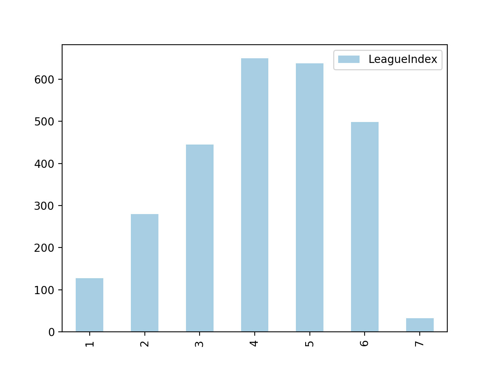

---

## I strongly suggest you read this part first

I'm going to do a simple linear regression on the variable provided in the dataset and try to visualize some problematic variables and try to make a final model with the most correlated variable. In the end, I will organize and make a kernel up on Kaggle.com if possible, so go to the link on the bottom for an organized report. 'Stream of Progress' tags are a progressive post that are going to talk about stuff that maybe aren't so worth your time.

**Finalized Post/Blog/Kernel**

* [For Kaggle](www.google.com)
* [For My Own Blog](www.google.com)

---

## Getting to Know the Data

There are total of 20 variables in the dataset. It's explained quite succinctly on the kaggle page ([Skillcraft Kaggle](https://www.kaggle.com/danofer/skillcraft/home)). I'm going to set the *League Index as the Dependent Variable* and *Other Variables as Independent Variable* first to get the gist of the dataset.

**Getting Data and Splitting Data**

import pandas as pd
import urllib.request as urllib
from sklearn.model_selection import train_test_split

# getting data
url = 'https://raw.githubusercontent.com/Jinwooooo/Kaggle-SC2' +
      '-Skillcraft-Regression-Analysis/master/data/raw-skillcraft.csv'
response = urllib.urlopen(url)
df_main = pd.read_csv(response)
response.close()

# splitting data
df_train, df_test = train_test_split(df_main, test_size=0.2, random_state=111)


First let's try to see if the league index follows a normal distribution curve. (If it doesn't follow, then it's highly likely going to be a waste of time)


import matplotlib.pyplot as plt

df_league_index_distr = (df_train['LeagueIndex'].value_counts()).to_frame()
df_league_index_distr.sort_index(inplace=True)
df_league_index_distr.plot(kind='bar',y='LeagueIndex',colormap='Paired')
plt.show()


It's skewed toward the higher LeagueIndex. Need to keep that in mind as we go on, but since it's somewhat of a normal distribution curve, I think it's okay to do a linear regression.

**1st Model (Full)**

import statsmodels.api as sm

# Dependent Variable
y = df_train[['LeagueIndex']]

# Independent Variable
removed_cols = ['GameID','LeagueIndex']
x_1 = df_train.drop(removed_cols, axis=1)

# 1st Model (Full)
model_1 = sm.OLS(y,x_1).fit()
print(model_1.summary())


You can notice I've dropped GameID, since it's intuitive it's gonna be random and will have no causation to the dependent variable whatsoever. So, the output comes like this.


OLS Regression Results                            
==============================================================================
Dep. Variable:            LeagueIndex   R-squared:                       0.948
Model:                            OLS   Adj. R-squared:                  0.948
Method:                 Least Squares   F-statistic:                     2695.
Date:                Tue, 04 Sep 2018   Prob (F-statistic):               0.00
Time:                        12:00:00   Log-Likelihood:                -3778.0
No. Observations:                2670   AIC:                             7592.
Df Residuals:                    2652   BIC:                             7698.
Df Model:                          18                                         
Covariance Type:            nonrobust                                         
========================================================================================
                           coef    std err          t      P>|t|      [0.025      0.975]
----------------------------------------------------------------------------------------
Age                      0.0229      0.005      4.808      0.000       0.014       0.032
HoursPerWeek             0.0098      0.002      5.647      0.000       0.006       0.013
TotalHours            -1.08e-06      1e-06     -1.076      0.282   -3.05e-06    8.89e-07
APM                     -0.0120      0.002     -4.987      0.000      -0.017      -0.007
SelectByHotkeys         97.7732     14.367      6.805      0.000      69.601     125.945
AssignToHotkeys        834.2688    117.474      7.102      0.000     603.918    1064.619
UniqueHotkeys            0.0321      0.009      3.408      0.001       0.014       0.051
MinimapAttacks        1099.5574    137.978      7.969      0.000     829.002    1370.113
MinimapRightClicks      -3.0813     60.373     -0.051      0.959    -121.464     115.301
NumberOfPACs           904.6219     51.368     17.610      0.000     803.896    1005.348
GapBetweenPACs          -0.0087      0.002     -5.160      0.000      -0.012      -0.005
ActionLatency           -0.0074      0.002     -3.883      0.000      -0.011      -0.004
ActionsInPAC             0.3072      0.031      9.954      0.000       0.247       0.368
TotalMapExplored        -0.0083      0.004     -2.318      0.021      -0.015      -0.001
WorkersMade            207.8367     42.068      4.941      0.000     125.348     290.326
UniqueUnitsMade         -0.0070      0.013     -0.528      0.597      -0.033       0.019
ComplexUnitsMade       259.6567    236.983      1.096      0.273    -205.034     724.347
ComplexAbilitiesUsed    69.7129     97.815      0.713      0.476    -122.088     261.514
==============================================================================
Omnibus:                       13.011   Durbin-Watson:                   2.010
Prob(Omnibus):                  0.001   Jarque-Bera (JB):               13.146
Skew:                          -0.166   Prob(JB):                      0.00140
Kurtosis:                       2.909   Cond. No.                     2.45e+08
==============================================================================

Warnings:
[1] Standard Errors assume that the covariance matrix of the errors is correctly specified.
[2] The condition number is large, 2.45e+08. This might indicate that there are
strong multicollinearity or other numerical problems.


It's common practice to remove p-values that are lower than 0.05 (of course adjustments are made depending on the result you are trying to achieve through linear regression). So I'm going to remove total of 5 independent variable (TotalHours, MinimapRightClicks, UniqueUnitsMade, ComplextUnitsMade, ComplexAbilitiesUsed)

**2nd Model (Removing insignificant p-value variables)**

# 2nd Model : Excluding Independent Variable w/ p-values lower than 0.05
removed_cols = removed_cols + ['TotalHours','MinimapRightClicks','UniqueUnitsMade',
                   'ComplexUnitsMade','ComplexAbilitiesUsed']
x_2 = df_train.drop(removed_cols, axis=1)
model_2 = sm.OLS(y,x_2).fit()
print(model_2.summary())



OLS Regression Results                            
==============================================================================
Dep. Variable:            LeagueIndex   R-squared:                       0.948
Model:                            OLS   Adj. R-squared:                  0.948
Method:                 Least Squares   F-statistic:                     3731.
Date:                Tue, 04 Sep 2018   Prob (F-statistic):               0.00
Time:                        12:00:00   Log-Likelihood:                -3780.5
No. Observations:                2670   AIC:                             7587.
Df Residuals:                    2657   BIC:                             7664.
Df Model:                          13                                         
Covariance Type:            nonrobust                                         
====================================================================================
                       coef    std err          t      P>|t|      [0.025      0.975]
------------------------------------------------------------------------------------
Age                  0.0223      0.005      4.691      0.000       0.013       0.032
HoursPerWeek         0.0098      0.002      5.655      0.000       0.006       0.013
APM                 -0.0122      0.002     -5.202      0.000      -0.017      -0.008
SelectByHotkeys     98.5245     14.098      6.989      0.000      70.880     126.169
AssignToHotkeys    853.8782    116.965      7.300      0.000     624.526    1083.231
UniqueHotkeys        0.0322      0.009      3.431      0.001       0.014       0.051
MinimapAttacks    1095.3560    136.800      8.007      0.000     827.112    1363.600
NumberOfPACs       903.0007     49.697     18.170      0.000     805.552    1000.449
GapBetweenPACs      -0.0085      0.002     -5.066      0.000      -0.012      -0.005
ActionLatency       -0.0079      0.002     -4.220      0.000      -0.012      -0.004
ActionsInPAC         0.3115      0.031     10.185      0.000       0.252       0.371
TotalMapExplored    -0.0077      0.003     -2.453      0.014      -0.014      -0.002
WorkersMade        215.7429     41.608      5.185      0.000     134.156     297.330
==============================================================================
Omnibus:                       13.781   Durbin-Watson:                   2.010
Prob(Omnibus):                  0.001   Jarque-Bera (JB):               13.935
Skew:                          -0.171   Prob(JB):                     0.000942
Kurtosis:                       2.910   Cond. No.                     1.04e+06
==============================================================================

Warnings:
[1] Standard Errors assume that the covariance matrix of the errors is correctly specified.
[2] The condition number is large, 1.04e+06. This might indicate that there are
strong multicollinearity or other numerical problems.


Looks a bit nicer now in terms of p-value for correlation. However, we still need to check upon other issues here. For next step I think I will have to check upon outliers in the data. Will come back to that on the next post :^).
