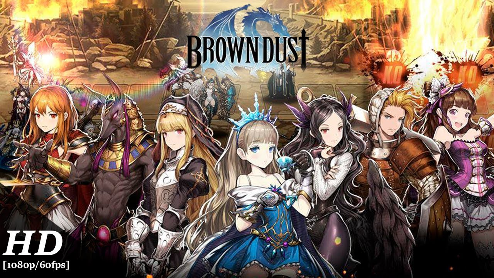

I play this mobile game called Browndust, a SRPG (Strategic Role Playing Game). Currently there are 6 servers : Korea, Japan, Taiwan, Asia, Europe and Global. I play in the Korea & Asia server. For most of Browndust related post, I will be referring to Korea which is few patches ahead of other regions. I will be making posts related strategies, unit reviews, formations, and etc. However, I generally do not enjoy making posts that are ephemeral (i.e. tier list).

If you are interested in my regular arena placements here are the particulars

**Deck Type** Granhildr Support Variation Formation
(Used to use 2 Row Formation Variation, but switched to Granhildr deck on July 2018)

**2018**

* August : Master I ~ Master III
* September : Master II ~ Grandmaster III
* October : Master III ~ Grandmaster III
* November : Master I ~ Grandmaster II
* December : Master I ~ Grandmaster III

**2019**

* January 1st Week : Master III ~ Master I

**2019 Feb and onwards**

No longer competitive in arena, mostly hoarding AC related items for future use (probably season 3). ***if you really like to know, I usally end up in sapphire due to the fact that I generally do not use Dominus Ictos (I do have them)***

---

## Basic

no post yet

---

## Intermediate

* [Brown Dust : Understanding Attack Priority](https://jinwooooo.github.io/jinwooooo-blog/browndust-understanding-attack-priority/)
* [Brown Dust : Immunity, Prohibition, Purification Interaction](https://jinwooooo.github.io/jinwooooo-blog/browndust-immunity-prohibition-purification-interaction/)

---

## Advanced

* [Brown Dust Arena Formation : 2 Row Variation Formation](https://jinwooooo.github.io/jinwooooo-blog/browndust-arena-formation-2-row-variation/)
* [Brown Dust Arena Formation : 3 Row Power Formation](https://jinwooooo.github.io/jinwooooo-blog/browndust-arena-formation-2-row-variation-extension-(3row)/)
* [Brown Dust Arena Formation : Granhildr Support Formation](https://jinwooooo.github.io/jinwooooo-blog/browndust-arena-formation-granhildr-support-formation/)
* [Brown Dust Arena Formation : 6 Turn Push Formation](https://jinwooooo.github.io/jinwooooo-blog/browndust-arena-formation-6-turn-push-formation/)
