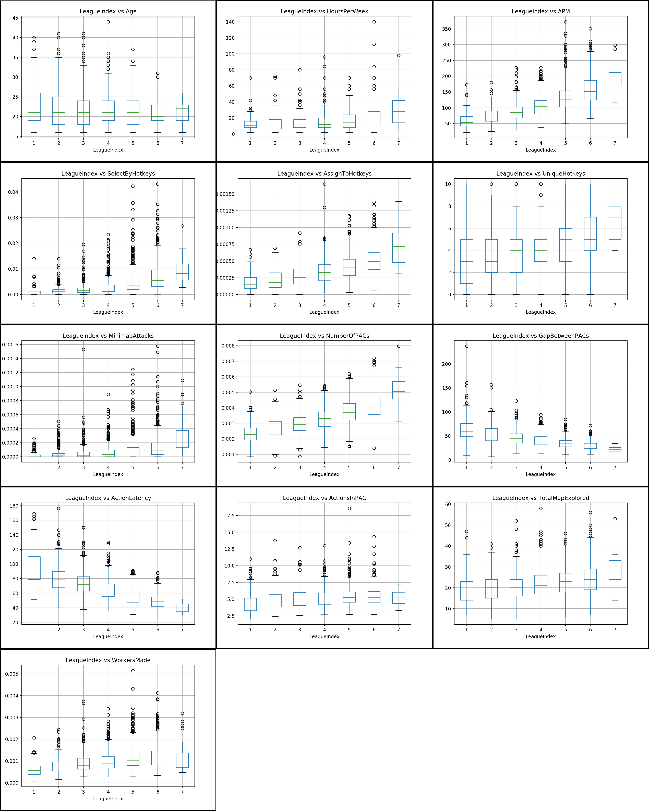

## I strongly suggest you read this part first

I'm going to do a simple linear regression on the variable provided in the dataset and try to visualize some problematic variables and try to make a final model with the most correlated variable. In the end, I will organize and make a kernel up on Kaggle.com if possible, so go to the link on the bottom for an organized report. 'Stream of Progress' tags are a progressive post that are going to talk about stuff that maybe aren't so worth your time.

**Finalized Post/Blog/Kernel**

* [For Kaggle](www.google.com)
* [For My Own Blog](www.google.com)

---

So I left off with 2nd Model and was going to go through outliers for each independent variable. However, I do want to write about the results of the 2 Models that are previously built.

**1st Full Model** was actually pretty good in terms of result. Adjusted R-Squared is 0.948 and Durbin-Watson is very close to 2. Skew and Kurtosis is close to 0 and 3 , respectively, which is a good indication. However, some values had p-values that were insignificant, so removing those variables in my opinion was the right move.

**2nd Model (insiginficant p-values removed)** almost same result as the full model. Since variables that were insignificant were removed this model would likely result in better model than the 1st Full Model when tested in the test set.

To be honest, it's possible to stop in the 2nd model because the independent variable is representing the train model very accurately. Probably no need to go further, but the purpose of this exercise is to refresh, so I will try to make a 3rd model depending on the outliers.

---

**Observing Outliers with Box and Whisker Plot**

# checking for outliers
dep_var = list(y)[0]
indep_var_list = list(x_2)

for indep_var in indep_var_list:
    df_train.boxplot(column=indep_var,by=dep_var)
    plt.title(dep_var + ' vs ' + indep_var)
    plt.suptitle('')
plt.show()


For me, I thought MinimapAttacks and SelectByHotkeys have more outliers than the rest, so I decided to remove them to see what happens. This is not a common practice by the way, usually you either 1. remove the outlying rows (which is discouraged as well since it means you are mingling with the data which in result may not reflect the real world) or 2. you just acknowledge the outliers and move on. Usually, the analyzing person or group should check on the outliers and see if it's actually a depiction of the real data or it is a mistake. If the ladder is certain, it's the correct move to drop the outlying data; otherwise, just acknowledge it.

**3rd Model (Removing variables with high number of outliers)**

# 3rd Model : Excluding certain variable with outliers that seem to be extreme
removed_cols = removed_cols + ['SelectByHotkeys','MinimapAttacks']
x_3 = df_train.drop(removed_cols, axis=1)
model_3 = sm.OLS(y,x_3).fit()
print(model_3.summary())



OLS Regression Results                            
==============================================================================
Dep. Variable:            LeagueIndex   R-squared:                       0.946
Model:                            OLS   Adj. R-squared:                  0.946
Method:                 Least Squares   F-statistic:                     4233.
Date:                Wed, 12 Sep 2018   Prob (F-statistic):               0.00
Time:                        12:00:00   Log-Likelihood:                -3833.2
No. Observations:                2670   AIC:                             7688.
Df Residuals:                    2659   BIC:                             7753.
Df Model:                          11                                         
Covariance Type:            nonrobust                                         
====================================================================================
                       coef    std err          t      P>|t|      [0.025      0.975]
------------------------------------------------------------------------------------
Age                  0.0292      0.005      6.091      0.000       0.020       0.039
HoursPerWeek         0.0111      0.002      6.330      0.000       0.008       0.015
APM                  0.0035      0.001      4.133      0.000       0.002       0.005
AssignToHotkeys   1040.0505    117.689      8.837      0.000     809.280    1270.821
UniqueHotkeys        0.0356      0.010      3.729      0.000       0.017       0.054
NumberOfPACs       612.9167     32.029     19.136      0.000     550.111     675.722
GapBetweenPACs      -0.0090      0.002     -5.300      0.000      -0.012      -0.006
ActionLatency       -0.0024      0.002     -1.413      0.158      -0.006       0.001
ActionsInPAC         0.1411      0.018      7.693      0.000       0.105       0.177
TotalMapExplored    -0.0050      0.003     -1.588      0.112      -0.011       0.001
WorkersMade        164.8810     41.841      3.941      0.000      82.836     246.926
==============================================================================
Omnibus:                       14.352   Durbin-Watson:                   1.989
Prob(Omnibus):                  0.001   Jarque-Bera (JB):               14.063
Skew:                          -0.157   Prob(JB):                     0.000884
Kurtosis:                       2.833   Cond. No.                     8.68e+05
==============================================================================

Warnings:
[1] Standard Errors assume that the covariance matrix of the errors is correctly specified.
[2] The condition number is large, 8.68e+05. This might indicate that there are
strong multicollinearity or other numerical problems.


Seems that removing the variable I selected yielded no fruit. Seems like going back to Model 2 is the right choice. However, I'm going to make a Model 4 by removing the insignificant p-value from Model 3.

**4th Model (Removing insignficant p-values from 3rd Model)**

# 3rd Model : Excluding certain variable with outliers that seem to be extreme
removed_cols = removed_cols + ['ActionLatency','TotalMapExplored']
x_4 = df_train.drop(removed_cols, axis=1)
model_4 = sm.OLS(y,x_4).fit()
print(model_4.summary())



OLS Regression Results                            
==============================================================================
Dep. Variable:            LeagueIndex   R-squared:                       0.946
Model:                            OLS   Adj. R-squared:                  0.946
Method:                 Least Squares   F-statistic:                     5169.
Date:                Wed, 12 Sep 2018   Prob (F-statistic):               0.00
Time:                        12:00:00   Log-Likelihood:                -3835.3
No. Observations:                2670   AIC:                             7689.
Df Residuals:                    2661   BIC:                             7742.
Df Model:                           9                                         
Covariance Type:            nonrobust                                         
===================================================================================
                      coef    std err          t      P>|t|      [0.025      0.975]
-----------------------------------------------------------------------------------
Age                 0.0258      0.004      6.043      0.000       0.017       0.034
HoursPerWeek        0.0110      0.002      6.259      0.000       0.008       0.014
APM                 0.0040      0.001      5.034      0.000       0.002       0.006
AssignToHotkeys  1028.6848    117.491      8.755      0.000     798.303    1259.067
UniqueHotkeys       0.0330      0.009      3.492      0.000       0.014       0.052
NumberOfPACs      590.7042     28.539     20.698      0.000     534.744     646.664
GapBetweenPACs     -0.0111      0.001     -9.473      0.000      -0.013      -0.009
ActionsInPAC        0.1266      0.016      7.852      0.000       0.095       0.158
WorkersMade       167.5466     41.811      4.007      0.000      85.562     249.531
==============================================================================
Omnibus:                       14.168   Durbin-Watson:                   1.988
Prob(Omnibus):                  0.001   Jarque-Bera (JB):               13.879
Skew:                          -0.156   Prob(JB):                     0.000969
Kurtosis:                       2.833   Cond. No.                     7.83e+05
==============================================================================

Warnings:
[1] Standard Errors assume that the covariance matrix of the errors is correctly specified.
[2] The condition number is large, 7.83e+05. This might indicate that there are
strong multicollinearity or other numerical problems.


There isn't much difference from Model 2, but Model 4 is slightly worse by just comparing Adjusted R-squared, AIC/BIC, Durbin-Watson, Skew, Kurtosis.

Think I will settle with Model 2 and Model 4 (I could use Model 1 and Model 3 as well, but due to insignificant p-value I will have to exlcude them later and they are highly likely be an inferior model to the other 2 I have selected). Compare the 2 models with ANOVA then choose the better one (I'm going to say Model 2 is probably going to be better by an inch). After choosing the model, will do final tests to insure that the model is viable (i.e. multicollinearity)
