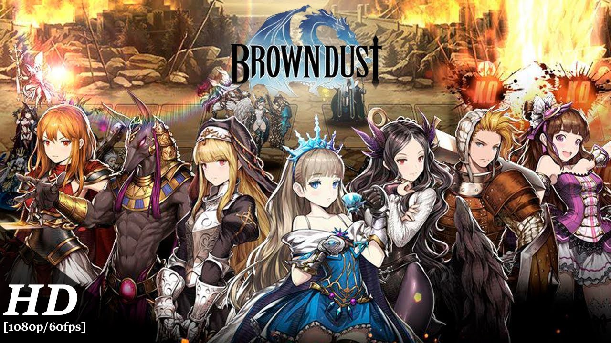

I play this mobile game called Brown Dust, a SRPG (Strategic Role Playing Game). Currently there are 3 servers : Korea, Japan, and SEA. I play in the Korea server which is few patches ahead of the other regions. I will be making posts related strategies, unit reviews, formations, and etc.

If anyone who is already playing the Brown Dust. I usually end my regular arena as Master I ~ Master III and use Granhildr Support Variation Formation. I used to use 2 Row Variation Formation, but switched few months ago. Currently focused on getting rewards on World Boss and Guild War contents.
