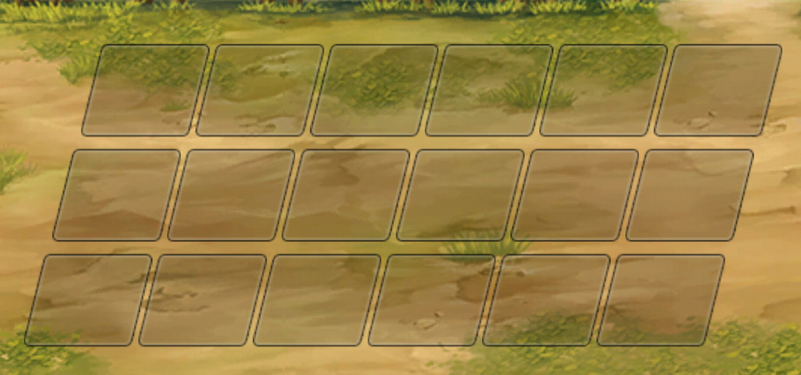
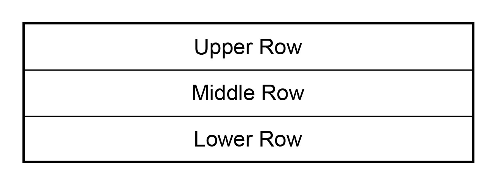
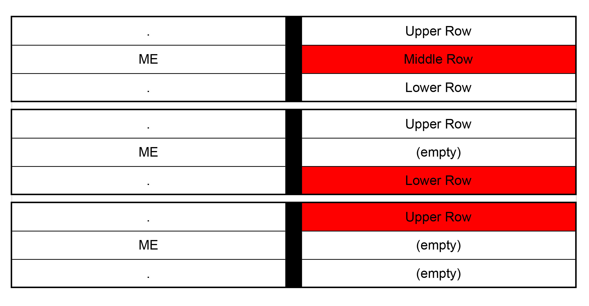
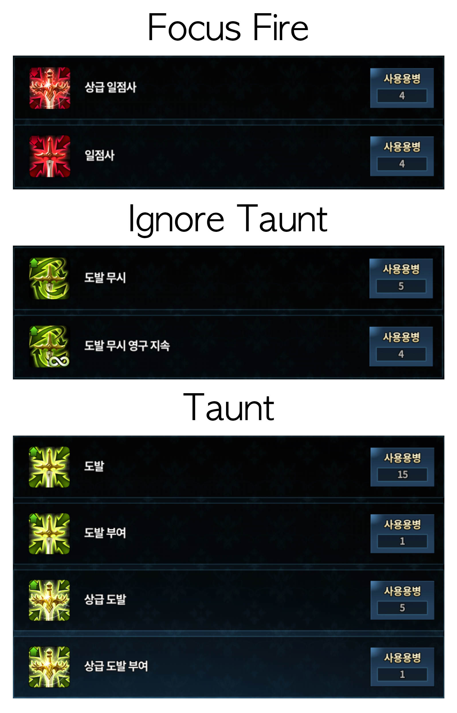
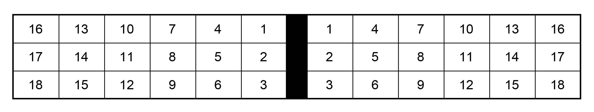
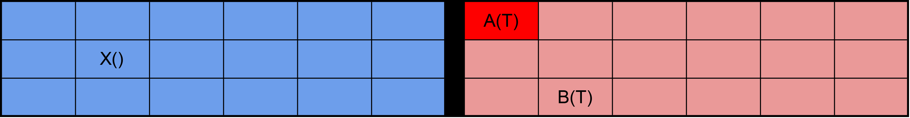
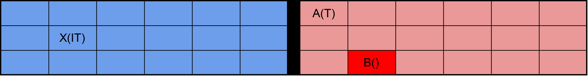
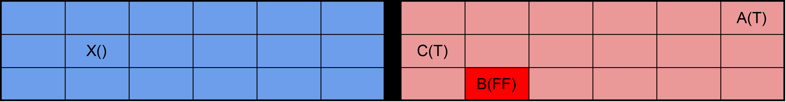

Most of my posts aren't going to actually introduce Brown Dust. You will have to be somewhat familiar with the game to understand what I'm posting about (if the tags include 'Basic', that might be a post that can be understood without even knowing what Brown Dust is, otherwise, you'd have to know the game at least a little)

---

## Introduction

Unlike most other games, Brown Dust has a 3x6 matrix like board (see image below). Not all cells are used, which can lead to strategic formations. In this post, I will only elaborate on how ***attack priority*** works on the board.

'So which row/cell does the unit attack?' will be the main topic elaborated. In order to ease the explanation, I'm going to simplify the board into just rows for now.

---

## Attack Priority (w/ Rows)

If your current unit is on the Middle Row and if there is a unit on the enemy's Middle Row, then it's pretty intuitive that it attacks the unit on the enemy's Middle Row. However, what happens if there are no units on the enemy's Middle Row, but on Upper Row and Lower Row? Well, in Brown Dust, the priority goes **down**. For example,

It will attack the row that's colored red. The only way to forcefully change the row it's naturally going to attack is by using the skills :

* Focus Fire
* Ignore Taunt
* Taunt

---

## Focus Fire / Ignore Taunt / Taunt

(because I use the KR client, it's in korean, but I think you guys can figure it out with the icon image)

**IMPORTANT**

How I ordered these skills are related to priority. In a sense, if there is a ***Focus Fire*** active on the board, ***it doesn't matter if there are taunts or ignore taunts ability active, because it will target the unit that has the Focus Fire ability active***. If there are no ***Focus Fire*** ability active on the board, then ***Ignore Taunt*** is up next. Even if there is taunt on board, it will attack the same cell(s) on the board even if there is a ***Taunt*** active on board. If there are no ***Focus Fire*** and ***Ignore Taunt*** available on the board, then ***Taunt*** takes highest priority and any unit that attack will attack the unit that has ***Taunt*** active.

For the sake of simplicity say there are only ***Focus Fire*** or only ***Taunt*** on the board. Everything seems fine if there is only 1 ***Focus Fire*** or ***Taunt*** on the map, but what happens if there are 2? For this we can no longer use only rows, but we will have to consider columns as well. Here is the ***Focus Fire*** and ***Taunt*** priority shown with the board.

(Lower the number, the higher the priority)

The question I had when I first saw this focus fire and taunt priority board was : ***Does the position (cell) of the unit that is about to attack matter?*** The answer is **NO**. The only factor that's taken into account is the position of the unit that currently has ***Focus Fire*** or ***Taunt*** active.

Perhaps, examples will help...

* X = the unit that is going to attack
* A,B,C = the unit that is going to receive the attack (i.e. enemy unit)
* () = no skills active
* (FF) = Focus Fire active
* (IT) = Ignore Taunt active
* (T) = Taunt active

**Example 1**

Pretty straight forward. It follows the priority as shown beforehand.

**Example 2**

Due to ***Ignore Taunt*** by unit X, it will attack B even though A as ***Taunt*** active.

**Example 3**

If A didn't have ***Focus Fire***, it will attack C. However, A's ***Focus Fire*** takes higher priority, so it will attack A.

**Example 4**

Now C has ***Focus Fire*** and A still has ***Focus Fire***. When A and C both don't have ***Focus Fire***, ***Ignore Taunt*** takes over and attacks C, but since both has ***Focus Fire*** active it follows the priority shown previously, so it will attack A.

**Example 5**

Even without ***Ignore Taunt***, it will attack ***Focus Fire*** active unit.

---

Before concluding, I'd like to say that ***Focus Fire*** ability isn't activated by the enemy. It's a debuff given to an enemy unit by an ally unit. This is why it has higher priority. Since there's no point of having a ***Focus Fire*** ability without a ***Ignore Taunt*** (what's the point of having it when you are gonna give ***Focus Fire*** to an enemy unit ***Taunt*** unit that already has the highest priority?), you will find that every single unit with ***Focus Fire*** ability have ***Ignore Taunt*** ability as well.

If there are any confusing parts or any parts you'd like more elaboration, leave a comment or contact me in any ways possible :^)
