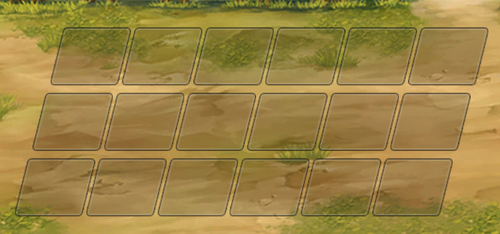
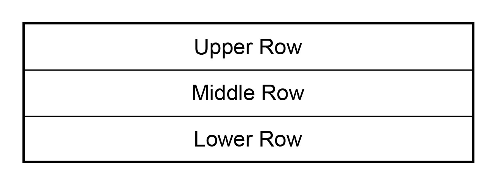
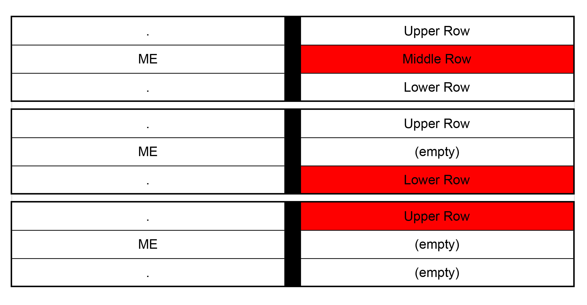
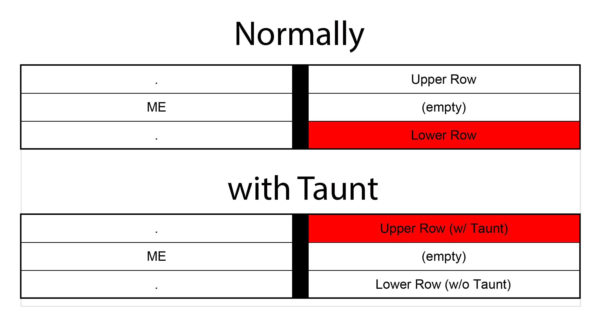
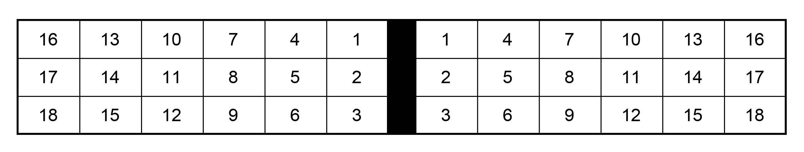

### This is not an Introduction

Most of my posts aren't going to actually introduce Brown Dust. You will have to be somewhat familiar with the game to understand what I'm posting about (if the tags include 'Basic', that might be a post that can be understood without even knowing what Brown Dust is, otherwise, you'd have to know the game at least a little)

---

Unlike most other games I have encountered, Brown Dust has a 3x6 matrix like board (see image below). Not all cells are used, which can lead to strategic formations. In this post, I will only elaborate on the basics of the map.

The mechanics here that should be highlighted is which row does the unit attack. I'm going to simplify the board into just rows.

If your current unit is on the Middle Row and if there is a unit on the enemy's Middle Row, then it's pretty intuitive that it attacks the unit on the enemy's Middle Row. However, what happens if there are no units on the enemy's Middle Row, but on Upper Row and Lower Row? Well, in Brown Dust, the priority goes **down**. For example,

It will attack the row that's colored **red**. The only way to forcefully change the row it's naturally going to attack is by using the ability **taunt**. So with taunt the row/cell attack priority can be modified as shown below.

But what happens if there are more than 1 taunt? (i.e. 2 units with active taunt) In this case it will attack the unit with highest priority according to the board below. (note that your unit position on the board does not matter, the position of enemy's unit with active taunt is the only factor that needs to be considered)

If there are any confusing parts or any parts you'd like more elaboration, leave a comment or contact me in any ways possible :^)
