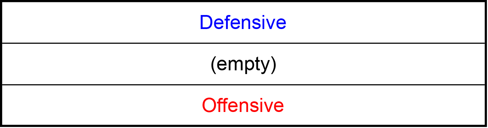
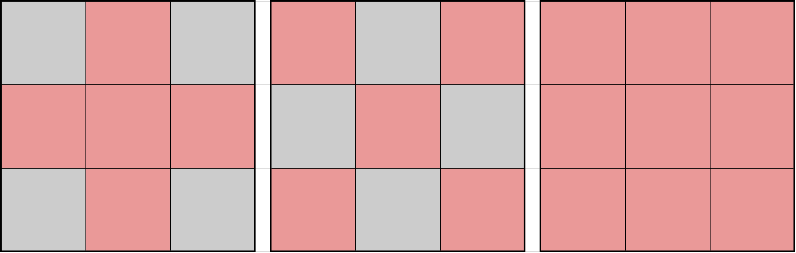

This post isn't for players who just started playing Brown Dust. You need to have some experience in Brown Dust Arena contents. I will not go in length to explain unit skills and mechanics.

---

## Chapter 1 : Defensive / Offensive Row

The 2 Row Variation Formation will only be using 2 rows out of 3. One of the row is Defensive row (aka Dummy row) and the other row is Offensive Row.

**Defensive Row**

You can think of this row's purpose as a sandbag. It's supposed to take heavy fire from the enemy's units. The beefier the sandbag, the more time/turn it allows ally's offensive unit to deal damage to enemy's units and formation.

***Based on September 2018 (KR Server)***
The most popular units used for Defensive Row are as follows:

1. **Lucius** The BEST sandbag in the game.
2. **Arkan** Above average sandbag.
3. **Lilian** Conditional sandbag. (highly likely to be very effective)
4. **Aron** One of the most reliable damage reflector w/ or w/o taunt.
5. **Caylen** New unit, need more data and experience to evaluate, but she's gaining popularity.
6. **Seir** Reliable taunt unit with conditional damage reflection.

**Offensive Row**

You typically use the most heavily invested offensive unit in this row. Most of the time the offensive units are placed in the middle and supports and extra defensive units are located at the front or the back (the placement in the Offensive Row heavily depends on the current meta). Because there are many offensive units, I will not be showing a example list. However, I do believe elaborating on support is important.

**Usually 2 Row Variation Formation lacks durability compared to other formations.** Since 2 Row Variation Formation does not like a elongated fights, it puts a lot of importance on support units. I'd probably even say that you having least 2 of the top tier supports with this formation is a requirement (the choice of top tier supports vary depending on your offensive units and formation).

***Based on September 2018 (KR Server)***
The most popular support units used are as follows:

1. **Repithea** Best support unit if her skill level is 10. Otherwise mediocre.
2. **Benaca** One of the two best non-legendary support unit.
3. **Mary** The other best non-legendary support unit.
4. **Veronica** Very good if the first unit that attacks has good AOE.
5. **Michaela** Conditional support unit. If used with right unit she's very effective.
6. **Ceres** The only ★4 support unit in this list. Very effective for 2 row formation variation and the key skill that she has is the stat reducing effect immunity.

***Combinations***

If your offensive units are based on Crit Rate + Crit Damage:
* Benaca + Mary
* Benaca + Ceres
* Mary + Ceres

If mixed :
* Repithea + Ceres
* Repithea + Benaca
+ Repithea + Mary

If based on Att Damage :
* Repithea + Michaela
* Mary + Michaela
* Michaela + Ceres

If the first unit that launches attack has very good AOE:
* Repithea / Mary + Benaca / Michaela + Veronica (x / y means you either use x or y, not use x and y)

---

## Chapter 2 : Traditional 2 Row Formation w/ Example

Let's simply just look at theoretically how traditional 2 row formation in an abstract form.

There's a reason for the placement of offensive and defensive row. It will be elaborated on the next chapter (2 row formation variations), so just take it as it is for now. I just got one random Grandmaster user who is using the traditional 2 row formation to show you how it will look in the game.

If you can see from this example, all the top tier defensive and support units that I listed above are used. This deck is likely start with Ceres → Benaca → Eliza.

---

## Chapter 3 : 2 Row Formation Variations

There are total of 3 variations for 2 row formation. Here is another abstract depiction.

Any other variation that only uses 2 rows but does not follow the 3 abstract sample as shown above are likely to be inefficient. Explanation requires some rudimentary probability and statistics, but I will try to provide as many figures and examples to make it clean and simple.

So let's take 2 row formation variation that is not the one of the 3 as shown above.

Let's test this 'wrong' 2 row formation variation with the other 3.

If the cell color is colored lightly blue it means it's a favorable for trade for ally and if it's colored lightly red it means it's a favorable trade for enemy. As you can see when it's up against Traditional and Variation-2, it doesn't really present a problem. However, if you look at Variation-1, it's advantageous to the enemy because ally defensive row cannot fulfill its role.

If you test anyone of traditional, variation-1, variation-2 against each other, you'd find that in the end, the scores are even.

The key part to understand in the 2 row formation variation is that the defensive row is always on top of the offensive row. If you don't know much about attack priority, it's going to be hard to understand. So, I suggest you to read the post I already uploaded that elaborates on attack priority :^).

**This part includes some numbers, so if you don't like numbers you can skip**

For the sake of the explanation, I'm going to assume that enemy places their offensive row in the upper/middle/lower row with a 1:1:1 ratio. (i.e. if there are total of 99 enemies, 33 enemies will have a offensive row on the upper row, 33 enemies will have a offensive row on the middle row, 33 enemies will have a offensive row on the lower row)

So if you do any one of the traditional, variation-1, variation-2, then you have a 66% chance for the enemy offensive row to attack ally defensive row and 33% chance for
enemy offensive row to attack ally offensive row. But, if you do one of the three variation, then you will have a reverse situation, which is bad for you.

---

## Chapter 4 : Why Traditional 2 Row Formation has the title 'Traditional'

You may have wondered why out of 3 variations, one of them actually have a special name. The reason is simple : AOE. In Brown Dust there are unique AOE and the following AOE can be seen very frequently in arena.

It's possible to state that traditional 2 row formation is somewhat immune to these AOEs. Usually if a popular offensive unit has one of the AOE shown above, many top tier users will modify their 2 row formation into the traditional variation.

---

## Final Thoughts

While the traditional, variation-1, variation-2 are the statistical advantageous 2 row formation variation, it doesn't mean it's always the right to use them. It's very important to note that arena is a PvP content. **For you to win you ONLY have to be 1 step ahead of opponent.**

If it just so happens that out of 100 users, 99 users are using the traditional 2 row formation variation. Then using the 'Wrong Variation' that I have used as a sample that's not very good isn't actually a bad formation to use at that point in time.

Ah, also I play on the KR server, so I might get some names of the units wrong... you can leave a comment or whatever to notify me if you see one.
