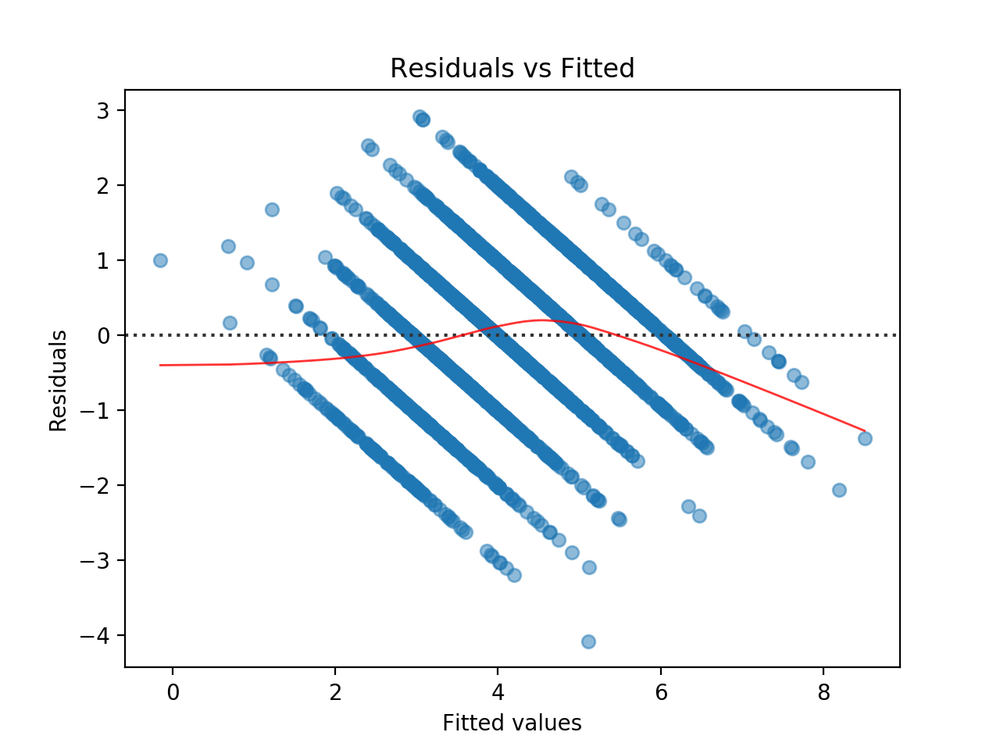
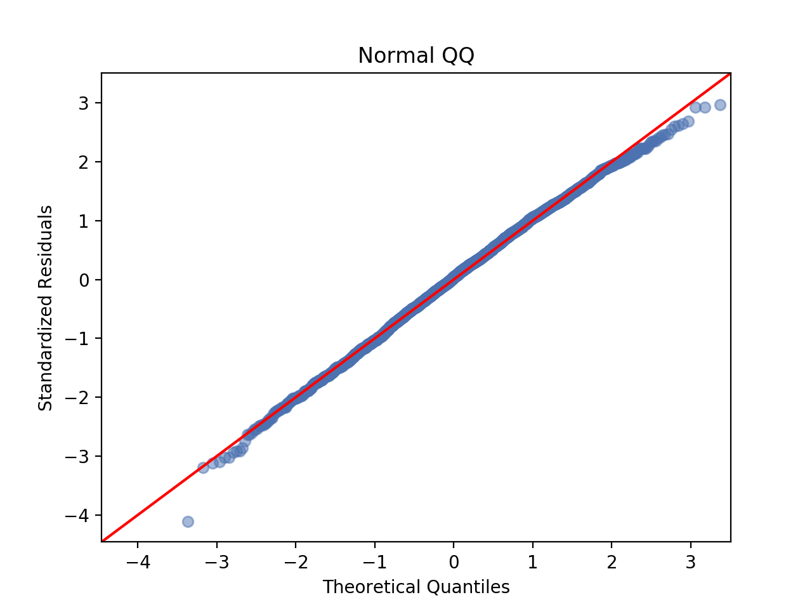

--
layout: post
title:  "Reviewing Linear Regression - Part 4"
image: ''
date:   2018-09-18 00:12:00
tags:
- Review
- Linear Regression
- Stream of Progress
- Python
description: 'Reviewing Linear Regression for Practice. Using Kaggle Public Dataset : Skillcraft'
categories:
- Linear Regression
---

## Read me first

I'm going to do a simple linear regression on the variable provided in the dataset and try to visualize some problematic variables and try to make a final model with the most correlated variable. In the end, I will organize and make a kernel up on Kaggle.com if possible, so go to the link on the bottom for an organized report. 'Stream of Progress' tags are a progressive post that are going to talk about stuff that maybe aren't so worth your time.

**Finalized Post/Blog/Kernel**

* [For Kaggle](www.google.com)
* [For My Own Blog](www.google.com)

---

## Residual Analysis

Let's start with looking at the graphs (will only do Residual vs Fitted and Normal Q-Q).

**Residual vs Fitted**


import seaborn as sns

# Fitted vs Residual (weird...)
fr_plot = plt.figure(1)
fr_plot.axes[0] = sns.residplot(x=model_7.fittedvalues, y=model_7.resid,
                          lowess=True, scatter_kws={'alpha': 0.5},
                          line_kws={'color':'red', 'lw':1, 'alpha':0.8})

fr_plot.axes[0].set_title('Residuals vs Fitted')
fr_plot.axes[0].set_xlabel('Fitted values')
fr_plot.axes[0].set_ylabel('Residuals')

plt.show()


Weird... I think there are 7 separate lines due to 7 different leagues. Think I have to come back later to find out what's going on.

**Normal Q-Q**


from statsmodels.graphics.gofplots import ProbPlot

QQ = ProbPlot(model_7.resid)
qq_plot = QQ.qqplot(line='45', alpha=0.5, color='#4C72B0', lw=1)

qq_plot.axes[0].set_title('Normal QQ')
qq_plot.axes[0].set_xlabel('Theoretical Quantiles')
qq_plot.axes[0].set_ylabel('Standardized Residuals')

plt.show()


Except the one data point that's at the left bottom seems a bit bad, but overall the graph seems to fit fine.

So there are 4 assumptions to be analyzed

1. Normality
2. Heteroscedasticity
3. Independence
4. Linearity

**1. Normality**

For visual confirmation, we just need to look at Normal QQ graph. If the data points are near the linear red line, then it usually satisfies the normality assumption. To get a number for this, it's possible to get the correlation. (I'm not sure how to do this on Python, in R you could just use the model summary to get it)

It's also possible to use Shapiro-Wilk normality test.


stats.shapiro(model_7.resid)



(0.998132050037384, 0.0032792764250189066)


Err... since the p-value is lower than 0.05, it shows a strong evidence that the Null Hypothesis is not supported. In other words, it fails the Shaprio-Wilk normality test. So I've googled a bit and found out Shaprio-Wilk normality test is sensitive, and looking at the Normal Q-Q plot is usually more reliable.

After reading some StackOverflow posts, seems like Anderson-Darling is a better normality test in my case due to the size of samples.


anderson_result = stats.anderson(model_7.resid)
anderson_result[1][2]



0.786


Since the p-value is higher than 0.05, it shows a strong evidence to not reject the Null Hypothesis. So it passes this normality test.

**2. Heteroscedasticity**

Well... just by looking at the Residual vs Fitted Graph, we can already kind of conclude that heteroscedasticity exists. Just for the sake of practice I wanted to try a NCV test, but it seems python doesn't support this (really shows R is better in linear regression...).

**3. Independence**

This one is already done. We use the Durbin-Watson value we got from the OLS summary. The value was very close to 2, so it already satisfies the Independence test.

**4. Linearity**

Ermm... will come back to this later after the test set.

---

Predicting with Test Set left! (and more additional studies...). When I was studying linear regression, a senior student told me that R is much better with linear regression and I could feel that heavily throughout the process. Should stick with R for linear regressions and simple machine learning (R is very slow, if you do a kNN with R few MB of data, it almost takes half of a day to calculate...).
