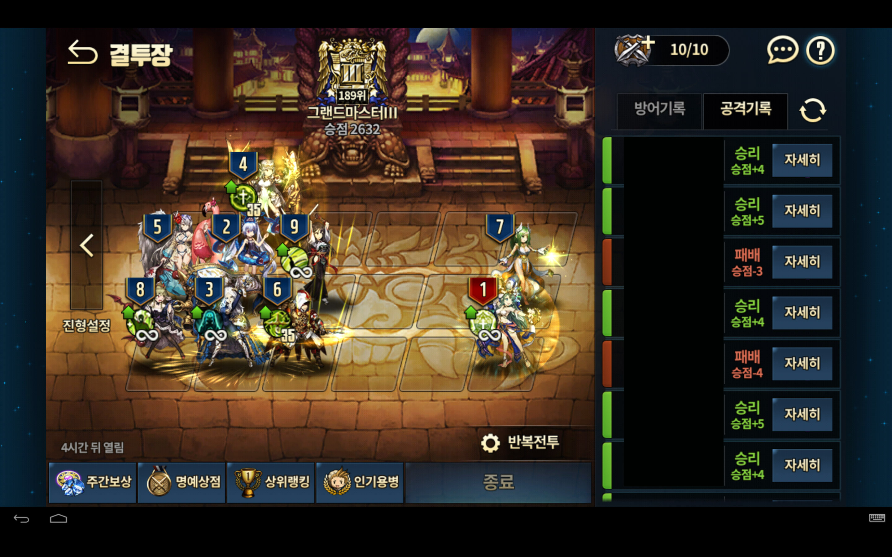
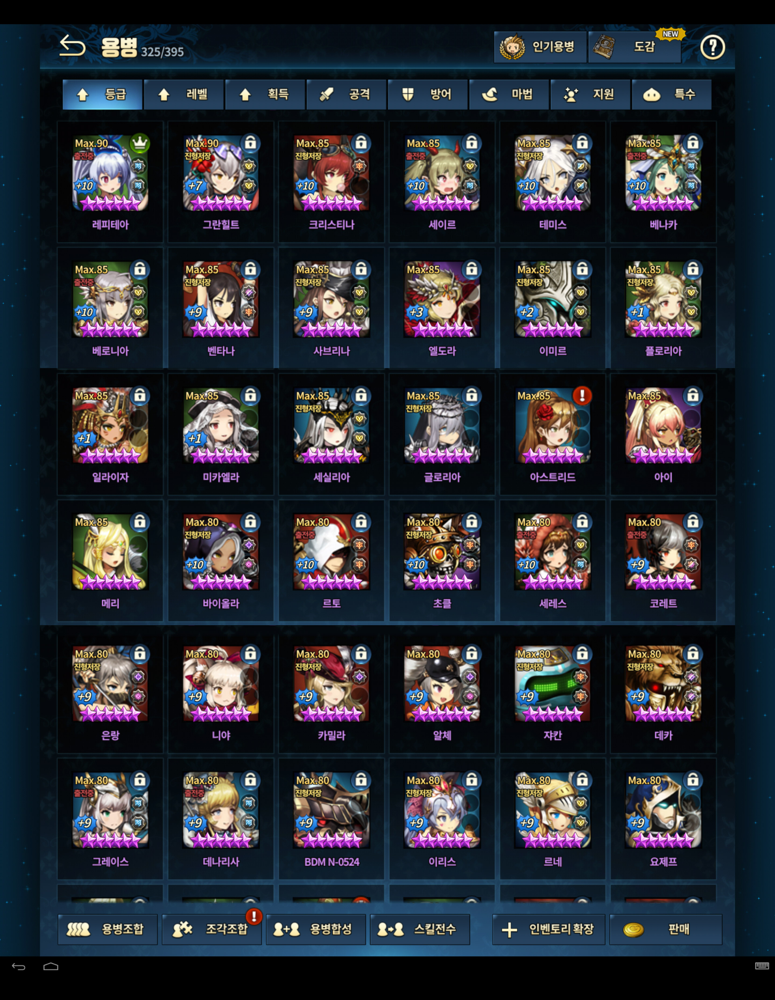

This is a **beta mode**, so there might be abrupt changes '^'.

Sorry, I'm currently busy and the current structure seems quite hard for me to make a good recommendation. I will try make a more formal one during winter break! Sorry :'(

---

## Instruction

**Currently not replying to comments, will try to make an upgraded version during winter break**

On the comment, you need to give me the following:

* **(MUST)** Your current arena formation

e.g.

* **(MUST)** Your top 6 rows of of units (arranged by default ordering)

e.g. (I photoshopped, but you don't have to, you can just insert 3 images)

* **(Optional)** What you want to achieve
e.g. My goal is to reach Crystal.
