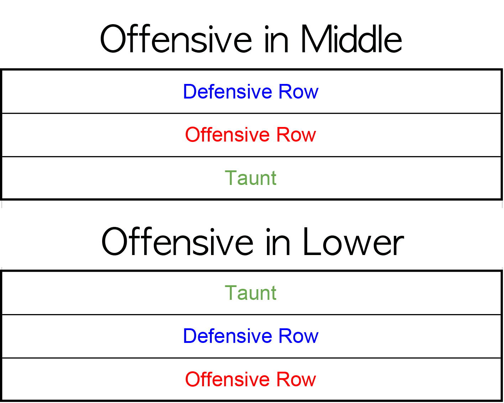

This post isn't for players who just started playing Brown Dust. You need to have some experience in Brown Dust Arena contents. I will not go in length to explain unit skills and mechanics.

---

**(2019 May Update)**
Note that the unit mentioned in this posts are somewhat outdated. I've added ***(Updates)*** on completely wrong evaluations. However, I am not willing to periodically update the post, so please try to understand and take away the abstract idea and concept of the 3 Row Power Formation.

---

## Prerequisite & Abstract

If you aren't familiar with [2 Row Variation Formation](https://jinwooooo.github.io/jinwooooo-blog/browndust-arena-formation-2-row-variation/), I suggest you go read it first, because this formation is an extension.

If you are familiar, the variation-1 and variation-2 has a weakness for AOE. This is why the 3 row formation started in KR server. It allows for the offensive row to be placed in the middle and lower row, but is less impacted by the AOE. KR server users call it **3 Row Power Formation**. The concept is very similar to 2 row variations.

---

## Chapter 1 : Abstract Depiction of 3 Row Power Formation

In 2 Row Variation Formation, I divided into 2 big chunks : Offensive and Defensive Row. For this formation, there will be **3 big chunks : Taunt, Defensive, and Offensive**.

And the placement of these abstract rows must follow :

* On top of Offensive Row, there must be a Defensive Row
* On top of Defensive Row, there must be a Taunt Row

(I'm going to exclude when Offensive Row is the Upper Row (i.e. Traditional 2 Row Variation) because the point of using 3 Row Power Formation is to reduce the disadvantage of being exposed to AOE)

Here is a abstract depiction

If you fully understood why 2 row variation formations must have defensive row on top of the offensive row, you will probably have understood it here as well. **If you go against an enemy who has an offensive row that is one row above your offensive row, you NEED a sandbag!**

Also important : **In terms of order, taunt should go last to avoid the large AOE from mages.**

---

## Chapter 2 : Taunt Row Units

You usually have total of 1 unit on the taunt row (sometimes 1 support unit is placed in this row as well). It's also important that this taunt unit is very efficient on itself. In KR there are usually 2 units that are very suitable for the role.

1. **Aaron** His damage reflect is a permanent skill
2. **Seir** She's very tanky, has immunity before attack, also has a dmg/curse skill that's permanently on
3. **(S) Zakan** He's not very good, due to very short taunt... but he's probably the only ★4 unit that's good in this position

These are units that will probably do well regardless of the meta (except in meta where first unit to launch attack is viola). For better performance, you should be using units that are suitable to the current meta.

---

## Chapter 3 : Defensive Row Units

The list is pretty much the same from the 2 row variation formation.

1. **Lucius** He's one of the reason why this formation started to get popular
2. **Arkan** Lucius is a hard unit to get, so users w/o Lucius can use him instead
3. **Lilian** She's one of the reason why this formation started to get popular as well. She can easily reach 100% armor when her skill level is +3. Also if she is attacked multiple times before she attacks, she's can do terrible terrible damage.

---

No chapter for Offensive Row just like 2 row variation formation, making a list for offensive units would be too long and pointless.

---
## Chapter 4 : Examples

These are random Grandmaster users in KR Server who uses the 3 Row Power Formation.

This one is the offensive row that is placed in the lower row. The starting order is Michaela → Nartas → Alec.

2 Support units for maximum wreckage. The starting order should be Michaela → Nartas → Alec.

Offensive row placed in the middle row. The starting order is Ceres → Mary → Hanya. Hanya is a upgraded version of Eunrang (he hits from the back, but he hits total of 3 cells while Eunrang only hits 2 cells).

---

## Final Thoughts

While it was popular for the last few weeks, it's slightly losing popularity due to the increase of Granhildr's Support Variation Formation users in the grandmaster tier. This formation has a very high winrate when it goes first, but a very low winrate when it goes second.

If you like going super ham, this formation is recommended.
