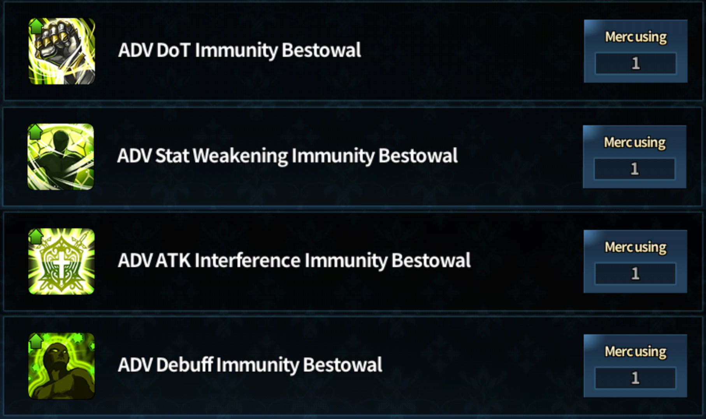
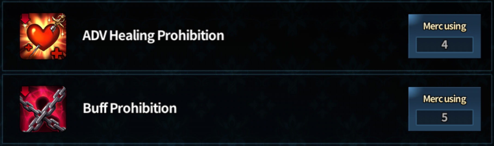
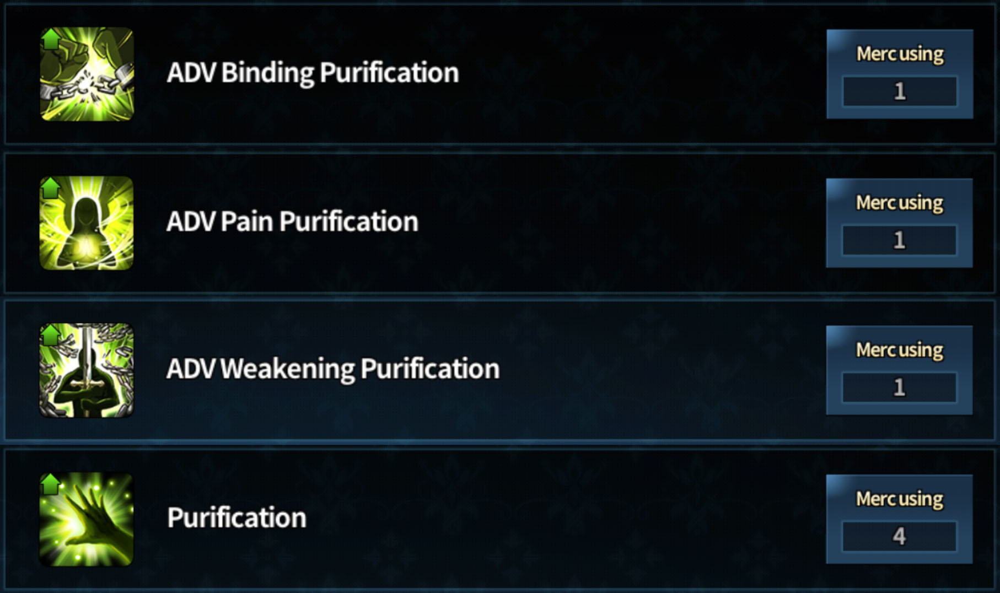

Most of my posts aren't going to actually introduce Brown Dust. You will have to be somewhat familiar with the game to understand what I'm posting about (if the tags include 'Basic', that might be a post that can be understood without even knowing what Brown Dust is, otherwise, you'd have to know the game at least a little)

---

## Introduction

Many users who are quite new to this game gets surprised with specific interactions in game because they sound like it's supposed to work like X, but it actually works like Y.

Lets first start with getting to know what Immunity, Prohibition, and Purification are. While on the way I will briefly explain how they interact. Because an plain explanation may still leave some users confused, I will finish off by giving an analogy in the hopes of giving a more easier depiction of the interaction and specific examples to clarify.

---

## Immunity

Before I go in lengths here, I will only consider cases where immunity is bestowed and are ADV (Advanced). The reason why I want to use ADV is because when these interact with Prohibition and Removal, only the immunity is left unaffected, the extra damage reduction your unit is supposed to get will not go through or removed.

So total of 4. So you need to think these immunity as neutral (i.e. think of it as 0). You cannot stop from a unit from getting the immunity bestowal. Even if a unit is under the **Buff Prohibition** units will still be getting the immunity bestowal and the units will be able to utilize the immunity effects. BUT, if under the effect of **Buff Prohibition** it will not be able to get the additional effect from the ADV Immunity (usually damage reduction).

---

## Prohibition

There are only 2 prohibition.

Before explaining the 2 prohibition, I'd like to highlight that **the only way to stop prohibition is DEBUFF REFLECTION (which only Granhildr has)**, otherwise there is no way to stop getting these effect onto your unit.

Healing prohibition stops enemy from getting healed by a skill that is labelled as healing. Basically, **if a skill is not labelled as healing, but has a healing factor, it will go through**. In current KR server, only 2 skills is able to go through, which are : 1st skill for Sabrina and 1st skill for Benaca (will add the benaca's skill image when it's released in Global Server). ***If you are interested, Sabrina's skill is labeled as barrier and Benaca's skill is labeled as stat enhancement. (funny interaction : you can actually remove Sabrina's 1st skill with protection nullifier)***

Buff Prohibition is like multiplying 0 to any positive number. Anything positive buff coming towards a unit that's under buff prohibition will not get nothing. **However**, as I mentioned before, if a coming effect is neutral (i.e. 0), it will not be prohibiting that effect.

---

## Purification

Just like immunity, these are labelled as **positive effects**. You have to think of them as neutral.

I don't think further explanations are required here.

---

## Analogy

Perhaps an analogy might help. body = unit, clothes = positive buffs, harmful effect on body = negative buffs.

* **Getting an positive buff (e.g. stat enhancement, damage reduction, etc)** is like putting clothes on. Removing positive buff (i.e. nullifier) is like removing the clothes.

* **Prohibition** is basically stopping the unit from putting clothes on (for healing prohibition, it'd be specific clothes). If the clothes are already on, they will not remove the clothes, but the units clothes can be removed by another factor (i.e. enemy nullfier, expire, etc.)

* **Immunity** stops enemy unit from hurting your unit's body (or specific part of the body for specific immunity), but it doesn't interact with clothes.

* **Purification** would be removing harmful stuff on the unit's body, but not the clothes.

---

## Examples

I'm going to simplify for simple scenarios
* **Arines** 1 positive buff (ATK Boost Bestowal)
* **Angelica** 1 prohibition (Buff Prohibition)
* **Frederica** 1 nullifier (Nullifier)

**1. Simple Scenario (Arines + Aie vs Angelica)**

Arines gives ATK Boost Bestowal to Aie before enemy attacks.

* **Arines** gives ATK Boost Bestowal
* **Angelica** Aie gets Buff Prohibition effect, but the ATK Boost Bestowal still effective on Aie.

Arines gives ATK Boost Bestowal to Aie after enemy attacks.

* **Angelica** Aie gets Buff Prohibition effect
* **Arines** Aie is under Buff Prohibition effect before the ATK Boost Bestowal, so Aie cannot receive ATK Boost Bestowal from Arines.

**2. Simple Scenario (Arines + Aie vs Frederica)**

Arines gives ATK Boost Bestowal to Aie before enemy attacks.

* **Arines** gives ATK Boost Bestowal
* **Frederica** Frederica's Nullifier will strip ATK Boost Bestowal from Aie.

Arines gives ATK Boost Bestowal to Aie after enemy attacks.

* **Frederica** Since Aie has no buffs to be removed, so Aie just receives damage from Frederica.
* **Arines** is able to give ATK Boost Bestowal to Aie.

Time for a complex one!
* **Refithea** has 3 positive buffs (Glutti + Barrier + Crit Rate) and 1 removal (Purification).
* **Seir** has PERM Death Infliction Counter + Debuff Immunity (activates before attack) + PERM Masochism + Taunt.
* **Viola** has 2 negative buffs (Silence + Curse), 1 DoT (Decomposition) and 1 prohibition (Buff Prohibition)

**3. Complex Scenario (Refithea + Seir vs Viola)**

Refithea gives support to Seir and Seir attacks before Viola attacks.

1. **Refithea's turn** All of Refithea's support is given to Seir
2. **Seir's turn** Seir's Debuff Immunity and Taunt is Activated
3. **Viola's turn** Due to Seir's Debuff Immunity 2 negative buffs and DoT are ignored. However, Seir will still recieves Buff Prohibition (but all Refithea's positive buffs remain). PERM Death Infliction Counter is still active if enemy attacks Seir without Debuff Immunity because this effect is targeted toward enemy unit (only effects targeted to the unit itself will be restricted). Thus, PERM Masochism no longer works while Buff Prohibition is in effect because this is a positive effect to Seir herself.

Refithea gives support to Seir, but Viola attacks before getting the support.

1. **Viola's turn** Seir's eats all 3 negative buffs and also is under the effect of Buff Prohibition.
2. **Refithea's turn** All 3 positive buffs cannot be given to Seir due to Buff Prohibition, but Purification goes through and removes all 3 negative buffs from Viola.
3. **Seir's turn** Due to Buff Prohibition, Taunt cannot be activated, but Debuff Immunity is activated because it's a neutral effect.

---

## Final Thoughts

If I find any simpler way to explain this interaction I will modify this post. I've referenced some posts in KR Official BrownDust Cafe posts to make these.

If you are confused or you'd like a detailed walkthrough like the examples, leave a comment! '^'
