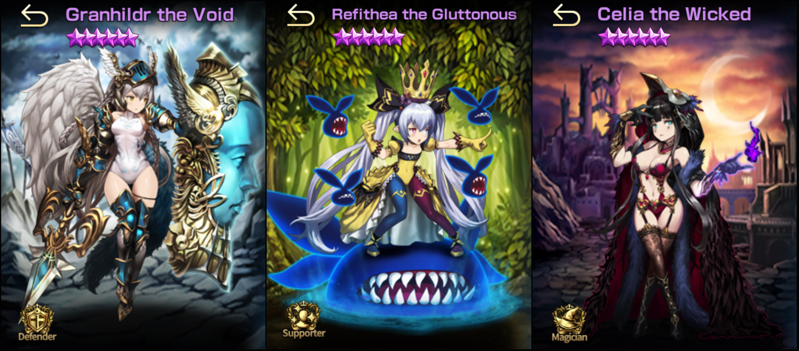
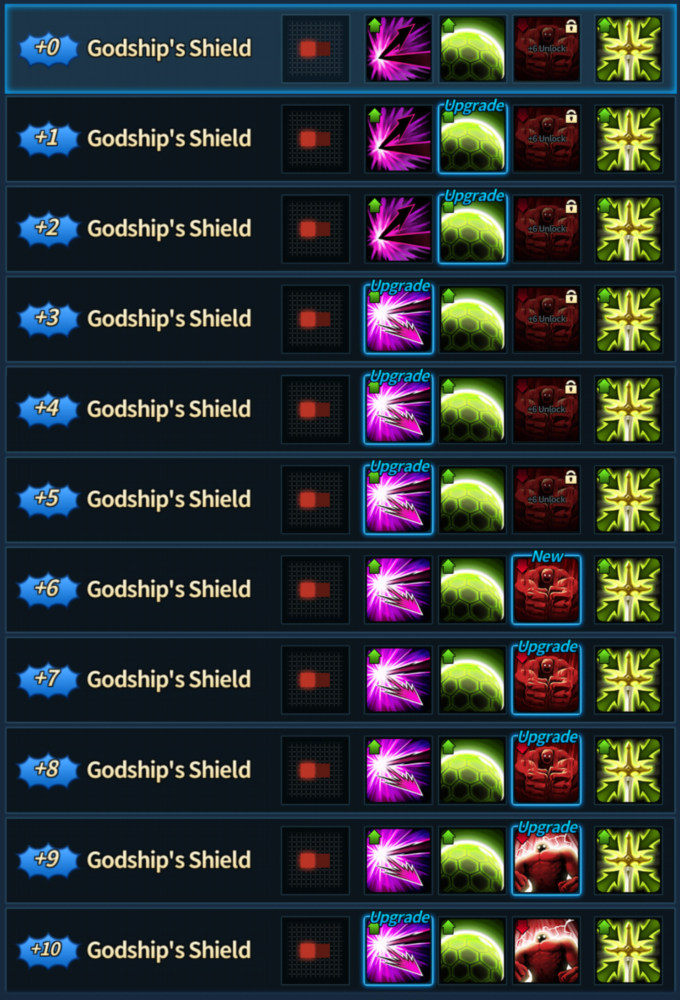
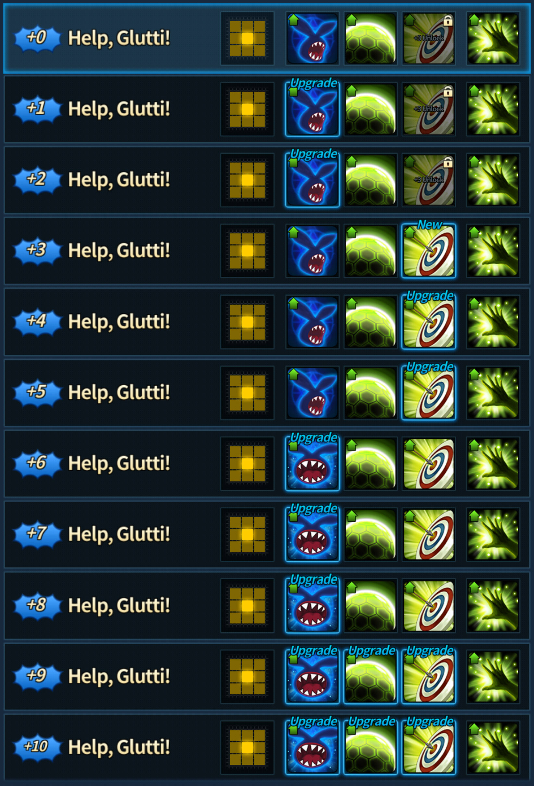
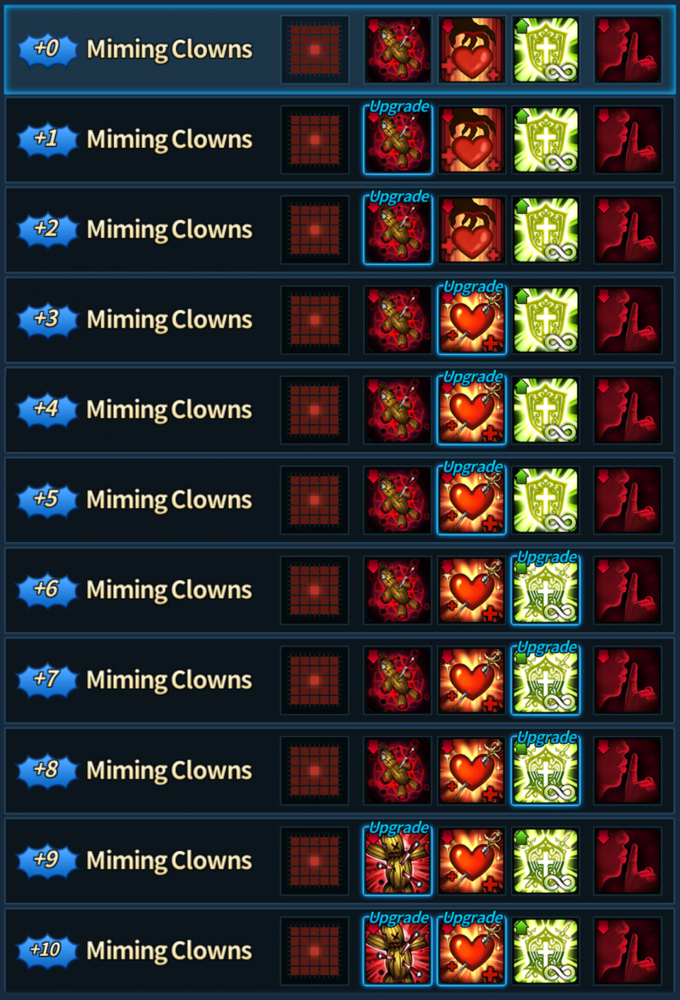
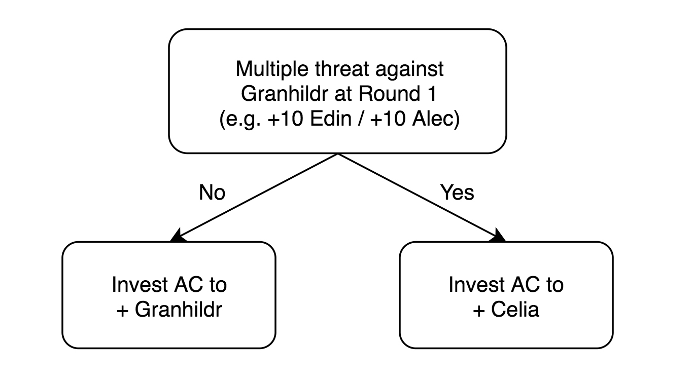
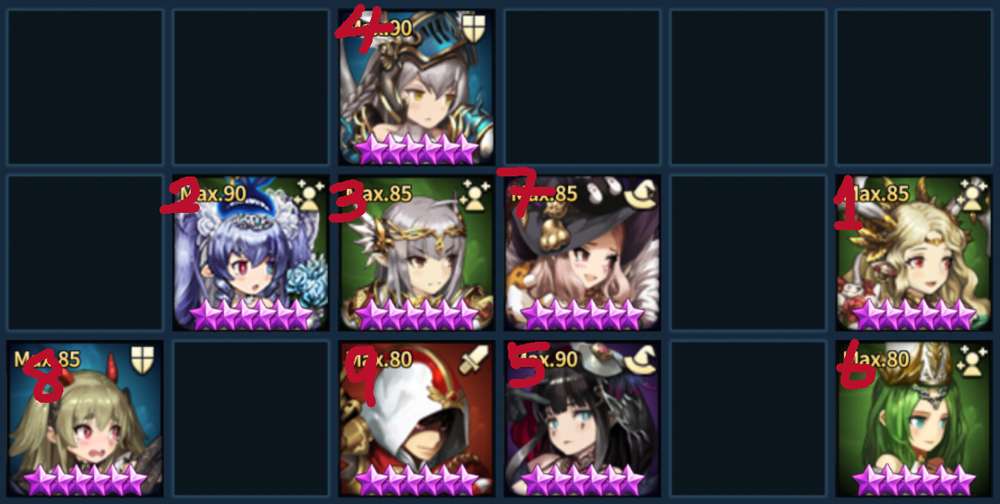
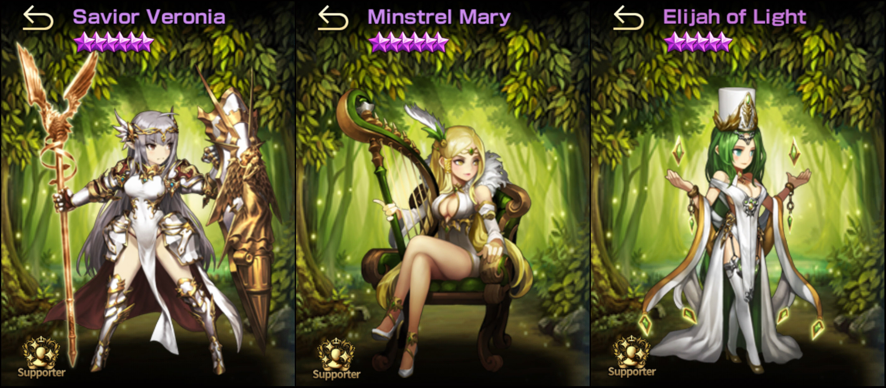

This post isn't for players who just started playing Brown Dust. You need to have some experience in Brown Dust Arena contents. I will not go in length to explain unit skills and mechanics.

---

## Abstract

GSF (Granhildr Support Formation) has been able to stay in meta from almost beginning of Brown Dust and is still one of the most popular and powerful formation currently. GSF can be said to be efficient because it is able to adapt to different meta. However, GSF also requires to adjust to the meta by tweaking part of the formation and units.

Due to dependency of meta, I will not be able to give out solid examples and formations like the other formations I have posted about (in KR official cafe, I posted about GSF a month ago and is already starting to become outdated). I am going to introduce key units in GSF and talk about the theory behind how GSF works.

---

## Key Units (Static / Fixed)

The most primary units that are focused in GSF are the **Traitorous Trinity** set, Granhildr + Refithea + Celia.

It's very important to note that the unit who gets the spotlight changes depending on the meta. For example, when there weren't many units that could actually safely kill Granhildr, the spotlight naturally went to Granhildr. But, when meta shifted and Granhildr started dying in the 1st round, the spotlight went to Celia.

Let's look at each unit's skills more carefully.

**Granhildr**

* **+0 ~ +2** Improvement in Barrier. It's not bad, but there's a upper bound for barriers, so it's not much of an improvement
* **+3 ~ +5** Now has reflect damage on Debuff Reflection. The numbers aren't so high, so I wouldn't expect too much from here either
* **+6 ~ +8** This is the pinnacle of Granhildr. With set hp buff and decent % hp runes, she will hit like a truck if you give enough buffs on her. This is the moment where Granhildr is able to become a dps tank (like fighter/brawler type) instead of just taunt tank with ok reflection.
* **+9 ~ +10** I wouldn't recommend investing AC here. In terms of functionality, nothing changes.

**Refithea**

* **+0 ~ +2** Improvement in Damage Reflect. It's quite good for Granhildr because she lacks damage reflect.
* **+3 ~ +5** Improvement in Crit Rate. Reflect can crit, so pretty much improving damage reflect.
* **+6 ~ +8** This is where Refithea becomes really good. Her Glutty Bestowal now as a simlar effect to Masochism where she the unit under Glutty effect heal when they are hit. (Note that unlike Masochism, they heal AFTER the auto attack). Moreover, the heal can crit, so her Improvement in Crit Rate actually is now has more value than previously.
* **+9** Increase the buff by 2 turns. This is quite good for GSF because of the number of supports that are used with GSF, they eat up a lot of turns and this gives more flexibility.
* **+10** This is when Refithea becomes the God of supports. She gives huge dps, survivability, and utility.

**Celia**

There isn't much to talk about Celia actually. She's either a figure just to buff Granhildr's HP or a gigaton nuker.

* **+0 ~ +2** Improvement in Curse. More effective as debuffer than dps at this stage.
* **+3 ~ +10** From +3 and onwards, give her 3 or more dps enhancement buffs from supports and congratulations! You now have a gigaton nuker.

### What to focus / invest?

I'd suggest investing into +10 Refithea first. A +10 Refithea can be used anywhere (even in power formations). Very safe investment. After +10 Refithea you need to look at the current meta and your tier. The flow logic is quite simple at this point.

Say the answer was no and AC was invested into Granhildr. The moment you hit +6 on Granhildr you will want to give around 3 offensive and defensive buff (MUST have at least 1 Healing Support) to Granhildr and refresh the buff with Elijah. I call this strategy **Granhildr Shredder**.

Basically what happens is that Granhildr with Titan's x, you have a chance of killing 1~2 units (any unit that has weak defensive ability will die). After that because enemy can't kill Granhildr with reflect + glutty on, so enemy dps unit will die from attacking Granhildr, but leaving perhaps a bit of scratch on Granhildr.

Just an example what **Granhildr Shredder** would look like (it doesn't have to be exactly like this, there are many ways you can make this work).

Now consider that the answer was yes and AC was invested into Celia. What you want to do is try to let Granhildr do her thing simliar to **Granhildr Shredder**, but since we know that she's likely to die, you leave the next unit that goes after Granhildr to Celia. What this means is that the buff that went to Granhildr is now going to be on Celia on Round 2 if Granhildr wasn't able to make it.

You have to consider a case where Granhildr dies on the first turn (e.g. enemy's first turn was buffed +10 Edin), this means you need to make sure Celia and main dps supports are unhindered until round 2. This means you will need additional taunt units to ensure Celia and dps supports safety. The safe number is 3, but 2 usually works as well.

If you noticed, the example I have shown previously kind of uses the theory I have just elaborated on. You can see that Veronia's dps buff goes on to Celia if Granhildr was taken out on Round 1.

### What formations and combinations do I do when I'm in the middle?

This is the part I can't help you out with. This is very specific to the meta and the units that are available.

### Are there other variations?

YES! There are very unique variations out there. Many GSF users have their own twist. Some like to use multiple mages to have distributed damage after surviving the 1st round with multiple taunts, some use multiple high singular dps units to take out key units in the 1st round, there are even users with multiple reflector units for maximum shredding. I believe this part is completely up to you! :^)

What I have discussed earlier on what to invest is probably the most safest way to gain points in arena (in terms of AC investment).

---

## Key Units (Dynamic / Substitutable)

I think these units are substitutable depending on the current meta. **Elijah especially**. Recently Mary has been replaced quite heavily by Benaca in KR Server, so I suppose Mary isn't as good as the other two.

---

## Final Thoughts

I'd really like to bring out solid examples to explain about how GSF works, but seriously the GSF post I've made in KR about a month ago is already on the verge of being obsolete. Even the AC investment is subject to change depending on the new octos that will be released in 8 November, 2018. (there also have been 1 update for buffing 6 devils, so I suppose it could happen again soon after octos are out)

Perhaps I'll make a post later about high ranking GSF history, which might help you understand more about GSF '^'.
