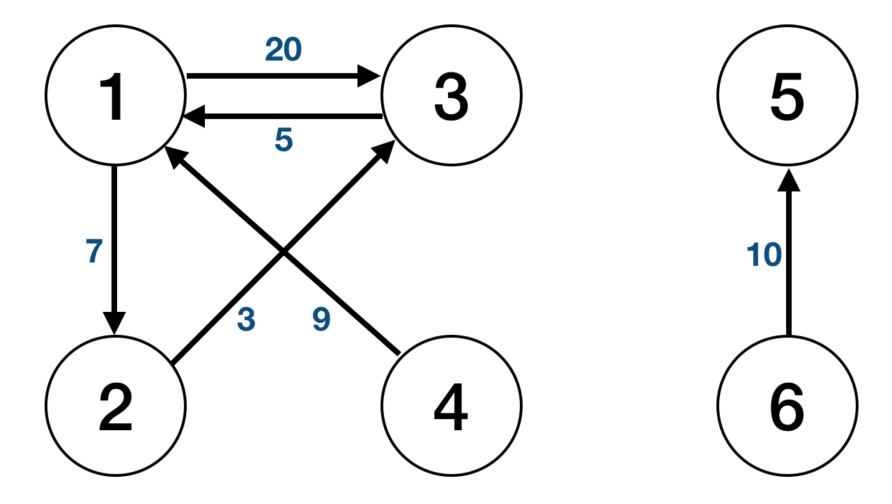
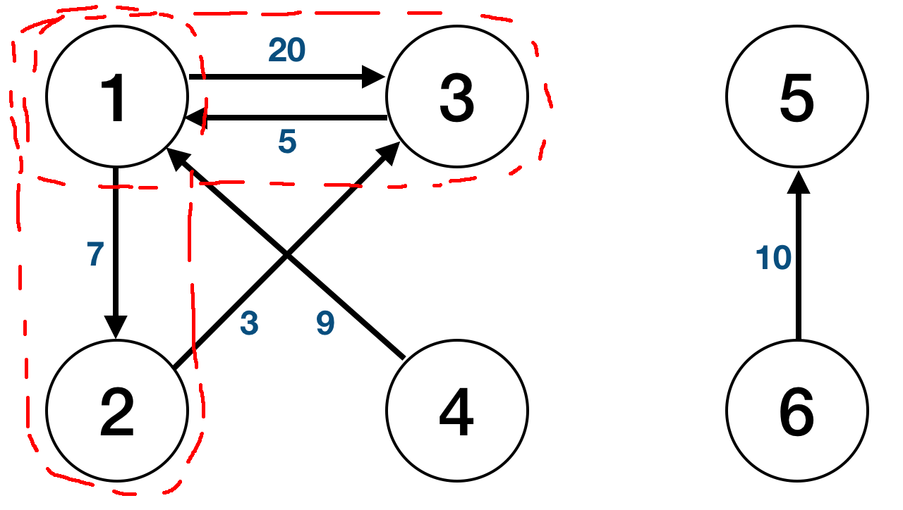
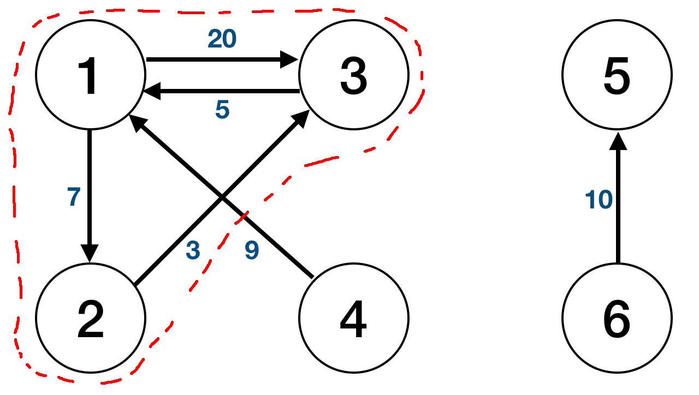

## Abstract

Hadoop is a distributive processing framework that allows large repetitive computation more efficient than a regular script programming languages like python or java. This post will go through how Dijsktra's SP algorithm was implemented in Hadoop.

Note that the environment that the program was executed is a fully distributed mode (1 namenode and 2 datanode in total).

For the full source code, visit [Github](https://github.com/Jinwooooo/dijsktra-hadoop)!

---

## Assumptions

Let's first go through some of the assumptions.

1. Input is in a format (node1, node2, weight)


1 2 7
1 3 20
2 3 3
3 1 5
4 1 9
5 6 10


this would be equivalent to

2. in the code to start hadoop to process the SP: (args[0] = input file; args[1] = output dir; args[2] = rootID or sourceID; args[3] = max iteration (if 0, iterate until SP is all found from args[2]);)

example would be : $[hadoop blah blah blah] input/simple-1.txt simple-1 1 0

---

## Output

The final output will be (nodeID, SP value, predecessor nodeID). From the sample input the output will be as follows


1 0 nil
2 7 1
3 10 2


---

## Implementation Flow Design

First it will process the whole input into an adjacency matrix (i.e. preprocessing). There are pros and cons about this approach. One of the major advantage of using an adjacency matrix is that it's a good data structure to compute SP algorithm (it is very intuitive). One of the major disadvantage is that if the graph is sparse, it eats up a lot of memory.

After processing an adjacency matrix, it will start the first iteration: finding SP from the root node to its first adjacent node(s).

It will save this temporary shortest distance within the memory/data and end the iteration (note that in iteration 1, it will compute node 1 → node 2 SP value to be 20, not 10, which is why the border are drawn as such).

Next iteration is from previous SP node(s) to the its/their adjacent node(s). It will compute a new SP value and compare with the previous iteration's SP value. If new SP value is smaller than the previous SP value, it will change the value. This will keep looping until a termination condition is found.

The termination condition is either when the all SP is found from root node or the max iteration that was configured when the program was executed is met. In order to know if all SP is found from root node, the program will keep a value that keeps counter of changes made for all the SP value. If no changes were made throughout the whole iteration, it will terminate. Therefore, the sample would have total of 3 iterations (2 iterations will be done that will actually be computing for SP and 1 iteration to check if the termination conditions are met).

---

## Implementation of Data Structure

**Before MapReduce** It will have an adjacency matrix as I have explained above, but there is a small catch. I have implemented the data structure so that it holds the current SP value and predecessor nodeID. Basically after preprocessing to adjacency matrix for the sample input, the adjacency matrix will look like:


1 -1 0 0 3 20 2 7
2 -1 -1 -1 3 3
3 -1 -1 -1 1 5
4 -1 -1 -1 1 9
5 -1 -1 -1 6 10
6 -1 -1 -1


After the nodeID, the -1 will be used as indication that the next 2 tokens are not a (nodeID, distance) tuple, but a (temporary SP value, predecessor node ID) tuple. I'm not an expert on MapReduce programming, but by surfing the web, I've heard multiple statements from experienced MapReduce programmers that it's common practice to utilize temporary values within the iterables.

**During MapReduce** The program has a class: ***NodeWritable***, this will keep all the intermediate parts of the data during MapReduce phase (utilizes HashMap to keep node ID and temporary distance value). I highly encourage you to actually look at the code uploaded on [Github](https://github.com/Jinwooooo/dijsktra-hadoop). It's very intuitive, so I will not go on further to explain how it works functions in intermediate stages.

**End MapReduce** It will output a similar adjacency matrix as **Before MapReduce**, but it will include updated SP value and predecessor node ID. For example, the after first iteration the adjacency matrix will look like:


1 -1 0 0 2 7 3 20
2 -1 7 1 3 3
3 -1 20 1 1 5
4 -1 -1 -1 1 9
5 -1 -1 -1 6 10
6 -1 -1 -1


---

## Chaining Jobs in Hadoop

Chaining jobs is necessary because each iteration is a new job for Hadoop. (i.e. preprocess is 1st MapReduce, 1st iteration is 2nd MapReduce, 2nd iteration is 3rd MapReduce, ...).

Overall there are 2 main ways to deal with this: the current programming language way (I used Java for this so I will call this Java way) or the Hadoop way.

**Java Way** is by utilizing loops and counters. Also will require to make sure each output (temporary values made from each MapReduce) can be linked to the next iteration to input and also have to make sure each job is completed before going on to the next job.

**Hadoop Way** is by utilizing ***JobControl*** and dependencies.

---

## Final Thoughts

My code utilizes a regular combiner. Therefore, if the memory is sufficient to hold all the data, using an in-mapper combiner will speed up the process.

Was a great exercise to get more familiar with Hadoop and MapReduce! I hope this post helped out anyone who are trying to get familiar with Hadoop and MapReduce :^)
