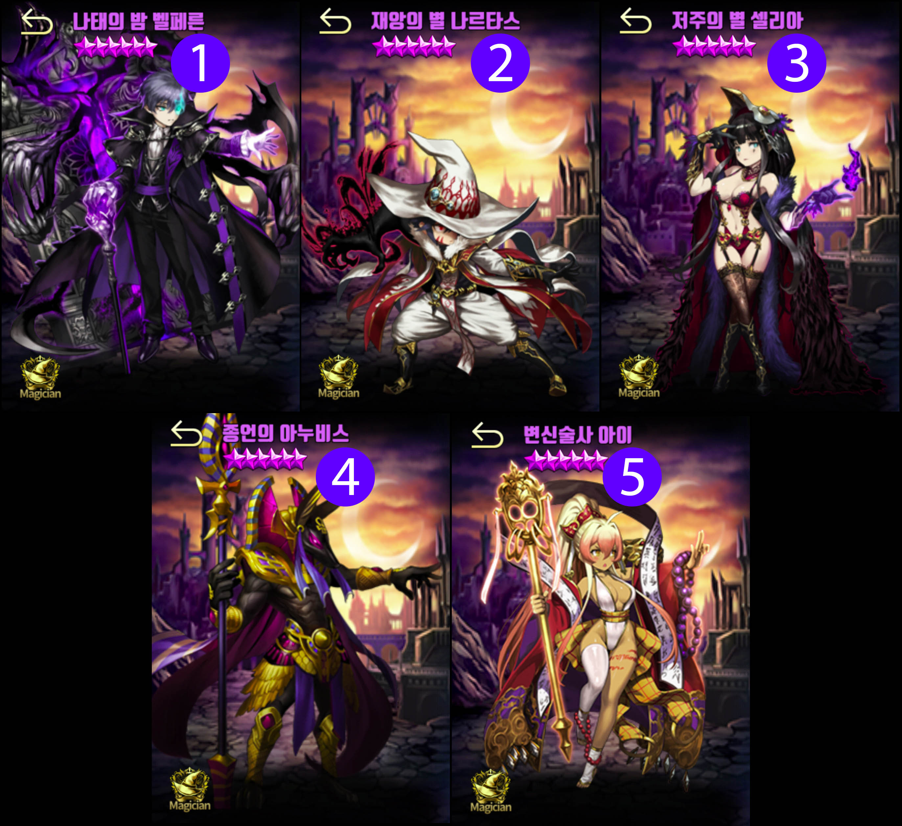
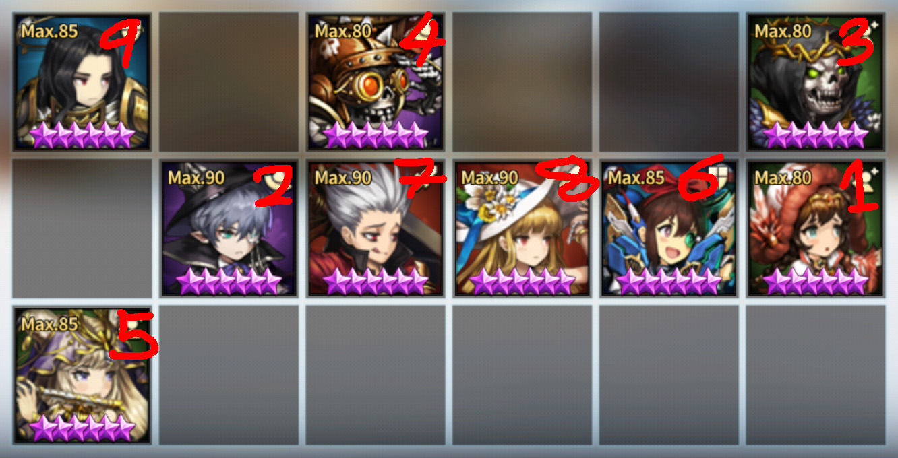

This post isn't for players who just started playing Brown Dust. You need to have some experience in Brown Dust Arena contents. I will not go in length to explain unit skills and mechanics.

---

## Abstract

This formation is completely useless unless **Reckless** (defensive taunt unit) is popular in arena. **Reckless** is very different from other taunt units because the taunt on reckless is periodic (similar to the boss unit you see in 43-5 in scenario).

When on the offensive (you attack first), it is a direct counter to Reckless, but when defending (enemy attack first) it also has a benefit of eating up all the enemy buff duration. Additionally, this formation usually mixes up with multiple suicide units (Chalkie and Kwik) and Wulya (taunt support) to mitigate some side effects.

---

## Chapter 1 : What is Reckless?

Going first meant that your attacking unit was able to attack without considering if enemy taunts. However, Reckless changed that concept because Reckless taunt is activated for 5 turns from the start regardless of who goes first. Due to the periodic taunt concept, the taunt will deactivate after the first 5 turns. It is important to know that when reckless taunt is deactivated, it acts like similar to the suicide reflect units (Zakan, Chalkie, Kwik). The image below is the 1st skill of Reckless when her skill level is +10.

The green skill states that for 5 turns from the start of the battle taunt is activated and while in this taunt state, it reduces incoming damage by 65%. The red skill states that for 5 turns after the taunt state is over it will heal 20% of her maximum hp per turn, increases incoming damage by 300%, reflect 150% of damage received. It repeats this taunt and no-taunt state every 5 turns.

It is important to note that this is a passive ability, so giving her heal prohibition and buff prohibition will not stop her from taunting, healing, reflecting.

---

## Chapter 2 : What units to utilize for pushing the initial 5 turns

This is very important because in a regular formation you usually want to have around 2~3 supports and perhaps 1 mage, but to push 5 turns means you will need more mages. Therefore, the mages to push turn must have a purpose. 1 mage can be used as a dps unit, but the other extra mages must serve a more defensive purpose.

**Offensive Mages**

1. **Balpharen** he's the new AC octo in KR server. Very imbalanced unit (deals pure damage 3x3 AOE that even OHKO 20k hp Granhildr and not die to reflect) If he's available, he's the unit to go for.
2. **Nartas** he does have ups and downs due to his AOE, but he can be used.
3. **Celia** she needs to be at least +3 to be utilized in this area, but she does work as well.
4. **Anubis** he's very good against GSF, so if you see lots of GSF, consider utilizing him.
5. **Aie** she's the last resort. You may consider not using any dps at this point.

**Why not Levia?** The reason why she's not on THIS LIST is because units here will get dps buff from supports. It is perfectly possible to utilize Levia, but just not with support buffs.

If you noticed, all of the mages either is able to kill taunt tanks (except Granhildr I suppose) or their kit doesn't mind the taunt (Celia AOE is huge and Anubis ignores taunt).

**Defensive Mages**

1. **Balthor** already quite known mage tank. Consider using him with John.
2. **Lilian** it's usually not so wise to give her an early turn, but this formation does not have enough flexibility to give her attack on the 9th turn.
3. **Edwin** he is doing quite well in KR at the moment (2018 December). His charm is more advanced than a normal charm so unless the unit has the full immunity or the deck has no pure purification, he's very problematic.
4. **Bathory** the worst one here due to the fact that she has brings no utility when she attacks and is not as tanky as others.
5. **(S) Chalkie** he's easily obtainable, so many users utilize Chalkie. He really isn't meant to attack, so he's usually placed in locations he's likely to get hit (if he does hit, he does hit like a truck).

**What about Supports?**

It doesn't really matter what supports you utilize as long as they are able to give buffs to the dps units, but Kwik and Wulya are very good at this formation since they regarded as multipurpose unit (Kwik = dps buff + suicide / Wulya = dps buff + taunt). If Wulya is available, consider utilizing her because she usually mitigates enemy's first attack.

If you are still a bit unsure, go to Chapter 4 to look at real examples.

---

## Chapter 3 : What unit to utilize on the first attack

You have pushed the turns so that Reckless taunt is not offline and if you thought about using some small AOE offensive units like Alec, Foxy, Sieg, Edin, Jin, etc (units with 2 cell AOE or less), why risk pushing 6 turns? The unit that launches the first attack **MUST have a LARGE AOE**. In other words, the unit must have a chance to wipe out more than half of the enemy's key units in one go.

1. **Hanya** upgraded version of Eunrang. He was one of the main reason why 6 turn push formation became popular (he was likely to wipe out almost all of the enemy dps if he's in the correct row)
2. **Rafina** since this formation utilizes multiple supports which is a condition required to utilize Rafina, it's like killing two birds with one stone in this case.
3. **Gunther** many users don't expect a unit with Gunther's AOE to be utilized, so he may sometimes be the best unit for this role.
4. **Christina** due to so many skip attackers, many users are prepared for Christina even though they weren't exactly trying to counter her. However, like Gunther she can be suitable for this role in special cases.
5. **Anastasia** new unit in KR that is same as Rafina, but is more squishy and does more damage. Usually if you have Rafina, many users won't invest in Anastasia, so she is seen less with 6 turn push formation, but she is more fit for this role than Rafina.

---

## Chapter 4 : Examples

After 5 turn push, it utilizes Hanya. Note that Edin → BDM is used to kill off Lucius so that on the 2nd round, Balpharen's nuke won't go to waste on a dummy unit. Also the reason for Chalkie is placement behind Wulya is to snipe out enemy's AOE dps unit. Very well thought out formation.

It is also important to note that units here do not need **Stat Reducing Effect Immunity**. Veronia covers for Hanya and Edin has an PERM Immunity against stat reducing effect. If it used some other units like Alec instead of Edin, then Ceres is a must.

Utilizes Rafina for the first attack. Since most dps units are usually placed on the top row, it placed the suicide boys up on top. The main weakness for this formation is that it has no taunt to save the dps row if it is unluckily targeted.

I also want to point out that if the first unit that launches attack has AOE same as Gunthur or Rafina, it is advantageous to place the dps row in middle to fully utilize their AOE. However, as I always mention, you only have to be 1 step ahead of the others, so if your current tier places many dummy rows on middle and bottom row, modifying the formation should be considered.

This formation is almost the same as the example above, but it uses Wulya instead of Beneca. It gives more safety for unlucky cases, but sacrificed durability (heal from Beneca and the fact Beneca main dps buff lasts 35 turns).

---

## Final Thoughts

6 Turn Push Formation is a very specific counter strategy. It's very useful on the last day of arena when you have to grind swords to get more points (the average time spent per battle is very short with this formation and has high winrate in specific tiers).

Although there are some ways to improve defensive winrate, this formation usually do not do very well in defense. I suggest utilizing this formation when you have enough time to spend swords regularly.
