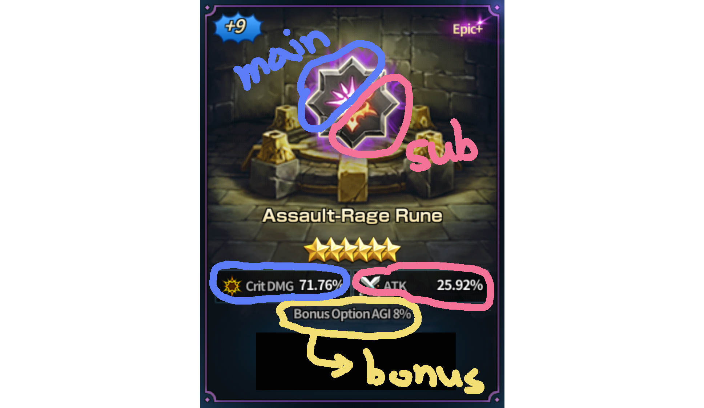

## Abstract

Many new users will most likely be farming/mining runes from 9th floor for a mono rune, but as users cumulate mono runes and become experienced with time, they start to look toward getting useful dual runes. However, depending on the main type of rune, there are combinations that doesn't exist. This is a short post to inform the user.

---

## Basic Structure of Dual Runes

Unlike mono runes, dual runes have **main** and **sub** category. If you are not sure about what **bonus** is possible, it is elaborate it after the combination tables. I feel the picture is sums it up quite nicely, so I will move on to combination tables.

---

## Possible Dual Rune Combinations

<table style="text-align: center; border: 1px solid black;">
    <thead>
        <tr>
            <th style="border: 1px solid black;">Main</th>
            <th style="border: 1px solid black;">Sub</th>
        </tr>
    </thead>
    <tbody>
        <tr>
            <td style="border: 1px solid black;">Flat Assault</td>
            <td style="border: 1px solid black;">% Vital</td>
        </tr>
        <tr>
            <td style="border: 1px solid black;">% Assault</td>
            <td style="border: 1px solid black;">Fatal</td>
        </tr>
        <tr>
            <td style="border: 1px solid black;">% Assault</td>
            <td style="border: 1px solid black;">Rage</td>
        </tr>
        <tr>
            <td style="border: 1px solid black;">Flat Assault</td>
            <td style="border: 1px solid black;">Shield</td>
        </tr>
    </tbody>
</table>

<table style="text-align: center; border: 1px solid black;">
    <thead>
        <tr>
            <th style="border: 1px solid black;">Main</th>
            <th style="border: 1px solid black;">Sub</th>
        </tr>
    </thead>
    <tbody>
        <tr>
            <td style="border: 1px solid black;">Flat Vital</td>
            <td style="border: 1px solid black;">% Assault</td>
        </tr>
        <tr>
            <td style="border: 1px solid black;">Flat Vital</td>
            <td style="border: 1px solid black;">Fatal</td>
        </tr>
        <tr>
            <td style="border: 1px solid black;">% Vital</td>
            <td style="border: 1px solid black;">Rage</td>
        </tr>
        <tr>
            <td style="border: 1px solid black;">% Vital</td>
            <td style="border: 1px solid black;">Shield</td>
        </tr>
    </tbody>
</table>

<table style="text-align: center; border: 1px solid black;">
    <thead>
        <tr>
            <th style="border: 1px solid black;">Main</th>
            <th style="border: 1px solid black;">Sub</th>
        </tr>
    </thead>
    <tbody>
        <tr>
            <td style="border: 1px solid black;">Fatal</td>
            <td style="border: 1px solid black;">Flat Assault</td>
        </tr>
        <tr>
            <td style="border: 1px solid black;">Fatal</td>
            <td style="border: 1px solid black;">% Vital</td>
        </tr>
        <tr>
            <td style="border: 1px solid black;">Fatal</td>
            <td style="border: 1px solid black;">Rage</td>
        </tr>
        <tr>
            <td style="border: 1px solid black;">Fatal</td>
            <td style="border: 1px solid black;">Shield</td>
        </tr>
    </tbody>
</table>

<table style="text-align: center; border: 1px solid black;">
    <thead>
        <tr>
            <th style="border: 1px solid black;">Main</th>
            <th style="border: 1px solid black;">Sub</th>
        </tr>
    </thead>
    <tbody>
        <tr>
            <td style="border: 1px solid black;">Rage</td>
            <td style="border: 1px solid black;">Flat Assault</td>
        </tr>
        <tr>
            <td style="border: 1px solid black;">Rage</td>
            <td style="border: 1px solid black;">% Assault</td>
        </tr>
        <tr>
            <td style="border: 1px solid black;">Rage</td>
            <td style="border: 1px solid black;">Flat Vital</td>
        </tr>
        <tr>
            <td style="border: 1px solid black;">Rage</td>
            <td style="border: 1px solid black;">Fatal</td>
        </tr>
    </tbody>
</table>

<table style="text-align: center; border: 1px solid black;">
    <thead>
        <tr>
            <th style="border: 1px solid black;">Main</th>
            <th style="border: 1px solid black;">Sub</th>
        </tr>
    </thead>
    <tbody>
        <tr>
            <td style="border: 1px solid black;">Shield</td>
            <td style="border: 1px solid black;">% Assault</td>
        </tr>
        <tr>
            <td style="border: 1px solid black;">Shield</td>
            <td style="border: 1px solid black;">Flat Vital</td>
        </tr>
        <tr>
            <td style="border: 1px solid black;">Shield</td>
            <td style="border: 1px solid black;">% Vital</td>
        </tr>
        <tr>
            <td style="border: 1px solid black;">Shield</td>
            <td style="border: 1px solid black;">Fatal</td>
        </tr>
    </tbody>
</table>

---

## Bonus Options

One easy way to understand this is to think **sub** as **bonus** because it does not affect what can be possible in **bonus**. If you are experienced user, you will probably get this by now, but for new players I will give an example. Consider that you have a mono + type Flat Assault Rune (i.e. 6★ rare+, 6★ epic+, etc.). It is possible for this rune to have any type of **bonus** except for ***Flat Assault*** (note that ***% Assault*** is possible).

---

## Recommendation for 9th and 12th Floor Rune Farming/mining

If you have looked closely at the table you've probably notice some of the duals are quite useless on general cases (i.e. shield + flat vital). So my recommendation is that you should go to 12th floor for **Assault** and **Rage** (50% chance to get a useful dual types), and for others you should go 9th floor, since it's better to try for mono runes since you only have 25% chance to get a useful dual type runes. This is only for general cases, if you have specific rune that you would like to obtain the chance of obtaining "useful dual type" will be different.

However, you have to note that 12th floor gives you a lot more runes than 9th floor. So if you consistently buy horseshoes with diamonds, I suggest you go for only 12th floor.
