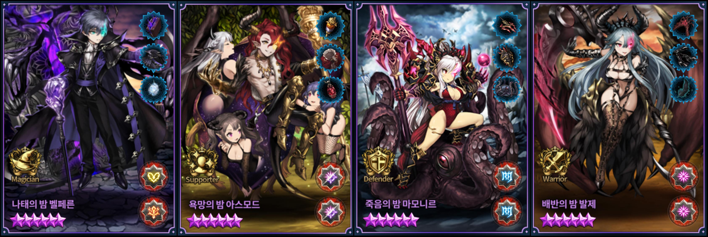
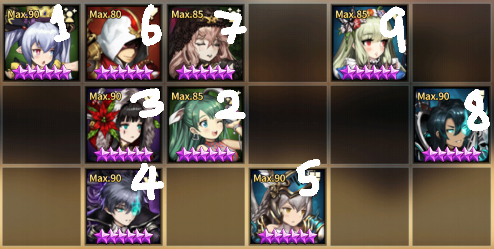
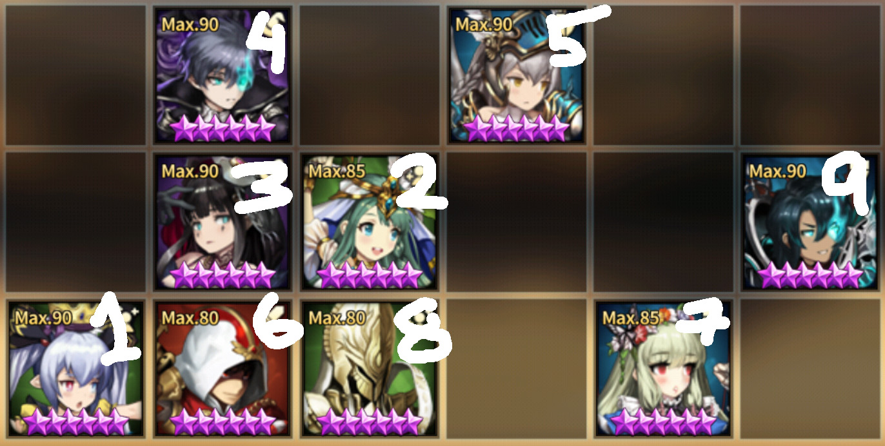
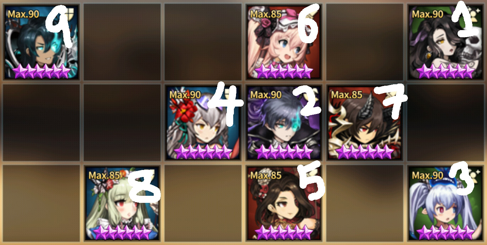

Read [this](https://jinwooooo.github.io/jinwooooo-blog/browndust-arena-formation-granhildr-support-formation/) to get a sense of what GSF is about. In this post, I will cover how to utilize GSF with Dominus Octos. Also some of the units I mention here are not yet released in non-KR server. If you want information about them I'm sure there are websites that has their information in it.

---

## Abstract

While it is possible to sustain GSF in a relatively low tier (Diamond ~ Sapphire) without the use of Dominus Octos, it is nearly impossible to go to a higher tier without it.

From Dominus Octo, you will require 1 mage and 1 tank. It is highly recommended to use Velfern and Lucius because they require very little skill up (Velfern above +3 and Lucius has no requirement). Levia needs +10 and Mamo needs +6 for okay results but Mamo +10 is recommended.

---

## Fall of 6 Devils

With the introduction to 2nd batch of Dominus Octos: Velfern, Asmode, Mamonir, Valze, all of 6 Devils alone are no longer good. Some may give an argument about Refithea being viable as well as Alec and Nartas, but if you gave them a chance to refund all the AC for them I'm pretty sure any highly competitive user will take it.

Basically the only way to keep up with meta is to integrate the Dominus Octo into GSF.

---

## Main Example

This user is one of the oldest known GSF user in Korea (KR IGN: 시아리). He held onto GM1 for quite a while, but recently he's been holding in GM2 most of the time (sometimes GM1), but overall I believe this is the only formation where you use the full GSF set (many GSF users have actually just benched Granhildr and Celia and are doing power formations with Refithea and Dominus Octos).

* **Main DPS** Velfern and Celia
* **Sub DPS** Leto
* **R1 Tanks** Granhildr (shield + shield runes) and Lecliss
* **R2~ Tanks** Lucius
* **Required Support** Eindolyn or John (i.e. support that gives taunt)

As mentioned previously, Levia +10 can sub in for Velfern and Mamonir +6 or higher can sub in for Lucius. However, you must note that if there are lots of Levia +10 → Velfern combos, then you should try to avoid using Mamonir. For Sub DPS, you should be able to substitute any offensive unit that can is able to fill at least 1 unit's role (I believe that for now, most successful replacement for this role is taylor +15, edin +10, valze +10).

Here is another similar GSF + Dominus Octo formations that is modified a little bit from the above.

In this deck I purposely changed John + Lucius from 7 → 8 to 8 → 9 (actual is 7 → 8) if John isn't +10, his taunt duration may fall short on R2. For taunts shorter than 10 turns, you should use the taunt at the last possible moment.

Sadly, none of the other formations are successful enough to reach Master tiers and higher with a full GSF set. You may synergize with part of the units from GSF, but most likely either Celia and/or Granhildr has to go.

---

## Special Defensive Formation Example

If you have a really strong DPS lineup, you may consider doing some special variation with Velfern +3 or higher / Levia +10, Beliath + 9 or higher and few of the GSF components.

Because 6 turn push formation is not a popular in higher tiers (power formations does not utilize Lecliss), this is using that specific information to its advantage. After Lecliss taking hit for the team in the first enemy's turn, Refithea + Beliath pretty much gives buffs to kill anything that hits afterwards. Foxy is there to nullify Eindolyn buffs (taunt with heal and damage reduction) so that Anastasia and Edin has a higher chance to hit key units.

Note that here, Granhildr is using vital + vital runes so that she can kill off enemy Anastasia / Edin with reflect (shield + shield runes may not kill Anastasia / Edin with reflect if they received any defensive buff). Also see that in the back 3 defensive units, they are all in unique column because of high usage rate of Valze in KR competitive tier.

**This formation is not used on the last day of Regular Arena (it's not bad, it's just not the best formation to get points when you can go first), so this sample is for users who are busy and can't burn swords regularly on weekdays or busy with real life on weekends**

---

## Future for GSF

As a GSF user, I'm hoping they become somewhat usable after they get Assistance/Helper update (new update in KR server on April 2019 to skill them up to +15). No guarantees though.
