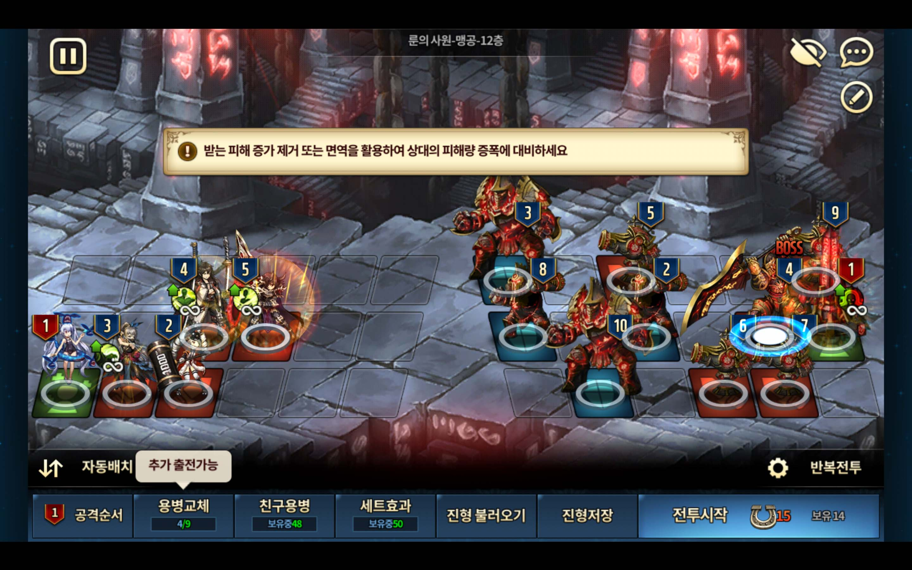
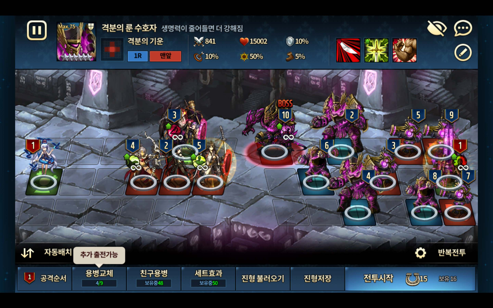

## Abstract

Units that have the right AOE to kill off units are based on low tier units. However, in order to reduce turn order, units like Asmode and Jin are required. Note that you may borrow 1 unit from your friend list, so if you have one but not the other, try to find a friend who has one.

* Any unit that's below 3★ is basically just taking up space, so you can place whatever units there
* I assume that users will have maxed out 4★, so I didn't mention any substitutes
* Asmode most likely have to be above +6 (above +9 to avoid rng)
* Jin most likely have to be above +9 (lower skill level Jin maybe possible, but I haven't tested it)
* I've used Refithea for all 3x3 support, but she can be replaced by any decent 3x3 support that is above 4★

I have referenced formations from one of the rune guru in KR server (IGN: 불꽃).

---

## Assault (9 Turns)

* **Edin** can be substituted by any offensive unit that can OHKO BOSS

---

## Vital (7 Turns)

* **Rogan** can be substituted by any decent offensive unit that OHKO the enemy unit with turn 8 and is slightly tanky to take AOE hits

---

## Fatal (10 Turns)

* **Foxy** can be substituted by offensive unit that can OHKO BOSS

---

## Rage (7 Turns)

* My unit at turn 4 is Ridel (with helper/assistant costume instead of original)

---

## Shield (8 Turns)

---

## Shortest known Turns for 12th Floor (that I know of)

* **Assault** 7 Turns
* **Vital** 6 Turns
* **Fatal** 7 Turns
* **Rage** 6 Turns
* **Shield** 7 Turns

To make the shortest turn possible, you'll need legendary tier runes and +10 units. **(These numbers are based on 카이, KR user)**
