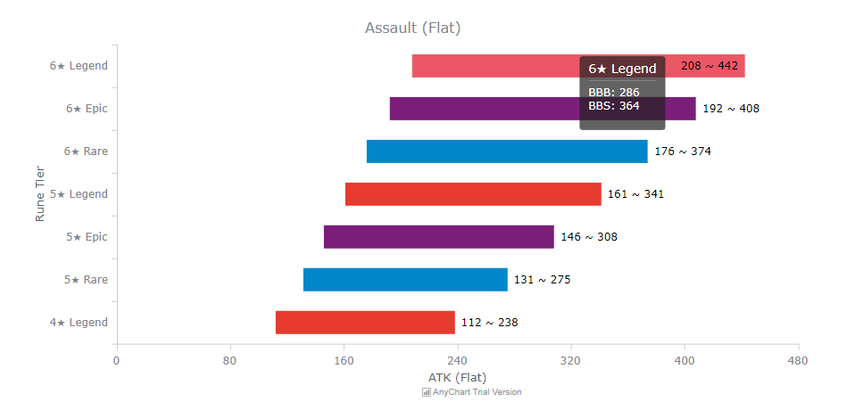
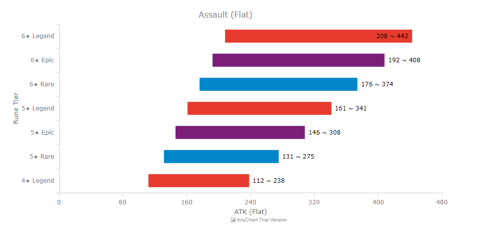
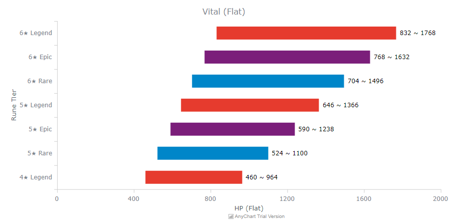
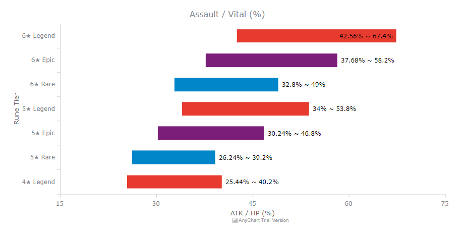
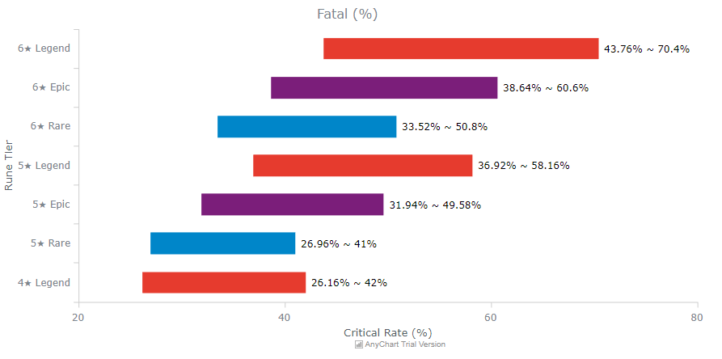
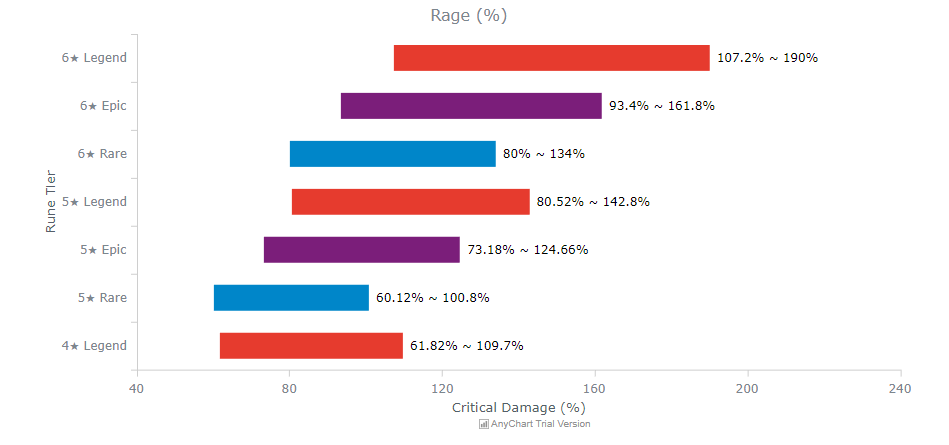
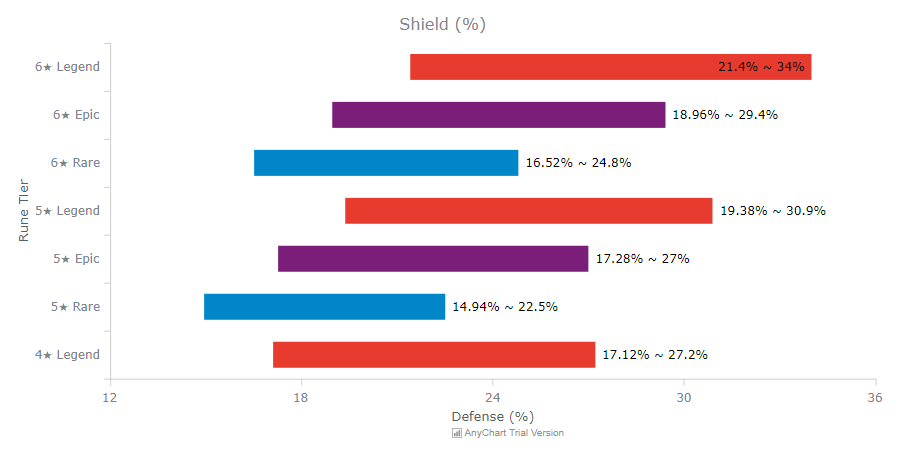

## Astract

As one starts getting more and more experience in Browndust, he/she starts to look at runes and tries to figure out what to keep and what to throw away. At first, if you haven't looked closely into it, it's intuitive the more ★ it has the better and the higher the tier (common → rare → epic → legend), the better. However, you'll find some exception to this rule and now you'll probably become unsure. If that's the case, this is the right post for you to read.

Even if you aren't, this post will be a good reference to even experienced user :)

---

## Explanations and Link

So this posts is based on Markdown, so I cannot fully utilize the HTML functions. Thus go to the link below (JSFiddle) to see the chart in HTML (it is interactive). Note that I haven't made the UI responsive, so I recommend you to go to the link with a Desktop.

[JSFiddle Link](https://jsfiddle.net/Baloomon/84kdtbo7/show)

In case you'd just like to see in there I posted the charts below. However, do note the charts are in PNG, so they are not interactive (the interactions allows the charts to show you the BBB and BBS refined values as shown below).

Morever, I did not include **common** runes and runes lower than **4★ legend** because they aren't worth keeping in the first place (only when you have just started should you use those lesser runes, after some time those eventually become dismantled or sold).

---

## Charts (in Image form)

