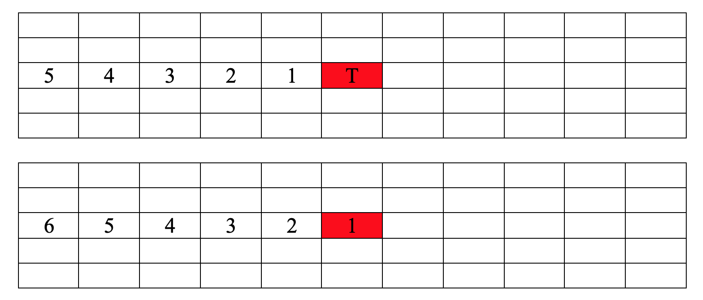
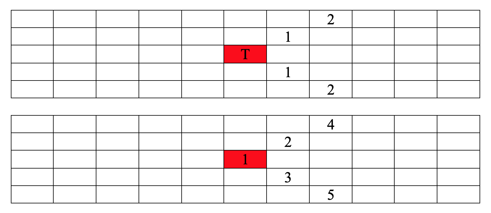

## Abstract

In this game there's a concept called AOE (Area Of Effect) for each unit.

I'm pretty sure most of the users would have assumed that in Browndust AOE is applied simultaneously. However, this is not the case if you looked closely. I will first give you the Appendix for the AOE and its Effect Order then elaborate why this matters.

---

## AOE Effect Order Appendix

* Note that all the boards are in **enemy board's perspective** (i.e. when you enter enemy's castle in GW, this ordering is directly applicable to the enemy's board)
* The **first board** represents the Main Target (labelled as T) and distance away from Main Target (each cell distance = 1)
* The **second board** represents the Order in which the Effects are applied (the lower the number the higher priority)

### Horizontal Forward AOE

### Horizontal Backward AOE

### Vertical AOE

### Diagonal AOE

***There is no Distance 2 Diagonal AOE unit (yet)***

### Diagonal Moving Forward AOE

### Cross AOE

### Square AOE

---

## Why does it matter?

Note that I used one of the Campaign Mode and flipped the images (so it may look a bit weird), so it's directly applicable to the Appendix that is listed above.

The enemy unit has a **+ (i.e. Cross AOE with Distance = 1)** with Freeze and without Immunity. Depending on where Gloria is placed, results are different (be wary that Gloria's PERM Skill Shield is applied after normal attack, so things that are activated before normal will go through (e.g. Deomaron's Decomposition)).

* **Red Cell** indicates Gloria's Location
* **Orange Cell** indicates the unit got affected by freeze
* **Green Cell** indicates the unit did not get affected by freeze

See how depending on Gloria's location, the Pillage effect from enemy is different? There are numerous ways to utilize this mechanics to your advantage (especially in Guild War). If you are unsure, the best way is to test it out in UA with your fellow friends. If you still are confused with interaction I suppose you can leave a comment in which I'll check it out :^)
