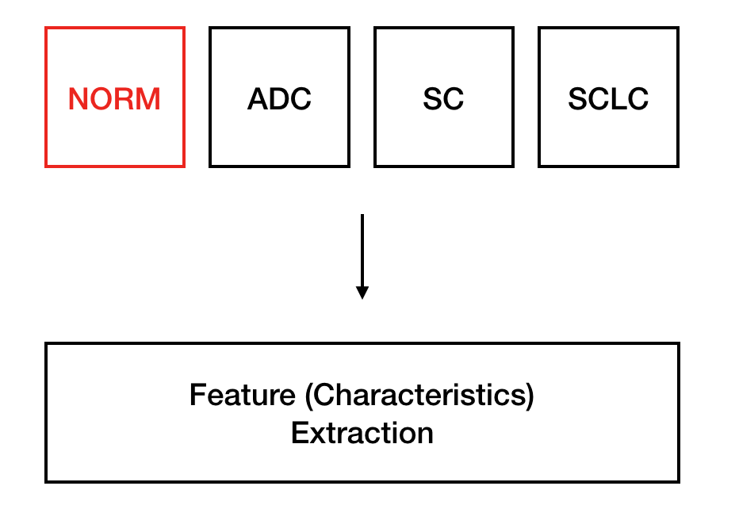
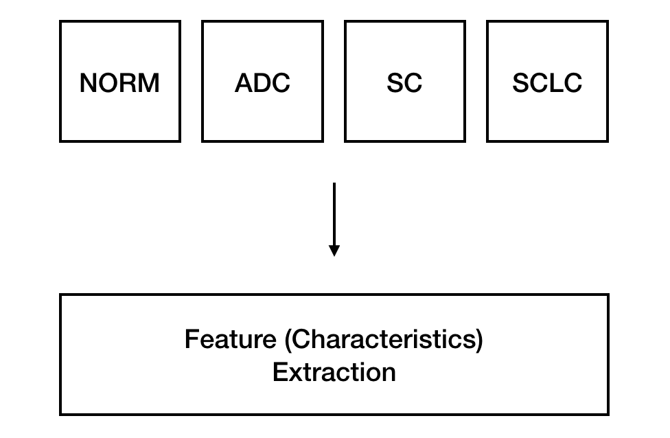
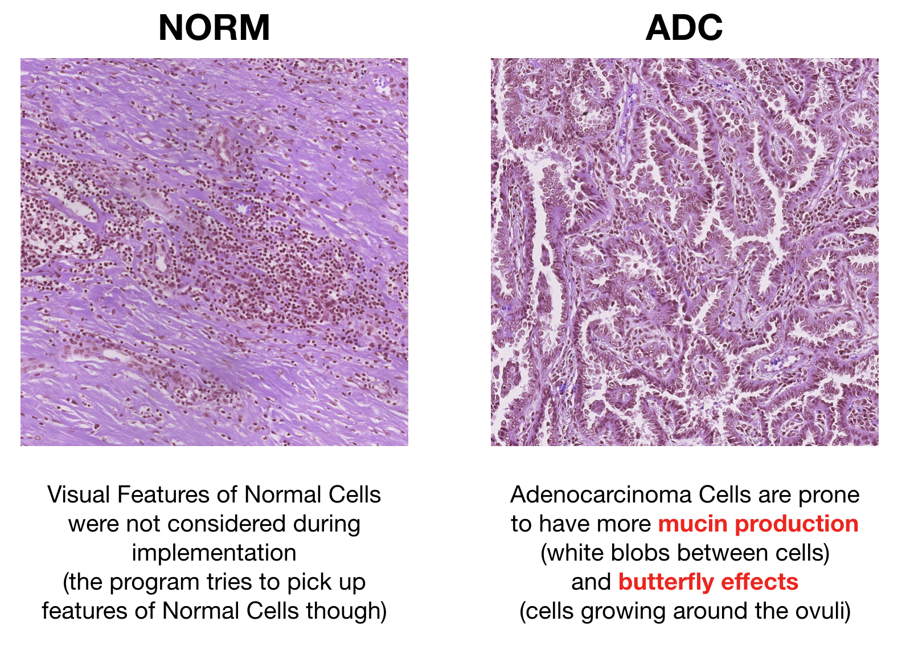
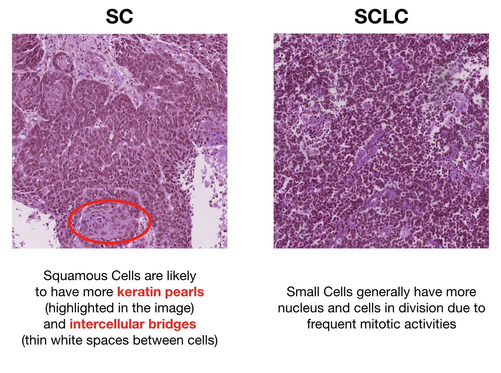
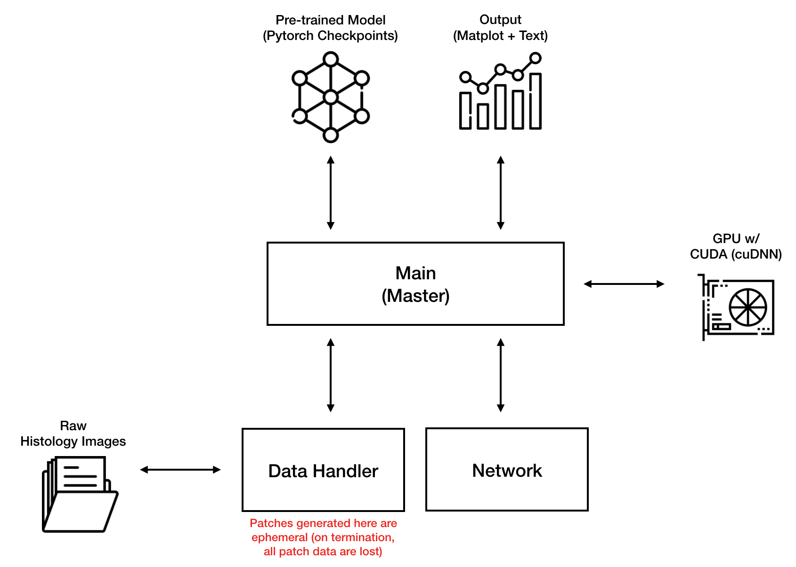

## Index

* **Index / General**
* **Methods Utilized**
* **Level 1 - Patch**
* **Level 2 - Image**
* **Results**

---

## Abstract

This project aimed to classify lung cancer histology images into 4 categories: Normal Cell (NORM), Small Cell (SCLC), Squamous Cell (SC), and Adenocarcinoma (ADC).

Traditionally, CNN image classification utilizes 1 level CNN where the whole image is processed. In this project, in order to reduce computational requirements and emphasizing the network to pick up more intricate details, 2 level CNN is utilized: **Level 1 - Patch** and **Level 2 - Image**.

The average accuracy of the **Level 1 - Patch** was 93% and the **Level 2 - Image** was 97% for the validation set. With a new test set, it was able to classify 98.5% images into the correct category.

One of the major problems with this project was the computational time consumed in the **Level 1 - Patch** (with 1 Nvidia GeForce GTX 1080 Ti 11G took almost 24 Hours for 1 epoch). However, due to usage of checkpoints feature within Pytorch, computational time problem for new set of data tests were not a problem.

---

## Specifications

### Images Specification

There were total of 1,600 images in each category (total of 6,400 images). Each image size was 2,560 × 2,560 pixels. Note that these images were extracted based on the doctor's annotation on multiple whole slide images.

### Hardware Specification

* **Operation System** Windows 10
* **RAM** 32GB
* **CPU** 3.7GHz Intel Xeon E5-1630
* **GPU** Nvidia GeForce GTX 1080 Ti (11G)

### Software Specification

* Python 3.6.7
* CUDA 9.0 Base
* cuDNN 7.4.2

---

## Basic Visual Features

Before showing images with the visual features, I'd like to elaborate on the basic idea behind how my thought process went. Basically, I've thought of the "NORM" category as the have no special feature category.

However, the program isn't going to do what I've set the "NORM" category as in my mind. The actual model I've built will also try to extract intricate visual details in NORM.

The reason behind understanding basic visual features is that usually in machine/deep learning you usually have incremental models. By knowing the visual features, it may act as a good guidance on where to touch on your model to be better than the preceding model. I'd also like to mention that the images below were handpicked by me in order to have a good look on the known visual features. It is possible for histology images to have very little features of what I have mentioned below.

---

## Program Structure

The overall structure of the program is pretty straight forward for a CNN.

---
