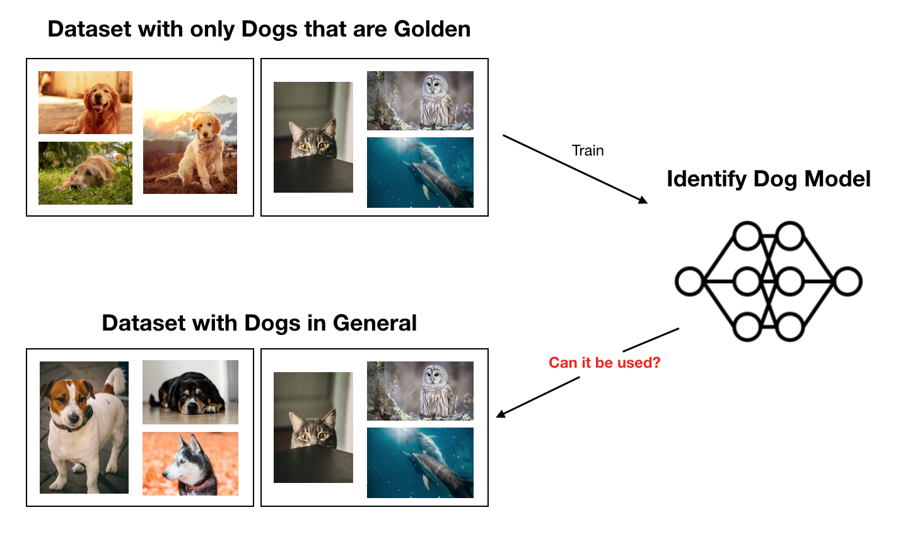
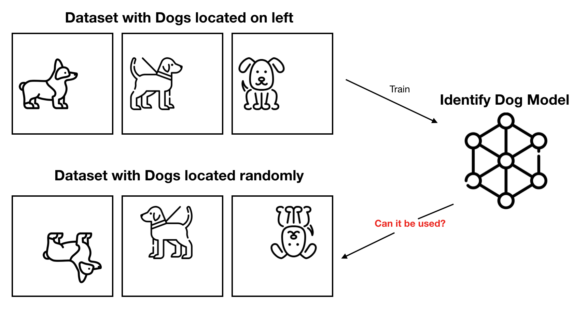

## Index

* [Index / General](https://jinwooooo.github.io/jinwooooo-blog/lung-cancer-histology-image-classifcation-with-cnn-(index-general)/)
* [Methods Utilized](https://jinwooooo.github.io/jinwooooo-blog/lung-cancer-histology-image-classifiation-with-cnn-(methods-utilized)/)
* [Level 1 - Patch](https://jinwooooo.github.io/jinwooooo-blog/lung-cancer-histology-image-classifiation-with-cnn-(level-1-patch)/)
* Level 2 - Image
* Results

---

In this post I will be elaborating on some of the techniques I utilized to enhance my network models. Note that this post does not include every methods I have utilized within the model and some of the methods will be shared on **Level 1 - Patch** and **Level 2 - Image** posts.

---

## Batch Normalization

In order to reduce overfitting, one of the major pitfalls of neural network. I've integrated **Batch Normalization** into the network. Not only does it reduce overfitting, it also allows for higher learning rate. Before going into technical terms I will try to demonstrate how Batch Normalization helps my network with an example.

If you consider a network trained without Batch Normalization on a the "Golden Dog Dataset" and the network is used on a "General Dog Dataset" it would not perform very well. However, if Batch Normalization is included, while it may not be a good model, it will generally perform better than a model without the Batch Normalization.

Batch Normalization basically works by subtracting the batch mean from the output of previous activation layer and then dividing the batch standard deviation (i.e. reducing covariance shift).

---

## GAP (Global Average Pooling)

This is another method to reduce overfitting problems for neural networks. This one also uses statistical values instead of a raw value like Batch Normalization, but this one focuses on a specific feature: spatial translation.

As shown in the Figure above, models with GAP method will perform better on the test set (Located Randomly Dog Set) than without the GAP method. GAP method achieves spatial translation robustness by feeding mean of each feature map directly to the SoftMax layer instead of feature map added on top of fully connected layer.

[Read here](https://alexisbcook.github.io/2017/global-average-pooling-layers-for-object-localization/) for more in-depth explanation and samples for GAP.
