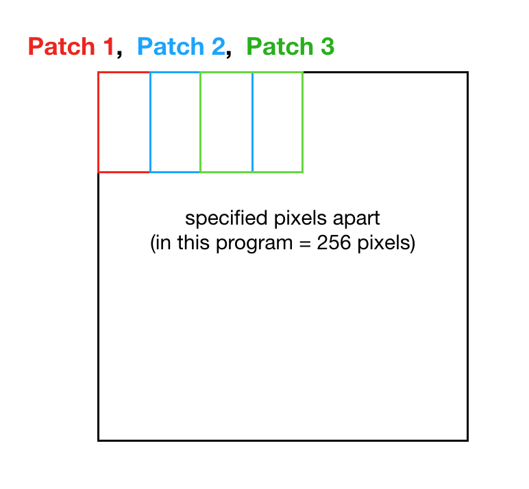

## Index

* [Index / General](https://jinwooooo.github.io/jinwooooo-blog/lung-cancer-histology-image-classifcation-with-cnn-(index-general)/)
* [Methods Utilized](https://jinwooooo.github.io/jinwooooo-blog/lung-cancer-histology-image-classification-with-cnn-(methods-utilized)/)
* [Level 1 - Patch](https://jinwooooo.github.io/jinwooooo-blog/lung-cancer-histology-image-classification-with-cnn-(level-1-patch)/)
* [Level 2 - Image](https://jinwooooo.github.io/jinwooooo-blog/lung-cancer-histology-image-classification-with-cnn-(level-2-image)/)
* Results

---

## Patch Specification

Modifying a full image into patch itself is not a complicated task, but there are some factors to consider.

1. Size of Patch
2. Size of Overlap (i.e. Stride)

In a sense the patches must include the proper size for the network to pick up distinct patterns for each category and a proper stride to reduce potential spatial information loss. For the optimal size for patch and stride, I've initially considered doing some trial and errors, but running a full scale Neural Network expects weeks of training. In the end, I've referenced successful patch based Convolution Neural Network researches with similar full image sized and based it on their numbers.

* **Patch Size** 512 pixels
* **Stride Size** 256 pixels

Here are snippets of codes to extract patches.


class ExtractPatches:
    def __init__(self, image, patchSize, stride):
        self.image = image
        self.patchSize = patchSize
        self.stride = stride

    def extract_single_patches(self, patch):
        croppedPatches = self.image.crop((patch[0] * self.stride, patch[1] * self.stride,
                                          patch[0] * self.stride + self.patchSize,
                                          patch[1] * self.stride + self.patchSize))

        return croppedPatches

    def no_of_patches(self):
        xNoOfPatches, yNoOfPatches = (int((self.image.width - self.patchSize) / self.stride + 1),
                                      int((self.image.height - self.patchSize) / self.stride + 1))

        return xNoOfPatches, yNoOfPatches

    def extract_all_patches(self):
        xNoOfPatches, yNoOfPatches = self.no_of_patches()

        allPatches = list()
        for y in range(yNoOfPatches):
            for x in range(xNoOfPatches):
                allPatches.append(self.extract_single_patches((x,y)))

        return allPatches


---

## Patch Neural Network Architecture

After extracting patches, the overall structure is very similar to a regular neural network.

Here is the code snippet


class PatchLevelNetwork(BaseNetwork):
    def __init__(self):
        super(PatchLevelNetwork, self).__init__('p_')

        self.features = nn.Sequential(
            nn.Conv2d(in_channels=3, out_channels=16, kernel_size=3, stride=1, padding=1),
            nn.BatchNorm2d(16),
            nn.ReLU(),
            nn.Conv2d(in_channels=16, out_channels=16, kernel_size=3, stride=1, padding=1),
            nn.BatchNorm2d(16),
            nn.ReLU(),
            nn.Conv2d(in_channels=16, out_channels=16, kernel_size=2, stride=2),
            nn.BatchNorm2d(16),
            nn.ReLU(),

            # excluded middle part, refer to the abstract architecture above to get a feeling of how it is done here

            nn.Conv2d(in_channels=128, out_channels=256, kernel_size=3, stride=1, padding=1),
            nn.BatchNorm2d(256),
            nn.ReLU(),
            nn.Conv2d(in_channels=256, out_channels=256, kernel_size=3, stride=1, padding=1),
            nn.BatchNorm2d(256),
            nn.ReLU(),
            nn.Conv2d(in_channels=256, out_channels=256, kernel_size=2, stride=2),
            nn.BatchNorm2d(256),
            nn.ReLU(),

            nn.Conv2d(in_channels=256, out_channels=1, kernel_size=1, stride=1),
        )

        self.classifier = nn.Sequential(
            nn.Linear(1 * 64 * 64, 4),
        )

        self.init_weight()

    def forward(self, x):
        x = self.features(x)
        x = x.view(x.size(0), -1)
        x = self.classifier(x)
        x = F.log_softmax(x, dim=1)
        return x


As mentioned in the **Methods Utilized** post, each procedure has a BatchNorm2d (Batch Normalization). Due to overfitting when tested, double downsampling was also integrated. Note that the output if this network will be a feature map so that in the **Level 2 - Image**, so spatial information are no longer available after this level.

Moreover, it is common in neural network to utilize maxpooling, but I've used 2x2 convolution layer with a stride of 2 instead (they pretty much do the same thing, I've used it because with a subset it performed better in terms of accuracy). If you are familiar with machine learning, you would have noticed the log_softmax function. Since the network is trying to classify a non-binary model, it makes sense to use the SoftMax.

Note that after each epoch the model is saved into a Pytorch checkpoints file.
