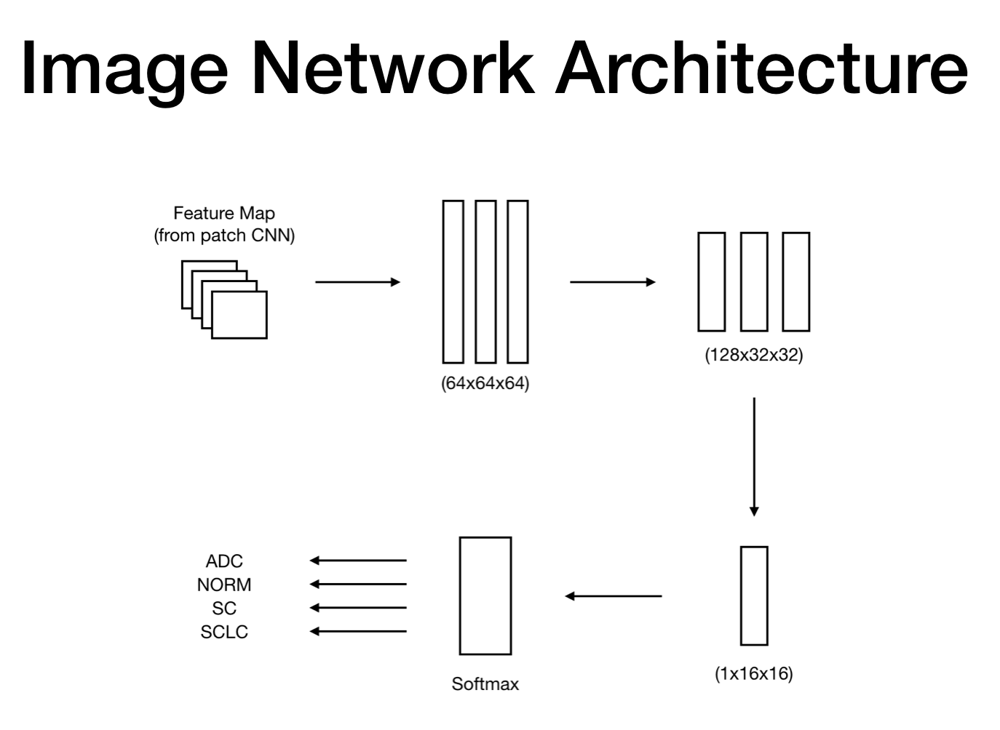

## Index

* [Index / General](https://jinwooooo.github.io/jinwooooo-blog/lung-cancer-histology-image-classifcation-with-cnn-(index-general)/)
* [Methods Utilized](https://jinwooooo.github.io/jinwooooo-blog/lung-cancer-histology-image-classification-with-cnn-(methods-utilized)/)
* [Level 1 - Patch](https://jinwooooo.github.io/jinwooooo-blog/lung-cancer-histology-image-classification-with-cnn-(level-1-patch)/)
* [Level 2 - Image](https://jinwooooo.github.io/jinwooooo-blog/lung-cancer-histology-image-classification-with-cnn-(level-2-image)/)
* [Results](https://jinwooooo.github.io/jinwooooo-blog/lung-cancer-histology-image-classification-with-cnn-(results)/)

---

## Overall Architecture and Execution

In this part, it's not that different from a regular Neural Network structure. The biggest difference is that the input is a Feature Map (output) from **Level 1 - Patch**.

I'm going to leave out majority of the code snippet in this post because it's pretty much the same as the **Level 1 - Patch** network which is following the architecture shown above. The only criterion to be careful here is making sure the Feature Map can be fed to the network properly. However, due to overfitting problem in this Level, I've implemented additional dropout in every batch.


self.classifier = nn.Sequential(
    nn.Linear(1 * 16 * 16, 128),
    nn.ReLU(),
    nn.Dropout(0.5),

    nn.Linear(128, 128),
    nn.ReLU(),
    nn.Dropout(0.5),

    nn.Linear(128, 64),
    nn.ReLU(),
    nn.Dropout(0.5),

    nn.Linear(64, 4),
)

