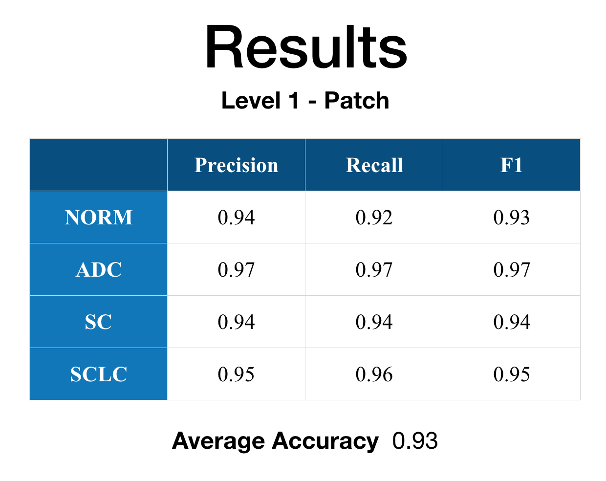
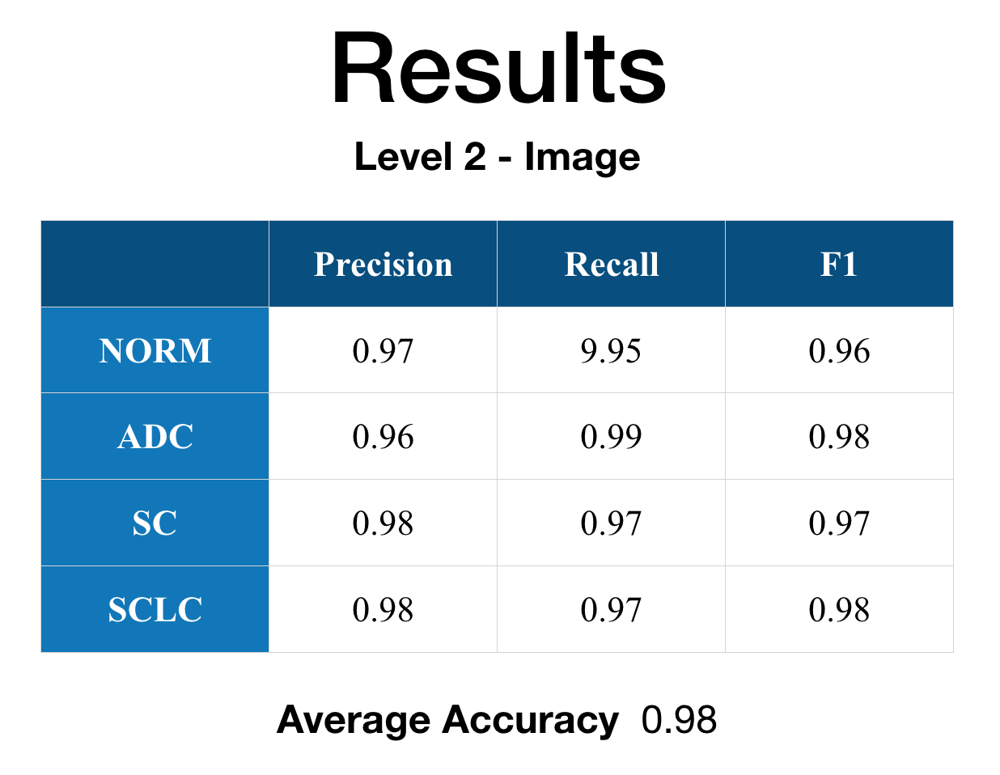
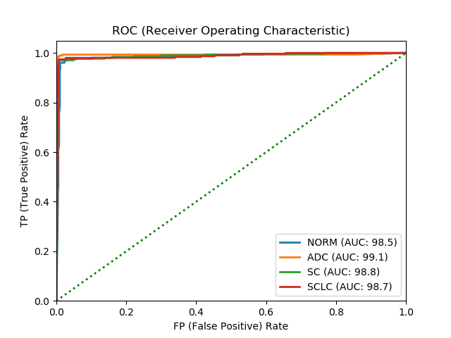
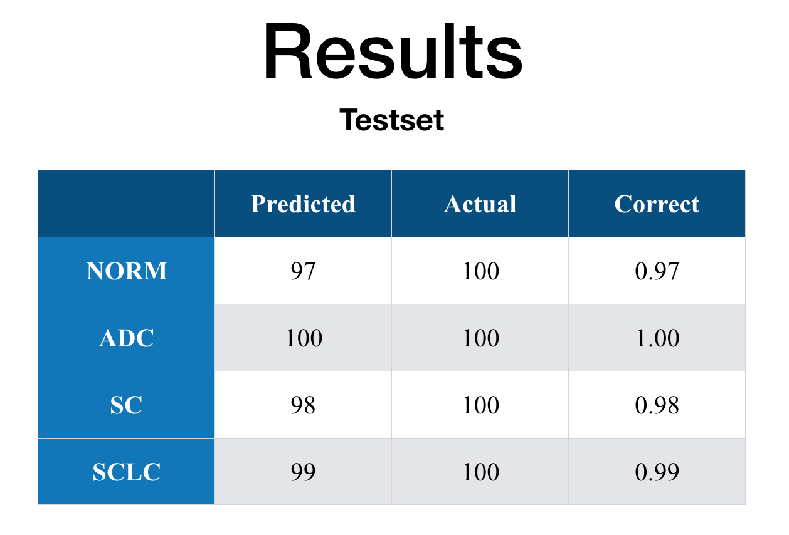
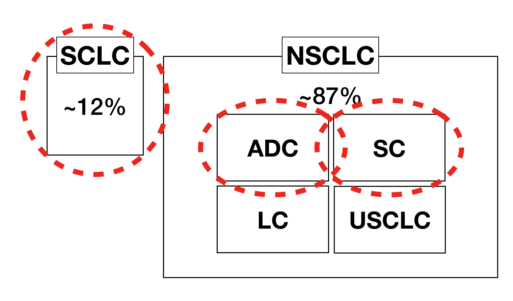

## Index

* [Index / General](https://jinwooooo.github.io/jinwooooo-blog/lung-cancer-histology-image-classifcation-with-cnn-(index-general)/)
* [Methods Utilized](https://jinwooooo.github.io/jinwooooo-blog/lung-cancer-histology-image-classification-with-cnn-(methods-utilized)/)
* [Level 1 - Patch](https://jinwooooo.github.io/jinwooooo-blog/lung-cancer-histology-image-classification-with-cnn-(level-1-patch)/)
* [Level 2 - Image](https://jinwooooo.github.io/jinwooooo-blog/lung-cancer-histology-image-classification-with-cnn-(level-2-image)/)
* [Results](https://jinwooooo.github.io/jinwooooo-blog/lung-cancer-histology-image-classification-with-cnn-(results)/)

---

## Training & Validation Set Results

Total of 1,200 training images and 300 validation images for each class (i.e. total of 6,000 images). Each epoch took about 1 day and this is the result of 20 epochs. I've used a common Adam optimizer with the values as listed below.

* **LEARNING_RATE** 0.001
* **BETA1** 0.9
* **BETA2** 0.999
* **LOG_INTERVAL** 50
* **EPOCHS** 20

Before going in to statistical result values, here is a compressed figure to show/remind what each values represents.

Here are the actual results in table form and the ROC graph.

It can be easily seen in the result that **Level 1 - Patch** performance is not that good as **Level 2 - Image**. I've looked through the results and found that some of the histology images have significant white spaces with not that many cellular information that is causing some problems with the patch classification. However, when the feature map is fed to the **Level 2 - Image** other feature map's strong indication/weight caused the final classification statistical result values to improve from the **Level 1 - Patch**.

Overall the results are great. Because there isn't any values that are lacking, the model is working properly for the 6,000 images that were used to train and validate. Now the main question here is that is the model overfitted to the given set of images?

---

## Test Set Results

Total of 100 histology images each class (i.e. total of 400 images) were prepared. These histology images were never given fed to the model, so by feeding them to the current model I was able to determine if the model is overfitting to the given set of data or not.

Since the results for test set is similar to the values for the train/validation values, it seems that the model is not overfitting to the training and validation dataset.

---

## Further Possible Application

The 4 categories that were covered in this project were: Normal (NORM), Adenocarcinoma (ADC), Squamous Cell (SC), Small Cell (SCLC). However, there are more Lung Cancer categories.

The red dotted circles are the ones I've dealt with the project. Large Cell (LC) and Unclassified Small Cell (USCLC) have very little visual features to identify, so professionals tend to use other methods to classify them. I believe that it is worth a try to not to identify if they are LC or USCLC, but to tell the user if the current image that was analyzed has low confidence in NORM, ADC, SC, SCLC so that it should be further analyzed with different methods.
