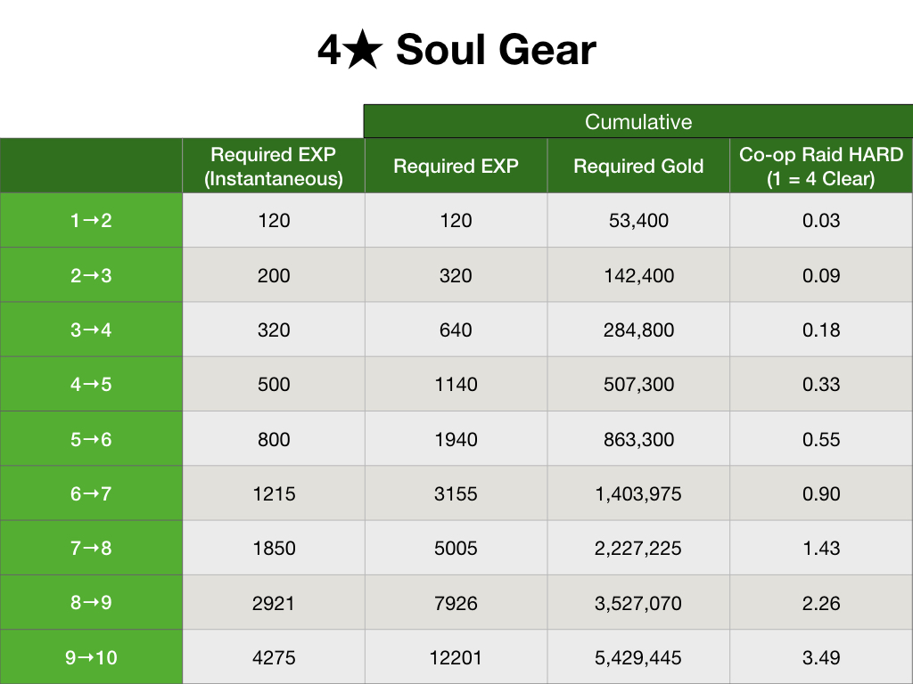
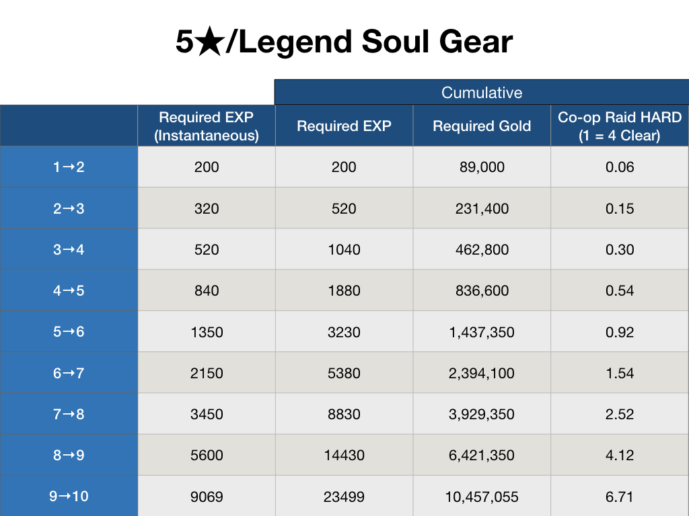

## Abstract

This post will mainly be in 2 parts.

1. **Raid Value (Easy, Normal, Hard)**
2. **Required Materials for Upgrading SG**

The global currency will be set as **gold**, but I will use other currency to give the readers a more cohesive understanding.

**(2020 Update)** The Soul Gear values were slightly altered (in a good way), but it is not so far off when leveling a Soul Gear from Lv 1 to Lv 10. I'm going to leave this as it is since it is still a good reference.

---

## Raid Value

**Easy (Successful Clear)**

* 1 SG = 40k Gold
* 300 SP = 40k Gold
* **Total** 80k Gold

**Normal (Successful Clear)**

* 3 SG = 120k Gold
* 900 SP = 120k Gold
* **Total** 240k Gold

**Hard (Successful Clear)**

* 4 SG = 160k Gold
* 1800 SP = 240k Gold
* **Total** 400k Gold

**Basic Analysis**

Since everyday you gain 4 chances, basically each day for clearing each Raid Difficulty are as follows

* **Easy** 320k Gold
* **Normal** 960k Gold
* **Hard** 1.6m Gold

If you see the % increase of Gold you get from going up a difficulty, it is **Easy → Normal (300% increase)** and **Normal → Hard (67.77% increase)**. It is easy to understand that doing a Easy raid is super inefficient. Some may think that because the increase from Normal to Hard isn't that big, maybe it's okay to keep doing Normal, but you here are some additional information you should know.

Many users farm gold through the Friday, Saturday, Sunday gold dungeons, so I'm going to adjust the total gold value for raid in a full week.

* **Normal** 6.72m Gold
* **Hard** 11.2m Gold
* **Difference** 4.48m Gold

If you have experienced autoing Gold Dungeons, 4.48m Gold takes roughly about **4~5 Hours** (for 7 turns). Now, since autoing gold dungeons isn't particularly costly but **HS (Horse Shoe)** is. It translates to roughly about 2.5k HS, which is almost a full 4 days of HS saving in mailbox.

**Conclusion (tl;dr)** You lose more than 4.48m Gold (resources and opportunity costs) per week by not doing Hard raids. If you aren't able to solo Hard, be very active to find a Raid party that can successfully clear Hard

---

## Required Materials for Upgrading SG

Some Assumptions (these numbers are NOT OFFICIAL)

* Chance for 5★ SG = 10%
* Chance for 4★ SG = 20%
* Chance for 3★ SG = 70%

Do note that these numbers are based on expected value. Depending on your luck it may cost more or less :^). Since most of the grunt work is already done in these numbers, I'm sure other values like **How many days of NORMAL Raids** value can be easily derived from the information I've given in this post.

***혼자사는호랑이 (KR User)'s data were referenced for this section***
