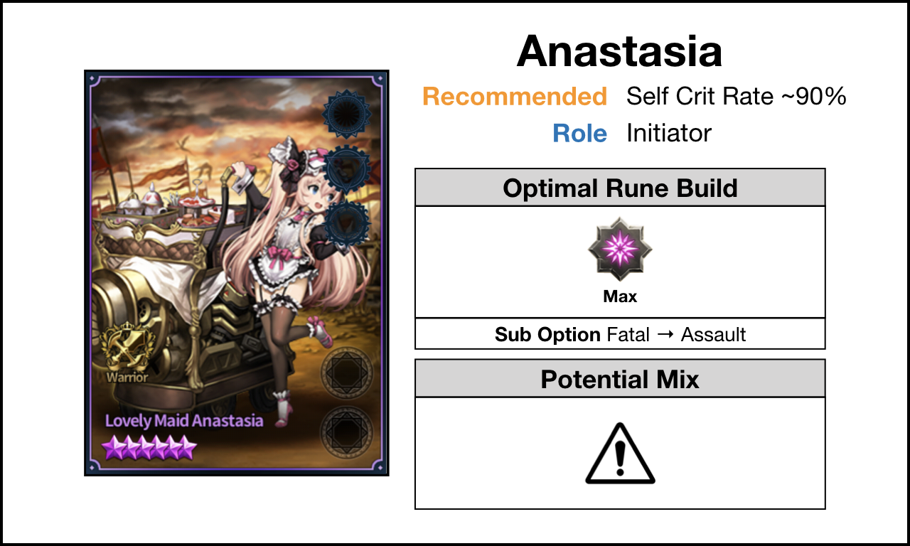
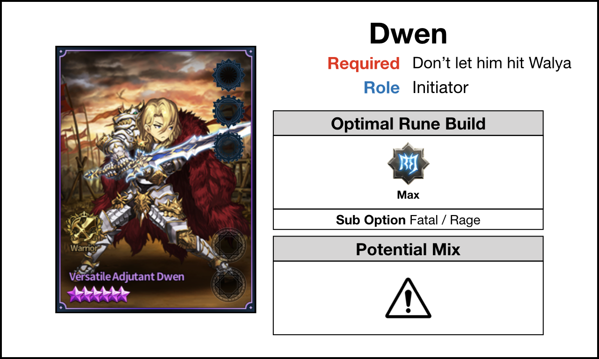

## Abstract

Generally most of 5★ Offensive Unit goes with a very similar format, but there's a mathematical logic behind this format. This post is separated in **3 Parts**.

1. **P1 - Mathematical Way to Optimize Damage Output**
2. **P2 - How to Read the following Guide**
3. **P3 - 5★ Offensive Unit List w/ Rune Guide**

Please use **Ctrl + F** w/ keywords **P1, P2, P3** to get there quickly. I'll try to look into the blog framework if I can make a link to the parts with a click.

For Units, also just **Ctrl + F** w/ the unit name.

---

## P1 - Mathematical Way to Optimize Damage Output

Before getting into it, please note that this is for units that don't have special ability to specific runes (e.g. Aanastasia w/ Fatal Fury). This one is for more general units (e.g. Foxy, Leto, Lian, etc.)

For impatient users, here is a **tl;dr** summary

For those who are interested how this algorithm is formed we have to look deeper into the Browndust Damage Mechanics.

The rest of this section, I'm going to assume 100% Critical Hits. I'll later move on to real example so that we also include Fatal Runes. For those who legit don't know why Critical Hits are more beneficial than Assault Runes, leave in the comments and if there I think there are enough users who legit don't know why, I'll add it into this post.

Anyway back to topic, here is the Final Damage Equation in Browndust (a bit simplified; removed FlatRuneATK, SoulGearATK, SelfBuff).


[UnitBaseATK (1 + %RuneATK) (1 + SupportATK) (1 + UnitBaseCDMG + RuneCDMG + SupportCDMG)]


There are some values we are able to remove to reduce equation. I'll be removing UnitBaseAtk (it's treated as constant), SupportATK/CDMG, and I'll sub in UnitBaseCDMG for 0.5.


(1 + %RuneATK)(1.5 + RuneCDMG)


At this point we have 2 variables. We have 1 equation with 2 variables, which just doesn't work. So I'm going to form a relationship with %RuneATK and RuneCDMG to reduce this equation to 1 variable. I'm going to use values that are easier to work with so I used CBS epic rune for each one.

Basically, If I had 2 CBS Epic Assault Runes, %RuneATK = 1.0 and if I had 2 CBS Rage Runes, RuneCDMG = 2.7. So now I have this equation.


%RuneATK = x
RuneCDMG = 2.7(1-x)


If we substitute these numbers...


(1+x)(1.5 + 2.7(1-x))


and put these into [wolframalpha](https://www.wolframalpha.com/input/?i=(1%2Bx)(1.5+%2B+2.7(1-x))) for quicc mafs (click on the link to see the math stuff). Our maximum is when x = 5/18! (i.e. the damage output is **maxed when %RuneAtk = 27.7% and RuneCDMG = 197%**)

### Real Example

I'm going to be using DPS as **Foxy** and Support as **Venaka +10** and **Ceres +10**.

* **Venaka +10** give around SupportATK = 0.8; SupportCDMG = 0.7
* **Ceres +10** give around SupportATK = 0.4; SupportCDMG = 0.6

Usually with Ceres, you need a full Fatal Rune on Foxy to get ~100% Critical Rate, so I'm going to give a full Fatal Rune and we now have 1 slot to optimize Foxy's DPS.

* **Foxy** UnitBaseATK = 914; UnitBaseCDMG = 0.5


(914(1+x)(1+0.8+0.4))(1+0.5+0.7+0.6+2.7(0.5-x))
= (2010.8(1+x))(2.8+2.7(0.5-x))


**Max(x) = 29/108**

 **%RuneATK = ~0.27 and RuneCDMG = ~0.62** to get maximum DPS out of 1 slot rune Foxy.

### Some Values to be Aware of

* This 1.0 ~= 2.7 value is based on CBS 6★ Epic Rune, for custom optimization you'll need to find the value according to the runes available to you
* if FlatRuneATK gives you more ATK than %RuneATK with the optimization, you can substitute FlatRuneATK (generally with support buff, FlatRuneATK may give u slightly more advantage)
* Be mindful that the more support buff you give, giving RuneATK is more optimal (The reasoning behind is quite simple, think if the equation is x + y = 10 and max(x,y), easily x = 5, y = 5 is the solution. If you add in more support this equation becomes x + y = 20 and max(x,y). If you put x = 5, y = 15, it is no longer the maximum, rather it is x = 10, y = 10)
* It gives you slight advantage, this optimization will not give you like insane advantage (see image below)

---

## P2 - How to Read the following Guide

It is crucial that you know that these values are based on mostly after support buff is given to the units.

And here are the other stuffs that you should know

---

## P3 - 5★ Offensive Unit List w/ Rune Guide

* **Anastasia**

* **Babara**

* **Christina**

* **Dalvi**

* **Dwen**

* **Edin**

* **Eleaneer**

* **Elija**

* **Farrel**

* **Gunther**

* **Hanya**

* **Jin**

* **Kaina**

* **Rogan**

* **Siegmund**

* **Ventana**

* **Victor**

* **Wilhelmina**

* **Yuri**

