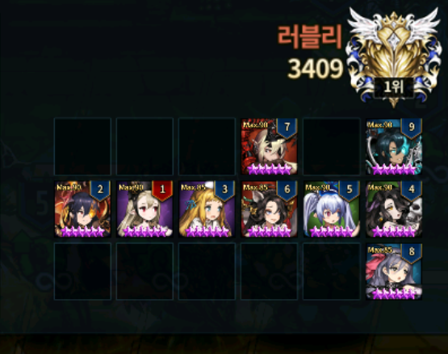
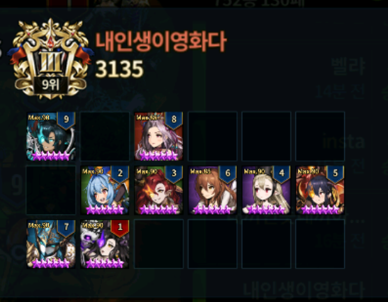

Stuff to note

* Data and Analysis are based on KR user **레오루**.
* The title for each images are their final ranks, the rank indicated in the image may not be their final rank.

---

**Rank 1 : 러블리 (Lovely)**

The DPS line up: Levia-Nartas-Catherine-Dalvi, is a very common line up. The support line up: Refithea + Beliath, is also a very common line up. Most interesting unit being used is Seto. You can think of him as a very expensive Zakan. The new unit Bansheena is also very popular in current KR meta. She can tank very commonly used Dalvi and can work similar like Lecliss.

**Rank 2 : 레오루 (Leo-Lu)**

Modified formation at the final sword rush. Very bad in defense rate, but has very good offense win rate. It's usually the norm to use Catherine-Nartas before Levia, but because of so many last turn Granhildr users, he was forced to use Levia earlier. If you think about it this works very similar to the Rank 1 Deck, just the DPS moved to bottom row instead of middle.

**Rank 3 : 내꺼인듯내꺼아닌내꺼같은브 (MineNotMineButLikeMine)**

Important factors in this formation is 1. Angelica at turn 9 2. Lucius getting Raffy's buff. Angelica at turn 9 most likely allows Angelica to kill last turn taunters or any activated taunt in the field, which allows Catherine to fire her stuff at heart of the enemy or kill Lucius for a clear hit for Alec + Levia in Round 2. Lucius with Raffy buff allows Lucius to take down enemy while he laughs away in DG.

**Rank 4 : Zia**

Similar deck to Rank 1, but here he threw in a curve with Dalvi initiation. If you noticed most of the images, Dalvi first turn will likely kill off 1~2 units along with Lucius. That 1~2 unit kill creates good chance for him to win.

**Rank 5 : 유튜브시청중 (WatchingYoutube)**

Rare Valze user in high tier. Because of high Beliath and Bansheena users right now, his Valze worked even though she usually don't kill anything.

**Rank 6 : 벨랴 (BellYa)**

Because of lack of Taylor users in high tier (or they just don't use anymore), this deck was able to get to Top 10. This deck had decent win rate in defense and offense, but seems like this is very specific to this week's meta, so it'll be hard to replicate the success to other seasons (future seasons included).

**Rank 7~8 : 마스터빈의마스터곰 (Master Bean & Master Gom); Note that he has 2 ID with similar name**

Not much modified from previous season except for Bansheena. He has massive unit pool and godlike runes, but he seemed to be busy or not interested, so not much analysis can be done here.

**Rank 9 : insta**

The 3 common magician line up is there, but threw a curve with Asmod and Alec on a different row from the mage row (Usually 1 is placed with the same row as Magician to get Lucius DG activated). He swapped deck formation consistently during the sword rush, so hard to analyze the deck he finished with.

**Rank 10 : 내인생이영화다 (MyLifeLikeMovie)**

This is like the most common power deck you can see in top tier (Beliath-Raffy-Asmod-Nartas-Levia-Catherine). If you see other ranks, they modified it for slightly better win rate in offense or defense for this particular season.
