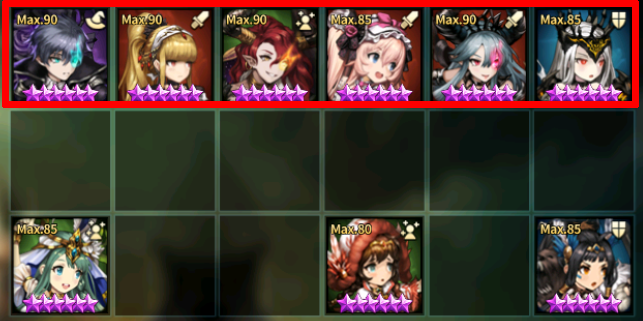
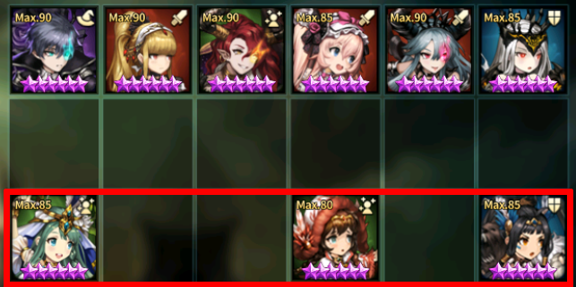
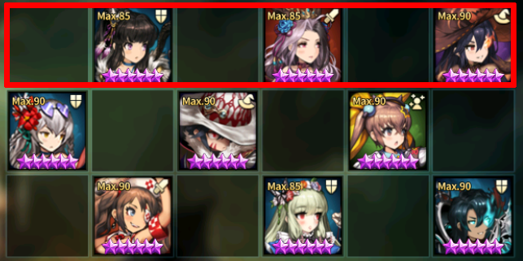
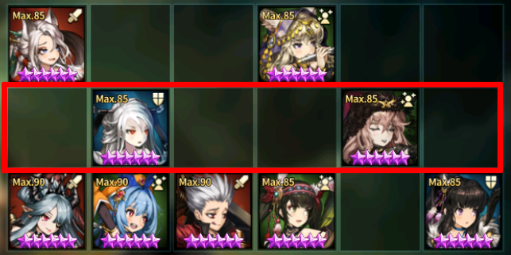

One of the few contents left in Browndust that isn't auto. Some users like the manual touch, so here it is.

---

### Here are few general rules that you should try to follow when creating a defense formation

I will first list them out and then elaborate on them after.

1. For your somewhat vulnerable attacker, you should try to pair it up with another unit in the same row that can cover up their weakness.
2. If you are using a taunter that can be easily blocked by Grace/Gloria, you should pair it up with attacker that can guarantee a kill on the blockers.
3. Try to avoid having units that can be **concentrated fire** in key location.
4. Always prioritize AGI bonus stat in rune over others if possible.

Of course, there are other ways in tricking opponents with some pocket strategy like Kaoli + Mich combo, activating Walya late, Lecliss first turn, but this post will cover some general stuffs. For the pocket/troll strategy, I will cover it separately (if I ever do decide to cover).

---

### 1. Pairing up offensive units to cover up each other's weakness

**Bad example**

You can easily just wall R1 for this formation with just Lilian alone. Just adding in Dalvi in the DPS row will make this formation a lot more robust.

**Good example**

One of main Dalvi's weakness is Lucius and one of Niya's weakness is against 100% Armored units. The two units are covering up each units weakness, making the formation more harder to deal with.

---

### 2. Pairing up units to stop enemy from easily removing taunt from the field

**Bad example**

If you put Gloria in front to tank Kaoli, you can pretty much just safely obliterate this row in few turns and move on to the next row.

**Good example**

If you don't know the turn order, Grace and Gloria cannot reliably block Kaoli because Dalvi is there. Mamonir can also be iffy to place in front because of Levia in R2. Also due to Kaoli getting a buff from Raffy, it will be hard to keep this row under control if not dealt with in some way.

---

### 3. Avoid placing units that doesn't have debuff immunity in key locations

This I feel is not very familiar with users who aren't that into Guildwar. **Concentrated Fire** if used correctly against some formation can win you the 3★ alone. Note that you need to make sure that the key units are not vulnerable to the AOE from the concentrated fire targets. If some support dies alone by getting concentrated fire, that's usually not a problem.

**Bad example**

This one is trying to make scouting hard by utilizing multiple taunts, but is very weak to concentrated fire. By using Natalie and Elija, you can easily clear the Eindolin and Cecelia in the middle row and then fire Nartas in R2 to make it a complete wipe. Also note that this user also doesn't take into consideration of the first point I made, which makes it easy to deal with Dalvi in the top row.

**Good example**

The concentrated fire targets here is only Lucius (Walya is also targetable, but you'd need Dominique). But Lucius on resurrection will remove all buff/debuff on him, so it's not ideal.

---

### 4. Prioritize on AGI bonus stats in runes

What AGI basically does is by luck some units happen to survive an attack they were supposed to die which can completely mess up the opponent turn order. It also reduces the turn order of enemy's debuff into half, so it will also create problems to enemy who are thinking of using concentrated fire (very problematic with Maya because if enemy does graze, Maya's concentrated fire debuff will tick out before you get to attack). Even for DPS units, they may survive a titan strike attacks from Cecelia or Gran to survive for another turn.
