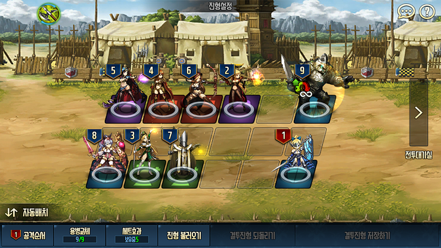
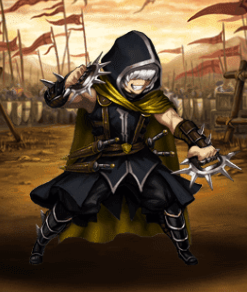
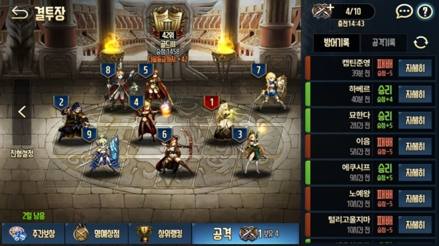
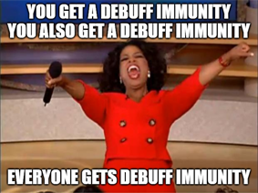
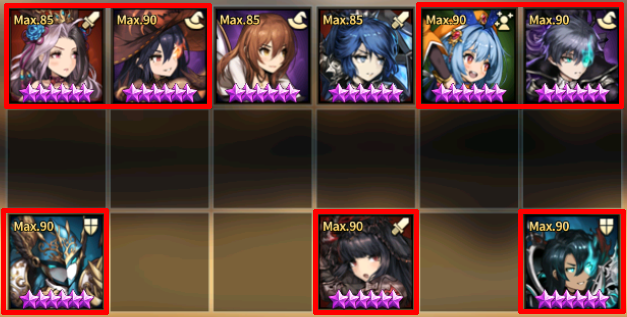
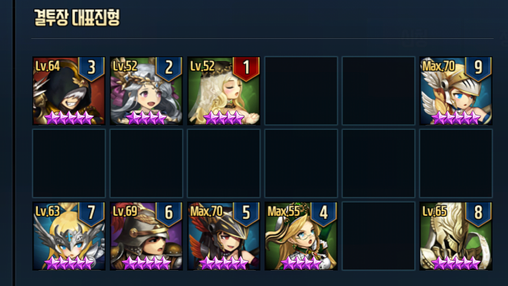

In **Stone Age**, majority were stuck with 3★ units and had to try to use one major 4★ units because using multiple high +4★ luxury many users could not afford.

**Stone Age consisted of 3 big Eras**

* Ridel Era
* Ron Era
* Frederica Era

**All 3 Eras did not have the following systems**

* Ancient Coin System
* Dominus Octo (1st Batch - Beliath, Levia, Lucius, Seto)
* Soul Gear System
* Dominus Octo (2nd Batch - Asmod, Mamonir, Valze, Velfern)
* Companion System
* Custom / Pity System
---

## Ridel Era

Before going into details, you have to understand that there were not many choices available. The next new offense 4★ unit was Viola I believe, so pretty much Deka and Octavia were the only alternatives for 4★ offense unit.

**What made Ridel OP?**

During this period there were no units that could punish Ridel’s initiation. Only candidate that could've potentially trade with Ridel was Mercedes, but Mercedes eats up a turn to activate her reflect. Units that could unconditionally punish Ridel like Sloan and Zakan were also not available at this period. This meant that if you had the first attack priority, you were guaranteed 1~3 unit kill for free. Due to this reason, her usage rate was a whooping ~90% in the high tiers.

In addition to her being a very good unit overall, she also allowed users to gain another bonus: her set effect with Cordelia and Velona. Many users lacked runes and supports were abysmal, so gaining the set effect boost was quite huge at this period. If Cordelia and Velona were shady units, maybe it wouldn't be as good, but Cordelia was definitely one of the best 3★ offense unit and Velona wasn't too shabby either.

She did require +9 because of the extra AOE gave increased formation flexibility and cleanup potential. It was quite hard to get her +9, but most of the high rankers (had to buy dia with $ a bit even at this period to get her +9 quickly, but still doable as f2p) at this period had +9 Ridel. Imo, you can kinda think of Ridel as Nartas on 6D Companion Update.

Here is a sample formation that actually landed rank 3. It don't exactly recall the + of all the units, but Ridel was +9 and Ymir was +0 unawakened. Iris and John were I think lower than +3. None of the 3★ were maxed, they were all at 5★ close to max level.

**Cause of downfall of Ridel Era**

Usually Era changes are caused by updates of new units and/or renewal, but this one wasn't. Some big brain user found out you can just tank all the Ridel and her set effect team by stacking bunch of DMG Reduction and adding AGI DMG Reduction on top of that.

Note that it's just an Era change, Ridel was still one of the best initiator until the introduction to Zakan/Sloan.

## Ron Era

**What made Ron OP?**

Many users do not know this, but he was the sole reason why the current DMG Reduction caps at 70% and AGI DMG Reduction is 35%. Originally, the DMG Reduction was capped at whooping 95% and AGI DMG Reduction was 50%. Ron with his kit alone already had 30% DMG Reduction with his Taunt AND 95% self AGI buff. What you just had to do to make him unkillable was to stack a lot of DMG Reduction buff and heals on him with supports (Clarice, the go to support with Ron, who gave bunch of DMG Reduction also gave stat weakening reflect, which made her super OP with Ron). So this was the birth of the Ron Support Formation (this later became the stepping stone for the biggest cancer thriving defense formation called the Granhildr Support Formation). Oh, did I mention that Ron had reflect based on ATK? Yea, so all your glass cannon DPS pretty much tickled him while your DPS killed themselves.

One of the solution was to use a combination attack: reduce the stat stuff on Ron with units like Karg and then go in with a heavy nuke. However, this didn't really work out well because at this period, a lot of users were utilizing multiple taunts (Mercedes was very popular and depending on player they added another taunters like Iris or John+Rene). Many users right now maybe thinking: why not use nullify to just remove Ron's presence in the game? During Ron's pinnacle in Arena, there were no other usable nullify (Maya was available, but she had taunt ignore in her kit, so didn't really make sense).

Here is a sample formation (Rank 42). At the beginning this one is gave 1 buff to Ron so that he can tank enemy initiation. Because Ron would rarely die anyway, this use gave Ron heal at the last moment so that he will be good to go in Round 2. Because nothing was too fixated at this period, there were quite a lot of variations...

Theoretically, many users opted to go for Ron with 3 support buffs (popular combinations were Arines+Clarice+Julie), which gave him better ATK Reflect with Arines buff, insane DMG Reduction with Stat Weakening Reflect on top with Clarice, and one of the best Heal (at this period, there were no other better feasible healer) with additional AGI to make it 100%.

**Cause of downfall of Ron Era**

The reason for Ron's downfall is pretty much the standard way with most games: new unit update countering the current OP: Frederica. Because Frederica was a defense unit, she was a bit tanky enough to not die to Ron's reflect and had nullify to remove his presence in the field after he racked up bunch of defense buffs.

3 support buff Ron strategy was the one that took a big hit and pretty much was completely wiped from high tiers. 1 buff Ron was still popular choice because he was still quite tanky and many users liked to use 2 or more taunt units (Mercedes was fixed, so the extra taunter was usually Ron)

## Frederica Era

**What made Frederica OP?**

Mainly due to the fact that there were not that many choices and she was the only efficient choice to counter the Ron Support Formation, she was able to reign at the top for few weeks. Unlike Ridel, she was good to go from +6 and since the 4★ Skill Books were scarce resource, she was a more viable choice to go for. Note that she was a good counter to Ron Support Formation, but because of so many users also utilizing Mercedes, Frederica was one of the few units that could kill Mercedes and not die (at this period supports were not that good, so DPS units were fairly under buffed compared to what we experience now).

What is interesting about Frederica during her era is that she was the cause of the immunity mechanics change. Right now we all know that you cannot nullify immunity, but during Frederica Era, it was possible to nullify immunity. It wasn't really a big issue back then. Some users raised issues about this interactions and because at this period the devs were very keen on listening to user's feedback, they actually modified the immunity system so that it cannot be nullified... However, this pretty much made BD mechanics complicated and I personally think that currently BD is like this (units marked with red border are technically debuff immune)

Here is a sample formation that utilized semi Ron Support Formation with Frederica. I believe this was in the crystal tiers. In terms of units, this is a very good unit composition, but the ★ and + for each units were too low as well as level, so this wasn't able to go that far.

**Cause of downfall of Frederica Era**

Similar to downfall of Ron Era, Frederica Era ended with a new update. Although the AC System got implemented on the new update at end of Frederica Era, it wasn't the availability of 6D that caused it... it was caused by the Legendary Kyle (yes the mage)...
