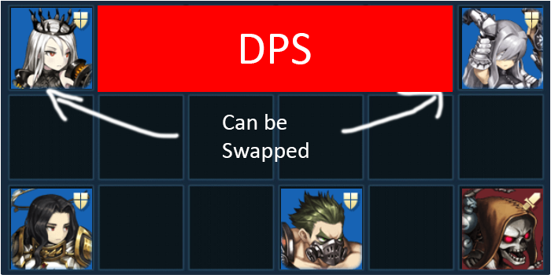

**Iron Age** is when many users start using 1~2 6D, 1~2 high +5★, 1~2 low 5★, and the rest were glued mostly with 4★. 3★ units were used here and there sometimes, but this is the Age where they start to become too weak to be effectively used in the PvP Arena.

Unlike other Ages, Iron Age will only consist of 1 big Era with multiple variation. As mentioned in the previous Age, Iron Age, the big Era was called **三種の神器 Era (Sanshuno Shinki Era / Three Sacred Treasure Era)**. The overall fundamental core units stayed the same, but they moved around depending on what units were popular. Here are the units that made the core units of the 三種の神器 Era move around.

* Eunrang
* Dalvi
* Aie

Some Honorable Mentions: Helena, Viola, Mora, Ymir

**Iron Age did not have the following systems**

* Dominus Octo (1st Batch - Beliath, Levia, Lucius, Seto)
* Soul Gear System
* Dominus Octo (2nd Batch - Asmod, Mamonir, Valze, Velfern)
* Companion System
* Custom / Pity System

---

## 三種の神器 Units

Before diving into units, the 三種の神器 consists of 3 items: 草薙の剣 (Kusanagi no Tsurugi [Sword]), 八咫鏡 (Yata no Kagami [Shield]), and 八尺瓊曲玉 (Yasakani no Magatama [the curved shaped bead]).

But in BD it's more like this...

Because all 3 units were **defensive units and 1 unit was more "broken" than the other 2**. If you have started BD with Asia/JP Launch, you'll probably have seen the major one in action for sometime before Lucius showed up.

The main one, **Arkan**, was pretty much Lucius before he showed up. He was notorious for his 100% armor during his prime. There were no armor pierce during 三種の神器 Era and the only reliable fixed damage was Alec (there were I believe 1 or 2 mages with fixed damage, but they were stigma or sth, which had no effect on Arkan who was immune to everything). Even after introduction of Dalvi later on (she was not introduced yet), he was still arguably the best tank available. I will elaborate more on Arkan in the next section.

The one who faded away, **Gloria**, was damn hard to deal with during her prime. As I have emphasized in the previous Ages**, there were not many Debuff/Atk Interference Immune units back then**, so she was one of the most popular units to be in line of fire for your DPS row. She was naturally placed in front in the beginning to possibly block taunts from units like Astrid/Mercedes and tank DPS units with no immunity like Camilla who was still frequently seen in PvP Arena. The best part about Gloria was that she required no + skill to be deployed. Technically she could be deployed without awakening, but she didn't have self sustaining skills so she many users awakened her to make her a bit more tanky.

The one who regained spotlight with companion, **Cecelia**, allowed formations to be flexible. She was the main unit that allowed the 2 power row variations. Sometimes she was used in the DPS row for keeping your DPS safe or she was just sent to the dummy row to buy for extra time while not letting AOE kill your key units. Similar to Gloria, she also required no + skill to be deployed and perform. The slight difference of Gloria was that if you +9 Cecelia, she obtained an ADV Curse Reflect (not PERM, was activated when she attacked for 20ish turns) which made her extra hard to kill if she was also given a sustaining buff.

## Elaboration of the Public Employee, Arkan

I'm not sure if this is common in all countries, but in KR, Arkan was called a Public Employee because when his time ran out, he'd just leave the battlefield. He even has a costume related to this concept.

He wasn't actually popular when he was first introduced. He was introduced when First Generation of GSF was popular and effective, so buying time didn't really make sense. So he was basically forgotten for 3 weeks or so until users started to + their Alec. When Alec hit +3, that was when the First Generation of GSF pretty much died. Right now the skill set is different for **Alec, but before he got buffed on the 6D Companion Release Update, his Atrocious Wrath was unlocked at +3.** Because Granhildr usually was equipped with some kind of damage reflect, **Alec started to actually die together with Granhildr.** Because GSF is so heavily focused on letting Granhildr alive for at least Round 1, this was a huge deal. When this +3 Alec train started to hit the PvP Arena harder than First Generation of GSF, that's when Arkan was given the spotlight. Just note that Alec +3 wasn't the sole reason why first generation GSF lost place in the very high tier PvP Arena, but it was one of the major reason.

At this period Arkan who was able to tank everything in R1 against every unit also had **utility embedded into his kit: nullify.** This was crucial because if you let Arkan go at the last turn, he will most likely nullify enemy's last turn taunt, which gave your team higher chance to nuke the enemy's core part of the formation in R2. He also still had the Paralyze, which also caused some problems (not that much since if the game goes late, he will leave the battlefield due to his first skill). Due to so many users complaining about how op Arkan is in the forums and platforms, his nullify was eventually nerfed to Armored Assault.

**So during 三種の神器 Era, the unit majority of users rerolled for Arkan** and as if the BD Devs knew about Arkan's imbalance, they never put him on rate up in the banner until his usage rate plummeted (there were no custom gacha banner before, they had 2~3 rate up banners which were chosen by the BD Devs, so you had no control over what rate up you'd get).

Note that Arkan in the 三種の神器 Era is the major unit that played into making a 2 row power formation very popular within BD that you'd rarely see any weird formation anymore in the higher tiers. Before the 三種の神器 Era you were able to see some weird formations sometimes making up even in Top 10, but post Arkan, almost all high tier formations were variation of 2 row power formation or a highly invested next generation GSF.

## Eunrang Variation

She wasn't the first back row 2 cell DPS unit. It was actually Yuria, but Eunrang DPS was much higher, so she was able to kill tanks much better than Yuria. Because she was much better than most of offensive 5★ units available, she was usually called as "5★ unit masked as 4★"

She was one of the main reason for Cecelia and Gloria popularity. So the one of the framework of 三種の神器 units were like this.

Another framework was like this

Eunrang pretty much forced one of the 2 lesser 三種の神器 to wall Eunrang. Note that I just based on the traditional 2 row power formation, they can be applied to other variations of 2 row power formation.

## Dalvi Variation

Arkan was unkillable in R1 because the only unit that you had fixed damage was Alec and usually his fixed damage was in the range of 6k~9k, so he was unable to kill Arkan in R1. With Dalvi's introduction, it was no longer the same.

2 lesser 三種の神器 still stayed consistent because Eunrang was still highly saturated (many who could afford it used Dalvi + Alec + Eunrang DPS combo). The major star of 三種の神器, Arkan, was the one who had move so that he won't get KO'd in R1. But who to replace the location where Arkan use to go? This is when a member of the Suicide Squad, Zakan, regained the high saturation in Arena. Because Dalvi was 8 turn fox mode (fixed damage) / 8 turn human mode (no fixed damage), generally she was forced to go as the initiator. Since Dalvi had debuff immune during fox form, Sloan did not work. However, because after Dalvi initiation, Alec or Eunrang was very popular as cleanup, so they used the other member of the Suicide Squad, Sloan in skip or back position in the dummy row.

Variation 1: Zakan - Dalvi / Sloan - Eunrang trading form

Variation 2: Zakan - Dalvi / Sloan - Alec trading form

Variation 1 was more statistically robust because not all users were able to afford +9 Dalvi and +9 Arkan in their team, so those users who lacked 5★ SB frequently used Eunrang initiation. The Variation 2 is more robust against those who used Viola initiation, but Eunrang was much more popular due to her higher raw damage and not being affected by some of the full immune units like BDM and Ymir.

## Aie Variation

She was the start of the all purpose mage movement.

I mean Aie had everything: huge nuke (3x3 tile with insane atk interference debuff), tank (50% dmg reduc from PERM Self Debuff Immunity and 50% dmg reduc from PERM ADV Curse), and sustainability (when enemy unit dies by Aie's monkey business skill, Aie instantly heals a lot of HP and has a lingering HP regen buff for few turns). The biggest factor that made +9 Aie a big game buster was that she was able to tank Eunrang with no defensive buff. The only downside of high + Aie was that she kind of needed a buff from support in order to successfully OHKO all tanks (except Arkan of course). For low + Aie, she couldn't tank Eunrang, so she was forced to move into a safer placement.

Aie caused one of the 2 lesser 三種の神器, Gloria, to get fired from PvP Arena. While I didn't go in lengths to talk about it, but she couldn't stay in front due to units like Dalvi and Alec if you met enemy DPS row and Ymir and (sometimes) BDM if you met enemy Dummy row. The only place Gloria was able to go was back, but Aie has debuff immunity, so she wasn't really helping that much either.

The other 2 lesser 三種の神器, Cecelia, was mainly used at the back to tank Aie and Eunrang or to just tank 1 turn front.

If users utilized other variation of 2 power formation, most of the time Cecelia was placed in the back because of Aie AOE.

### Honorable Mentions

* **Helena** many referred her as "the bitch" because of lack of immunity and purification in arena, she alone sometimes gave instant win.
* **Viola** she did force Gloria to move in the back more often when she started to gain popularity, but there were too many counters to Viola (Ymir, BDM, Gloria, Arkan) and Eunrang had more impact.
* **Mora** she was also one of the main nukers during this period, but her impact was less than Dalvi and Alec and shes quite similar to them.
* **Ymir** if this post wasn't so long, I'd probably go in depths about this useless piece of stone, but he was one of the most feared bruiser during his prime and made Gloria almost impossible to stay in front anymore.
