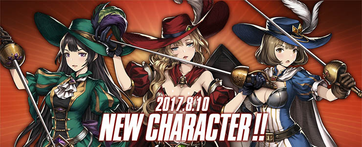

**Bronze Age** is when many users start using 1 6D and 2~3 high +4★ as core of their decks. The rest were glued together with 3★ units. 5★ were still like unicorns during this period.

**Bronze Age consisted of 2 big Eras + a counter formation concept**

* (Legendary) Kyle Era
* Suicide Squad
* Three Musketeer Era

**All 3 Eras did not have the following systems**

* Dominus Octo (1st Batch - Beliath, Levia, Lucius, Seto)
* Soul Gear System
* Dominus Octo (2nd Batch - Asmod, Mamonir, Valze, Velfern)
* Companion System
* Custom / Pity System

AC (Ancient Coin) System was introduced at the start of Bronze Age and because AC System was a modification from the Gacha system, in KR they allowed users to switch their 6D to another 6D they wanted (Celia was fusion so she wasn't applicable). They only allowed only once per ID. Due to this free 6D swap regulation, many users were able to change their 6D if according to meta. If 6D were the core part of the deck, this would've pretty much killed niche formations (e.g. reflect decks were actually usable at this period), but except for the GSF, none of the other 6D were able to single handedly carry them to victory.

GSF will have a special edition because if they're included here it'll get quite back and forth, so I made a separate post for them. You can click on this [link]() to see the GSF post.

---

## (Legendary) Kyle

**What made Kyle OP?**

I'm sure that not many users would've have even seen this mage in action. For some veterans, if you experienced when Levia got buffed with the insane big cross range with 100% kill rate (except Lucius ofc), Kyle was basically what Levia was back then in this period. He was so OP that he was regarded one the same level or better than the 6 Devils. Kyle alone shaped how part of the formation looked. Here is an example.

You were forced to use a taunt rod on the final turn so that you don't get your core rows fried (i.e. this start of the last taunt isolated rod strategy). Due to his massive presence in PvP Arena during his prime, he was the first unit ever to get his skill set modified/nerfed (note that first stat modification was Mercedes and the first mechanics modification was Ron). Kyle's 'awakened skill' is currently PERM Adroitness, but during his Era it was actually PERM Attack Interference Immunity. As I pointed out in Stone Age, pretty much any unit that are currently popular pretty much have Debuff Immunity, but during this period, no one had a self PERM Attack Interference Immunity (you could potentially bestow with supports, but that would increase the constraints on how you form your decks). On top of his really good skill sets, he only required +6 for high tier competitive PvP deployment, so he wasn't that expensive either.


I want to highlight on the fact that a mage being the core part of the deck was unthinkable during this period. The impact that Kyle had on the arena was huge and I feel like any modern user will have a hard time comprehending Kyle's impact because of so much emphasis on mage right now in BD.


**Cause of downfall of Kyle Era**

As mentioned previously, his skill set got nerfed and units were now getting more harder to kill + the rise of usage of Suicide Squad. So with the triple hit to the face, he got knocked out.

## Suicide Squad

Unlike the Eras I've been elaborating about, the concept of Suicide Squad never completely falls off. Because it is more of a counter strategy, the employment of Suicide Squad usage depended on what kind of units are being highly used at that point in time. During this period, the Suicide Squad consisted of 2 units: Zakan and Sloan. I'm sure some of you may ask "shouldn't Mercedes also be included?". She does trade well, but the condition to be regarded in the Suicide Squad is that you are able to trade without prior conditions (Mercedes ate up a turn to activate her reflect and taunt).

Most users when Suicide Squad got popular had only 1 6D and at low + and the best solo 6D was regarded as Alec (reason for numerous high + Alec users in KR right now). Basically, Alec was highly saturated in PvP, so Sloan, a mere 3★, was able to trade with a legendary unit. Similar to Kyle, because of this possible feat, he was regarded as a Legendary unit. ~~Funny how current Alec still shares the same fate.~~

So as you have probably guessed, Sloan was mostly located in the very front or in the skip position and the one cell behind him was almost always empty (saturated DPS units like Alec Range + other DPS like Frederica had 2 cell range).

Zakan, one of the lowest required investment (+2) required to put him into good use. Position wise, same as Sloan.

As the popularity of the Suicide Squad grew so did the spotlight on GSF. Sloan and Zakan are units to trade with enemy units, so you lose durability. GSF at this period is a formation that slowly withers you down one by one. So, GSF was a direct counter to formations that were looking to get some damage done with suicides.

## Three Musketeers

**What made Three Musketeer OP?**

The star of the Three Musketeer was **Camilla**. Similar to Kyle, even though Frederica had nullify and reasonable DPS, her DPS was no longer enough in the current meta. Camilla who had nullify on her kit also had a decent extra attack skill with self buff on top of it.

**Brisa**, was also quite useful in the Three Musketeer. Camilla was important to keep alive to kill core units for the enemy team, but in front of the Suicide Squad, Camilla was vulnerable. So some users utilized Brisa to try to get rid of mines first (she survived Sloan, but not Zakan), and then go later with Camilla. Brisa also had bonus of the reflect and defensive bonus after attack, so if the user could afford Brisa, many users utilized Brisa.

**Martina** was the third wheeler in the Three Musketeers. She wasn't really tanky enough to be a reasonable wall and she didn't have DPS to be a bruiser like Frederica. She usually just served as a unit to take 1 hit if she was in the formation.

Because three musketeer will take 3 of your 9 units for the formation, users usually used at least 1 unit from Suicide Squad (usually front because of Alec). Here is a sample formation.

In terms of their impact, I think you can relate to the impact when the 3★ trio, Carlson + Beatrice + Rignette, became super effective in NA due to renewal + companions. They were affordable and effective.

**Cause of downfall of Three Musketeer Era**

Basically the Three Musketeers were no longer able to kill off the wall of the next era, so they faded away... but the next age will start where 1 high + 5★ units with multiple low + 5★ begin to show up.
