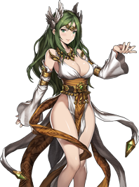

**GSF = Granhildr Support Formation**

GSF is a formation that has brought so much hate into the KR BD community that a rumor: "사장아들 그지덱유저 / BD CEO's son is a dirty GSF user" was quite popular for a while.

>
Before actually going into the formation itself, I'd like to elaborate on the KR term for GSF: 그지덱. It's basically an acronym of 그란힐트 (Granhildr) 지원 (Support) 덱 (Deck). While in English it looks like some random 3 alphabets, in KR, 그지 sounds quite similar to trash or bum in Korean. So in KR many new users first thought that the Formation is called Trash Deck because it's a **dirty way to get wins.** If you were a power formation user who didn't have a good means to kill off key units in GSF, it feels miserable because 1~2 units alone wipes your whole team.
>

## The Framework and the Father of GSF

In the [Stone Age](https://jinwooooo.github.io/jinwooooo-blog/browndust-pvp-arena-ancient-history-stone-age/), there is Ron Era. The basic framework of GSF is based off of Ron Support Formation, which is basically giving multiple supports on the one taunter (for Ron Support Formation = Ron and GSF = Granhildr), so that it can tank almost anything that the opponent can throw at it.

Because there were no AC system in the early days of BD, no one really could afford Granhildr, Refithea, Celia at the same time. Even after the AC system introduction, getting Celia was quite expensive back in the days because you would need to gacha Elija without custom banner and on top of that multiple 4★ for fusion and Asera (mileage gacha). But one of the initial whales of BD named Hiba (KR: 히바) was able to achieve the Traitorous Set and unleashed hell upon PvP Arena. Due to this feat, he was called as the "Father of GSF".

His Offensive Version for Initial GSF

* **Granhildr** The core of this formation. Granhildr's self buffs (Rainbow Reflect + Taunt + Barrier) were all 10 turns here (they were nerfed to 8 turn later on). Nothing during this period was able to kill a fully activated Granhildr.
* **Raffy** Her buffs were pretty abysmal at low + (+0 during this period), so she was pretty much referred as a HP totem for Granhildr. She wasn't a must to have unit for GSF during the early days of GSF.
* **Celia** While she is pretty meme right now, she was a force to be reckoned with. Just see the units Hiba used, nothing except for activated Granhildr had self atk interference/debuff immune. The reason why Elijah and Julie is so far away from Granhildr is because they were able to purify enemy Celia's silence (during this period, some just used solo Celia just because of her massive utility or used some AOE with Silence/Atk interference so that you could deactivate Granhildr's Supports). Celia was quite important to land in the highest tier (above rank 50), but you were able to work around it in the lower tiers.
* **Agaron** He is probably quite unfamiliar to many users, but he was one of the best units to have when the game came down to very low number of units. He does decent damage and was incredibly tanky with his buffs alone. I mean some power formations used Agaron in their formation and were able to land a place in Top 10 during this period.
* **Ridel** As mentioned in the Stone Age, Ridel was quite popular as one of the DPS units, so you can see he added one DPS in his lineup.
* **Elijah** She is what made everyone felt disgusted about GSF. Granhildr's Reflect is pretty much an upgraded version of Debuff Immune and it wasn't PERM at this time, so Granhildr's achilles heel was when her buffs are deactivated. But, Elijah pretty much fully covered up Granhildr's major weakness.
* **Julie** The best healer in the game at this point in time, there were no good replacement for Julie.
* **Mercedes** In order to protect Granhildr when Elijah's refreshed buffs on Granhildr timed out, many GSF utilized a 2nd taunter. During this period, Mercedes was the most affordable and popular taunter, so he utilized Mercedes.
* **Eunice** Since his Raffy is was +0 at this point in time, it was not enough buff for Ridel to do enough DPS, so he added a support who is a Hybrid (Offensive and Defensive Support) with a 3x3 support tile (possible to swap with Arines as well).

His Defensive Version for Initial GSF

You can refer to the list above for the units that I have already elaborated.

* **Sloan** Pretty much using it similar to Zakan.
* **Clarice** He doesn't really have DPS unit in this formation, so no point of utilized Arines or Eunice like for the Offense. I personally think that Hiba was trying to make enemy feel miserable waiting 7 turns for Granhildr to get fully buffed every round.

## First Generation of GSF Users

This is when the hatred started for the GSF. One of the main reason for such hatred is that the supports of GSF can be left at low ★. The worst one was Elijah, the buffer refresher shuttle. Elijah's primarily use was the skill "Lasting"

If you check the book.browndust, she has the Lasting at +0. I think you can refer Elijah as Lucius since you can also theoretically deploy him at +0 lvl 1 unawakened and achieve somewhat similar result as an invested one. Her purify also helped here and there, but you could always put Raffy and/or Julie outside of the dangerous zone instead of Elijah, so you were able to use Elijah as soon as you got her for GSF.

GSF user in ~2500 point tier. That 's right! No runes; +0; unawakened.

Many other supports like Clarice, Edan, Eras, Julie were also deployed at low investment (usually no/trash runes + only 4★ max level awakened). So users with highly invested power formation reaction when they lose to GSF in freakin round 15 had reactions like these

Here are some sample formations

Nothing too special, but as you can see Raffy and Celia were not required initially

Using Mercedes first to snipe one of enemy DPS

As you can see many users were not able to afford Raffy and Celia along with Granhildr, so people just got Granhildr with AC and gave Granhildr bunch of supports to tank everything. It worked quite well since the only DPS that was able to kill Granhildr were usually units that weren't that good against power formations (e.g. Melody), so it worked quite well with just Granhildr and supports alone. But when DPS starts to get stronger by every update, these first generation GSF eventually falls apart because Granhildr could not withstand the enemy bombardment without the Traitorous HP Set Buff.

So the first generation of GSF users lasted throughout the Stone Age, but those who did not invest in the Traitorous HP Set Buff no longer could continue in the Iron Age.

## Downfall of First Generation of GSF and the Mandatory Traitorous Set GSF

As hinted in the [Iron Age](https://jinwooooo.github.io/jinwooooo-blog/browndust-pvp-arena-ancient-history-iron-age/), DPS units were getting stronger that Granhildr with support alone could no longer really tank them effectively anymore. It wasn't that much of a problem for users who went full GSF with the Traitorous HP set buff. From this point onward all GSF must have Granhildr - Raffy in their roster. It was possible to get away with no Celia in perhaps Masters ~ Grandmaster III, but Grandmaster II and above, it was quite hard to go higher.

* **Against another GSF w/ Celia** meant if your key units don't die from enemy Celia, it pushed Rounds past 10, which made it impossible to compete in high rank without turning the device off and on. Even if your key units died from enemy Celia, you'd be lucky to lose Rounds before 10 because even if one healer and Granhildr stayed alive meant that it was highly likely for Rounds to go past 10.

* **Against non GSF** meant you were slow at using swords if they were vulnerable to Celia and at this period there weren't that many immune units.

Since I just mentioned about turning device off and on, I want to highlight that **GSF caused many users anger toward device off and on to accumulate points faster in the final few hours of Arena PvP.**

If GSF went first, they were notorious for above 90% winrate, but they would eat bunch of turns, so GSF users would turn the device off and on to accumulate points in shorter period of time. If GSF were on defense (going second) and the non GSF user wasn't able to kill the key units of GSF, they pretty much lost. Even if the non GSF user was able to kill off the key units of GSF, the GSF still dragged longer rounds than a non GSF opponent.

Additionally, Granhildr number of turns on the rainbow reflect and barrier got nerfed from 10 to 8. The taunt was still at 10 turn. This meant there were few turns here and there that Granhildr might be vulnerable. Before it was possible to let Granhildr Activate - Hit with DPS - Refresh, but now it was mandatory to Granhildr Activate - Refresh right away.

## Impactful Units for GSF during Iron Age

**Eldora**

Her kit is slightly different today, but her concept remain the same, **with self increasing buff and extra damage increased by enemy's positive buffs. Granhildr were still hogging the buffs from support, so I think they made her so that even with 1 buff, you could potential kill off Granhildr in R2.** But soon after her release...

What about **Lasting?** Well...

Surprise Surprise! Eldora's Self Damage Buff was refreshable. **What was worse was that Eldora for GSF was good against other GSF AND Power Formation!** It was a true nightmare for GSF haters. (Btw those who didn't really get why Lasting mattered is because GSF during this period used almost 0 offensive support, meaning you had to kill enemy through endurance and picking units one by one with reflect and stuff)

**Cecelia**

One of the 2 lesser 三種の神器 was one of the solution for Dalvi/Alec initiations and she made formations much more flexible so that other units were able to receive support buffs as well. She was also a good counter against GSF because she'd negate Celia's big AOE. In order to understand more, I think looking at a sample formation is helpful.

**Against Power Formations** Taunting with Cecelia first in order to tank initiators and perhaps kill with reflect. Anais was mandatory for Granhildr during the Iron Age because of Gloria. Because many users didn't use big AOE nukers (there weren't that many to begin with) post initiation, usually Celia and Eldora were usually quite safe.

**Against Another GSF** Usually GSF didn't really have a really strong DPS unit, so Cecelia usually lived in R1 meaning Taunt on Cecelia first turn meant that she will highly likely tank enemy's big AOE nuke.

There were many variation of the framework of the above. Because of Cecelia AOE Absorb, supports and mages were safe to be placed right adjacent to Cecelia which made it safe to clump so much units into small space.
