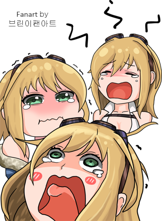
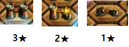
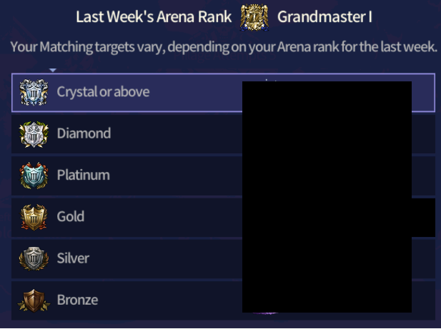
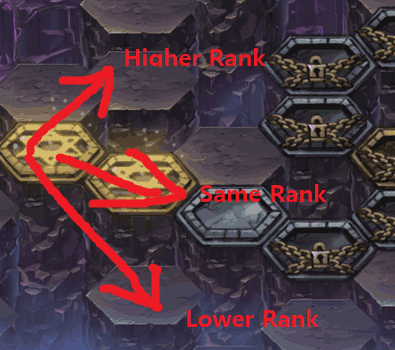

## Abstract

The new content idea I propose is called **Arena Formation Raid**. The idea is to try to win against other users’ arena formation without knowing the other users’ arena formation turn order. Like Guild War, the player is able to modify formation willingly in order to get a win.

---

## Background

Hi, I'm one of the oldest users of BD/B9 (Brown Dust/Brave Nine). I have downloaded the game near the day it was launched and started playing seriously near Arkan release.

I started this new content idea because I love the rudimentary elements of BD/B9: board mechanics, illustration, in-game animation, etc. However, I do not like the direction they are currently developing the game into. The power creep/inflation and specific broken skills (i.e. Seto’s Flame Guard and Helga minesweeper at the moment) I feel like do need attention, but that’s not what I’m majorly concerned about. The major concern I have is that they are pushing forward only PvE contents.

I want to clarify that I like new PvE contents. They do give challenges and require time and effort to achieve the rewards. However, they are **ONE TIME CONSUMED CONTENT**. The moment I finish getting the newly updated PvE contents done (usually within few hours), I am left with no more content to consume from the updated content.

The most important factor in the new content idea that I have is that **users are the ones who generates content and that BD/B9 only provides us with a platform**. But there’s another factor that has to be incorporated in this idea: **the users are mostly able to control when they want to play the content**.

In order to get a more concrete idea on what I’m trying to propose let’s look at two of the scrapped and existing BD/B9 system: **Conquest** and **Guild War**.

**Conquest is what I would categorize is user generated content, but have little control on when they want to play.** Having little control on when they want to play stresses out users immensely because there are specific time periods that are key to play (usually the time frame is at the last 15 minutes of each phase) and many of the users in BD/B9 are not able to meet this criterion freely (BD/B9 should not be expecting users who are attending school/lectures or working to stop what they are doing to play BD/B9).

**Guild War is what I would categorize is user generated content, but gives flexible time period to play the game when they can.** You can always attend Guild War whenever you are free to play within 24 hours. I get stressed about Guild War from time to time, but that is mostly because my units do not perform as expected or when I feel like my units cannot deal with opponent units.

---

## Possible Functions to Incorporate

**Conquest Fortified Point Function**

Like conquest fortified point function if the user wins straight out, the 3★ immediately becomes 0★ and the user is able go to the next castle/point. If the user fails it should reduce 1★ at a time (after 3 fails on the same castle/point, the user is able to move on)

**Castle/Point Selection**

In order to reduce the amount of work from individual users (and possibly trolling), I suggest that users should not have to specifically create a defense formation like Guild War and Mystic Island.

I propose a function to temporarily store users arena formation randomly throughout 30~90 minutes before the end of Arena. When storing the temporary formation, it should save all the particulars like the skill level of the units and runes so that it remains static throughout the week (users may remove runes for Novice Arena, which may hinder with the difficulty). The reason for 30~90 minutes before the end of Arena instead of after end of Arena is because sometimes users tend to modify formation after the Arena ends for whatever reason, which may not be true to their actual rank.

**Difficulty Modifier**

Like Mystic Island, the initial starting point should be based on what rank you have finished in Arena in the last week (higher than Crystal still gets Crystal based on Arena Formation).

After you have gained 3★ the user should be given a choice to go for a higher rank, same rank, or lower rank Arena formation. It would be great if there is some good UI/background to make the players feel more immersed like the new PvE content that was in the July Developer Notes.

Since ranks like Masters are non-existent in some of the servers in particular time period (or never), it would be best to use number ranks instead after Sapphire tier (i.e. Bronze, Silver, Gold, Platinum, Diamond, Crystal, Sapphire, Ruby ~ Rank 500, Rank 500~300, Rank 300~200, and so on)

**Fixed Number of Attempts**

For each Arena Formation Raid, each player should be given a fixed number of attempts like Guild War so that getting 3★ should be something to go for.

**Rewards**

Rewards should be given for gaining 3★ on a castle/points according to tiers. Failing 3 times in the same castle/point should also give the same rewards for someone who have gained 3★ in one attempt. Note that getting 3★ in one attempt is favorable because the user would be left with more attempts left to gain more rewards.

**Time Frame**

I feel that having this content on days when Guilds apply for Guild War would be best (e.g. Guild War → Arena Formation Raid → Guild War → Arena Formation Raid → Repeat) with same duration time frame, 24 Hours.
