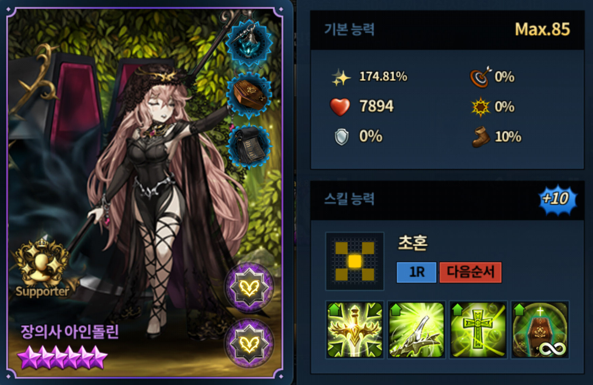
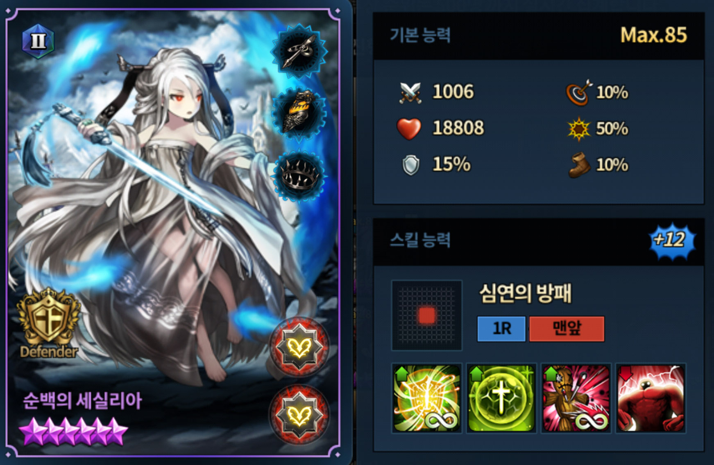
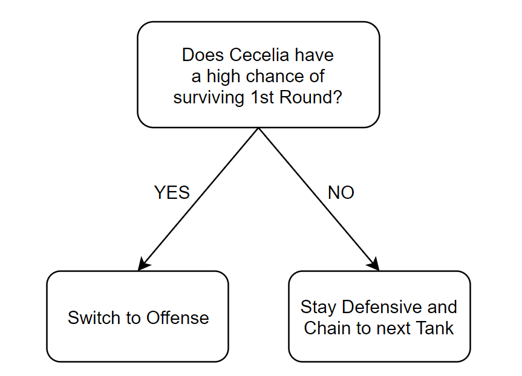
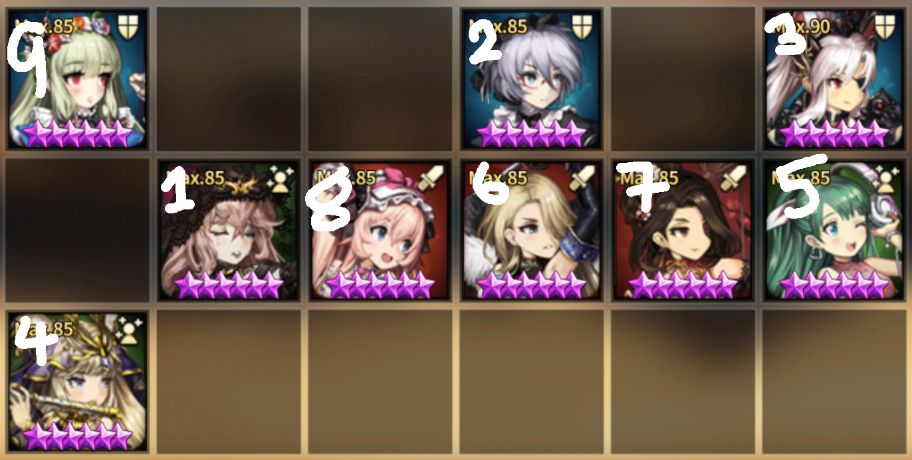
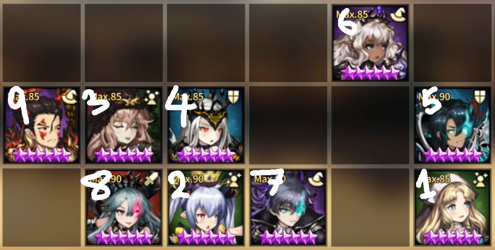

This post isn't for players who just started playing Brown Dust. You need to have some experience in Brown Dust Arena contents. I will not go in length to explain unit skills and mechanics.

---

## Abstract

Before the helper/assistance update, the only batch left in non-KR Server is the Ludia/Eindolin/Niel. In this post I will elaborate on successful integration of Eindolin into **3 Row (Power) Formation** (if you aren't familiar, [click me](https://jinwooooo.github.io/jinwooooo-blog/browndust-arena-formation-2-row-variation-extension-(3row)/)).

Unlike most regular offensive formations and decks, Eindolin Tank Chaining Formation, does not start with a strong assault, but starts with Eindolin → tank1 → tank2 → (optional: tank3) → offensive support chaining → attack (similar with defensive formation and deck). The most important unit other than Eindolin for this formation/deck is **Cecelia**. Before her helper/assistance update Eindolin only had reasonable result with Mamonir (basically using Eindolin as an expensive and better version of John), but now even without Mamonir, she can be utilized in a high competitive level.

---

## Eindolin and Cecelia (Renewed)

To start off let's get to know about Eindolin (Based on +10).

* ★5 Support Unit
* X AOE Bestowal
* **Skill 1** 12 Turn Taunt and Flat 50% Damage Reduction (only the main bestowal target)
* **Skill 2** 12 Turn Support Coefficient * 50% Critical Damage and 20% Attack Damage Buff (all AOE targets)
* **Skill 3** 12 Turn Eindolin's Max HP * 12% Heal and Support Coefficient * Critical Rate 30% (all AOE targets)
* **Skill 4** Per Ally's Graves (Ally Dead Units) Flat +60% Support Value (similar to Hanya's Grave Mechanics)

Her **Skill 2** and **Skill 3** is a very good stat enhancements on any DPS units, but because her main target will have taunt it's very risky to put DPS units within the AOE (especially with high usage of Velfern rate in current 2019 May meta). So you have 2 choices. Only put tanky units near the main target who synergizes well with Eindolin's buff (e.g. Velfern) or don't place any unit and just use her like a better version of John.

This problem was solved when Cecelia got renewed and got helper/assistant. The new Cecelia (Based on +12).

* ★5 Defensive Unit
* **Skill 1** Any skill targeted toward self will reduce AOE to self only and Heal 35% of the Damage Received
* **Skill 2** 45 Turn Reduce Incoming Damage by Flat 55% and Heal Self's Max HP * 4% (cannot be removed or nullified)
* **Skill 3** PERM ADV Curse Reflect (50% Stat Reduction)
* **Skill 4** ADV Titan Strike (DPS: Self Max HP * 25%; Heal: Self Max HP * 50%)

Since any main targeted AOE attacks on Cecelia (since she has taunt on) is reduced to herself only, any units near Cecelia is safe. Basically, now it's possible to give Eindolin's stat enhancement buffs to a DPS unit.

At this point you may wonder why you can't use this formation without the Renewal + Helper/Assistant. Here's some of the reason why.

**Assuming Cecelia Received Eindolin's Buff**

* NEW Cecelia can tank +8 or less Valze
* OLD Cecelia straight out dies to even +0 Valze
* NEW Cecelia can tank non-assault invested Velfern (assuming there isn't like more than 12 graves)
* OLD Cecelia cannot tank non-assault invested Velfern (assuming there is around 6 graves or more)
* NEW Cecelia can tank any # of buffed Foxy
* OLD Cecelia cannot tank Stat Immune Foxy
* NEW Cecelia can tank any # of buffed Wilhelmina
* OLD Cecelia most of the time cannot tank Wilhelmina
* NEW Cecelia can tank Edin
* OLD Cecelia straight out dies to Edin
* NEW Cecelia cannot tank Anastasia if she crits on both Normal and Extra
* OLD Cecelia straight out dies to Anastasia

So as you can see only DPS you have to really worry about is Anastasia (with any irremovable buff like Venaka's Skill 1) and +9 or higher Valze (assuming she has Stat Immunity and irremovable buff). ***Note I didn't mention Levia, since she's supposed to kill anyone w/o Energy Guard or Death Guard.***

---

## Idea Behind Tank Chaining

So after bestowing Eindolin's buff on Cecelia, you have two choices. Choice 1 is to go for the offensive support buff chaining into a strong attack. Choice 2 is to let one of your main tanks go after Cecelia (usually Lucius or Mamonir). The basic way to choose can be easily determined.

The reasoning is pretty simple. If your Cecelia is likely to die in the 1st Round, 2nd Round is very dangerous if you don't have contingency plan for opponent's potential Velfern and Levia. So by doing Tank Chaining, you have a high chance of being safe in the 2nd round's Mage Bombardments.

Moreover, it isn't that disadvantageous to push your attacks till the last few turns because since there's an abundant Walya user in the current meta (Based on 2019 May), this may actually let your DPS hit enemy formation where it's vulnerable. Obviously, if you push your attacks till the last few turns you will need a very robust formation since there's a chance that you might get hit too hard by enemy's bombardment to have an actual retaliation later on. So be mindful that if you're trying to gain something there's probably something you are risking in return.

---

## Example Formations and Elaborations

This one is mix up with **Eindolin Tank Chaining** and **3 Row Power Formation**. The stat enhanced buff goes to Anastasia and Foxy. Enemy's first DPS is tanked through Cecelia, second DPS is tanked through Recliss, and third DPS is tanked through Walya. Foxy → Anastasia order is to erase any taunts with Foxy and then hope for Anastasia to hit enemy's DPS. This formation is assuming that Valze is not used for second turn DPS. It's pretty standard deck for good defensive winrate and offensive winrate.

As you can see the stat enhanced buffs goes to Valze and Velfern in which both benefits pretty well and to make sure Cecelia has a higher survival chance against Anastasia, Michaela buff is added on top (in KR highly competitive tier you meet +10 Valze 9 out of 10 times, so she will still likely die in Round 1). This one is quite good even with 2 main DPS unit (Valze and Velfern) due to the fact that refi will kill enemy Anastasia with reflect. In Round 2, Lucius gets taunted to avoid enemy DPS hitting Valze/Velfern.

This deck is used mainly for weekdays because you get matched frequently with less completed decks. So here are some points you should know that changes on weekends.

* Note that Hijin will not be used in weekends because in very highly competitive tier in KR, nearly 100% of the users use Michaela, so Valze will not die to Hijin's burn dot. Hijin is replaced by Recliss for better defensive winrate (the position will be moved to top row instead of middle due to Anastasia's AOE)
* Lilian is replaced by taunter (mainly Aaron) on weekends. Because it is highly likely Cecelia will die, user will tank enemy's first DPS with Cecelia, second DPS with Recliss, third DPS with Aaron when on the offensive.

---

## Worthwhile Information to Note

This formation is not very good in top 30 decks due to the fact that almost 90% of the decks used in highest competitive tier have the most insanely strong DPS lineup that it just deletes anything it swipes (basically by taunting you are literally just killing one of your tank at a time). This deck/formation works very well in low tier (below Ruby in KR) and does fairly well in Master III ~ Grandmaster II. Basically it's kind of shaving off some win rate in offense and pushing up some win rate in defense.
