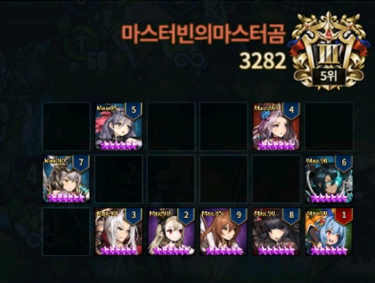

Stuff to note

* Data and Analysis are based on KR user **레오루**.
* The title for each images are their final ranks, the rank indicated in the image may not be their final rank.

---

**Rank 1 : 러블리 (Lovely)**

Back in the days, mages were garbage, but now... This deck basically just waiting on Round 2 for Apocalypse. The defense win rate for this particular deck isn't that good on general case, but against certain top tier decks, it had enough defense win rate to hold up on Rank 1 when paralleled with swords burning.

**Rank 2 : 벨랴 (BellYa)**

Very specific to this week's meta again. The Beliath + last turn Granhildr with position is very hard to deal with. This one has high defensive win rate.

**Rank 3 : 레오루 (Leo-Lu)**

Also very specific to this week's meta kind of formation. He stated that putting Nartas - Alec - Granhildr on different rows return good win rate in both defense and offense. His theoretical deck he has thought up before the last sword burning period was not the same as the image above. It just became like this after multiple modification.

**Rank 4 : 유튜브시청중 (WatchingYoutube)**

Same deck as last week. Seems like the low saturation of Valze users in high tier makes it possible for this deck to keep going Top 10.

**Rank 5 : Zia**

This guy usually picks one of the Top 10 users to snipe (usually the one who massively burns swords at the last few hours). Still using the Dalvi initiation like last week.

**Rank 6 : 내꺼인듯내꺼아닌내꺼같은브 (MineNotMineButLikeMine)**

Almost same as last week with few modification. This one is more safer than the last week with Walya taunt. But I think if he had other good meta units like Beliath, he wouldn't be using Walya.

**Rank 7 : 마스터빈의마스터곰 (Master Bean & Master Gom)**

Overall formation is similar from last week as well, but he has modified some stuff to not get lagged behind this week's meta.

**Rank 8 : 포맨 (ForMen)**

The traditional 2 row power formation. The dummy row is a very solid in this current meta, but the most interesting part is the use of Cecelia. Probably to snipe some user at the last hour.

**Rank 9 : 마스터빈의마스터곰 (Master Gom & Master Bean)**

He modified so many times today that it's hard to pick one to put as an example. Basically 3 row power formation with DPS on middle row.

**Rank 10 : 내인생이영화다 (MyLifeLikeMovie)**

Pretty much a modification from 레오루 (Leo-Lu) formation from last week. On the bottom right (currently Kaoli / Kallea), Bansheena and Angelica works pretty well with this formation as well. However, this formation doesn't do as well as you want in the low GM tier, so if you want to use this you should be wary of the pros and cons.
