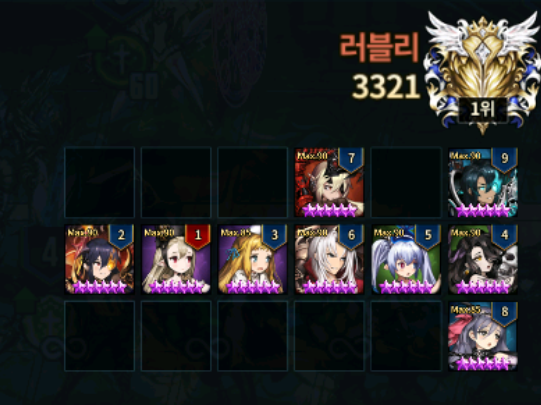
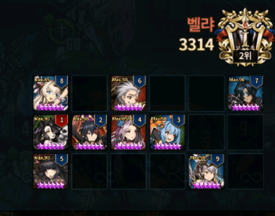
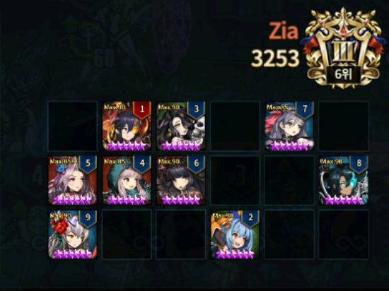
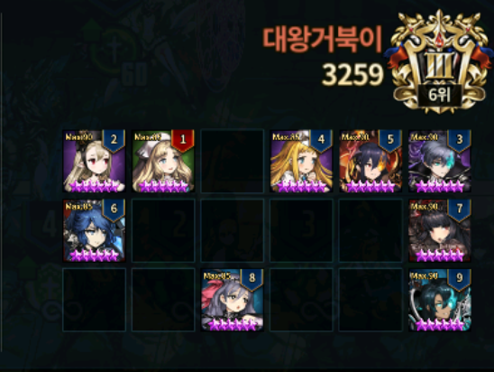
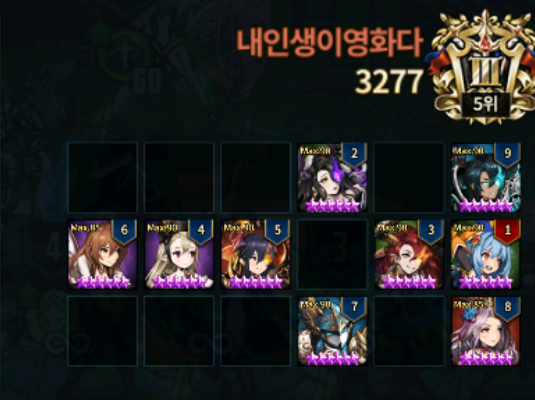
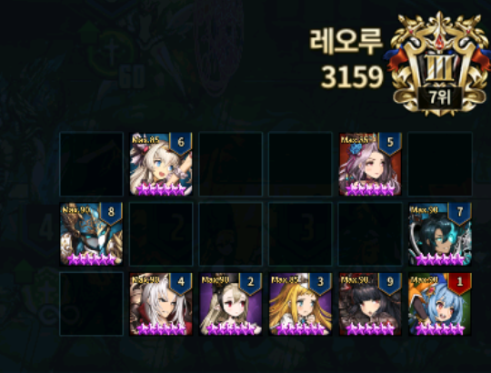
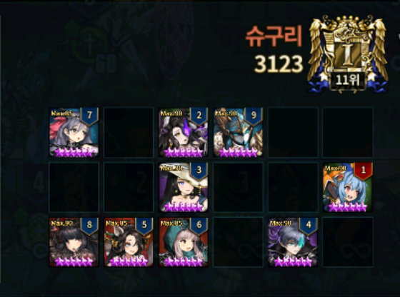
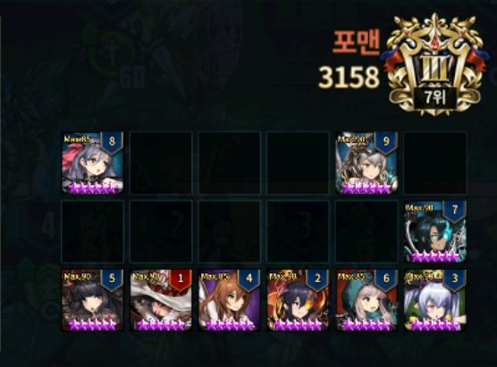
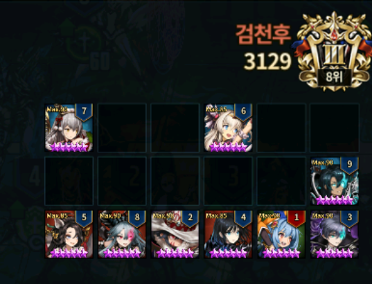

Stuff to note

* Data are based on KR user **레오루**.
* The title for each images are their final ranks, the rank indicated in the image may not be their final rank.
* You can see the interaction in video [here](https://cafe.naver.com/browndust/434217)

***If you are not be able to view video, it is probably some IP blocking from Naver***

---

**Rank 1 : 러블리 (Lovely)**

Keeps rotating not popular units in Top 20 (Velfern and Seto). Due to this variable change, think this user is able to obtain Rank 1 consistently.

**Rank 2 : 벨랴 (BellYa)**

No Catherine and Nartas. Very peculiar, but judging by this user's rank (usually Top 3~4 users only really care about defending against each other), it seems like it is trying to snipe defensive wins. (All Top 10 users are Lucius +10 users, this deck will take ages to clear Lucius).

**Rank 3 : Zia**

Also like Rank 2, no Catherine and Nartas. As similar reason, this is probably defensive formation. Turn 4 is a new unit in KR post 6D, it's the ninja girl you can find her in books.browndust.

**Rank 4 : 대왕거북이 (GargantuanTurtle)**

Finally no Raffy formation. Probably due to less users anticipating middle front X hit by Taylor, this deck was able to sneak to the top.

**Rank 5 : 내인생이영화다 (MyLifeLikeMovie)**

Not that different from previous season formation.

**Rank 6 : 마스터빈의마스터곰 (Master Bean & Master Gom)**

Not that different from previous season formation. Obviously there's always small tweaks in turn order and one or two unit but the fundamentals are the same.

**Rank 7 : 레오루 (Leo-Lu)**

Not that different from previous season formation. Very similar to Rank 6, but different turn order.

**Rank 8 : 슈구리 (ShuGuRi)**

Celia...??? She doesn't really do much especially against Top 10 decks, but seems like it works below? I'm not too sure.

**Rank 9 : 포맨 (ForMen)**

Ninja girl being used again here. She's good at dealing with Bansheena and the units she kills are nullified before attack, so allows mages to not die from Beliath Skellies. Seems like ninja girl is a good joker pick.

**Rank 10 : 검천후 (GumChunHu)**

Valze and Taylor being used. Valze good at dealing with Bansheena like ninja girl and also due to nullify before attack, she's good at dealing with Beliath Skellies. Taylor just initiator since many are putting in X formations.
